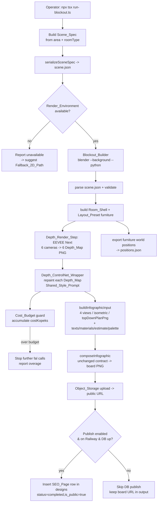

# Design Document — AI_Design_3D_Blockout (подход B2)

## Overview

B2 — это новый **offline-пайплайн** генерации геометрически согласованных
ракурсов, плана и изометрии для дизайн-бордов. Он решает корневую проблему
2D-генерации: при действительно разных углах камеры FLUX / gpt-image /
Nano Banana 2 не удерживают одинаковую расстановку мебели — между кадрами
«плывут» позиции, размеры и состав. B2 фиксирует геометрию **лёгким серым
3D-блокаутом** комнаты в headless Blender и поручает AI только фотореалистичную
перекраску.

Принцип работы:

1. Из площади и типа помещения детерминированно строится `Scene_Spec` — JSON
   с габаритами комнаты, оболочкой (стены/пол/потолок/окно/дверь), выбранным
   `Layout_Preset` (расстановка примитивной мебели в мировых координатах) и
   фиксированным `Camera_Rig`.
2. Headless Blender (`blender --background --python`) парсит `Scene_Spec`,
   строит `Room_Blockout` и рендерит **по одной `Depth_Map` на каждую из 6
   камер** движком EEVEE Next, а также экспортирует мировые позиции мебели в
   проверяемый JSON.
3. Каждая `Depth_Map` прогоняется через `Depth_ControlNet_Provider` на fal с
   единым `Shared_Style_Prompt` → `Photoreal_Repaint`. Карта глубины задаёт
   структуру, промпт задаёт стиль; геометрия одинакова во всех камерах, потому
   что приходит из одного блокаута.
4. 4 фото-ракурса, изометрия и вид сверху подаются в **существующий**
   `infographicComposer.ts` без изменения его контракта; остальные поля
   (тексты, материалы, смета, палитра, решения) формируются как раньше.
5. Готовый борд грузится в R2 (`objectStorage.ts`) → публичный URL; опционально
   публикуется как `SEO_Page` в таблице `designs` (только в окружении Railway).

Ключевая особенность стратегии — фича остаётся инструментом оператора для
наполнения SEO-страниц (~10 проектов в первой партии, цель ~100 по городам и
районам ЮФО). Существующий 2D-путь (`generate-design-board.ts` на Nano Banana 2)
**сохраняется как fallback** и этим спеком не удаляется.

Самый большой риск — удержит ли depth-ControlNet расстановку на fal — снимается
ранним **R&D-прототипом** (Requirement 1) до постройки полного пайплайна.

### Research Findings

Исследование, на котором основан дизайн (контекст из кодовой базы и публичной
документации fal):

- **Паттерн вызова fal уже устоялся** в `falAi.ts`: raw `fetch`, заголовок
  `Authorization: Key ${FAL_API_KEY}`, базовый URL `https://fal.run/{model}`,
  синхронный режим, ответ `{ images: [{ url, width, height }], has_nsfw_concepts }`,
  возврат `costKopeks` как аппроксимации (fal не возвращает фактическую цену).
  `Depth_ControlNet_Wrapper` обязан повторять именно этот паттерн (Requirement 6.1,
  6.5). Контент рерайзится для совместимости с лицензией.
- **Depth-управляемые модели на fal**: `fal-ai/flux-control-lora-depth/image-to-image`
  (карта глубины = структурный сигнал, init-изображение направляет цвет) и
  `fal-ai/flux-general` (полный ControlNet/LoRA/IP-Adapter). Выбор модели — через
  env, по образцу существующих `FAL_MODEL_*`. Источник: [fal.ai model API
  reference](https://fal.ai/models) (содержимое перефразировано для соответствия
  лицензии).
- **Blender headless + EEVEE Next**: рендер карт глубины делается через
  `blender --background --python script.py` с включённым выводом Z/Depth-прохода в
  Compositor (Render Layers → Normalize → File Output). Источник: [Blender Manual —
  command line rendering](https://docs.blender.org/manual/en/latest/advanced/command_line/render.html)
  (перефразировано для соответствия лицензии). Это согласуется с Requirement 12.1,
  12.2.
- **Контракт композитора** (`InfographicInput`): `views: Buffer[]`,
  `isometric: Buffer | null`, `topDownPlanPng?: Buffer | null` плюс `design{...}`.
  Это ровно три слота, которые заменяет 3D-путь (Requirement 8.1–8.3), остальные
  поля формируются прежним кодом (Requirement 8.5).
- **Хранилище R2** (`objectStorage.ts`): `R2File.save(buffer, { contentType })` и
  публичный URL через `R2_PUBLIC_URL`. Конфигурация требует
  `R2_ENDPOINT / R2_ACCESS_KEY_ID / R2_SECRET_ACCESS_KEY`, ошибка при отсутствии —
  явная (Requirement 10.3).
- **Round-trip как опорный тест** — в репозитории уже есть образец
  property-based round-trip теста для `Layout_JSON`
  (`__tests__/dizajn/layout-json-roundtrip.property.test.ts`) на `fast-check` +
  `node:test`. `Scene_Spec` round-trip строится по этому же образцу.

## Architecture

Пайплайн состоит из **TypeScript-оркестратора** (живёт в
`artifacts/api-server`, запускается `npx tsx`) и **Python-скрипта Blender**
(`Blockout_Builder`), которые обмениваются данными через файлы JSON и PNG в
рабочей директории проекта.



### Execution Boundaries

- **TS-оркестратор** отвечает за: построение/сериализацию `Scene_Spec`, запуск
  Blender как дочернего процесса, вызовы `Depth_ControlNet_Wrapper`, учёт
  `Cost_Budget`, сборку `InfographicInput`, вызов `composeInfographic`, загрузку
  в R2 и публикацию `SEO_Page`.
- **Blender Python** отвечает за: парсинг и валидацию `Scene_Spec`, построение
  `Room_Shell` и мебели из `Layout_Preset`, `Depth_Render_Step`, экспорт мировых
  позиций мебели.
- **Граница согласованности геометрии**: всё, что касается `Geometric_Consistency`,
  определяется единственным `Room_Blockout`; камеры лишь смотрят на одну и ту же
  сцену. Проверка ведётся по `Scene_Spec` / экспортированным позициям, **не по
  пикселям** (Requirement 7.2).

### Environment & Degradation Strategy

- `Render_Environment` (headless Blender + GPU) детектируется до запуска: если
  бинарь Blender недоступен — пайплайн сообщает об этом и предлагает
  `Fallback_2D_Path` (Requirement 9.3, 13.1), не трогая существующий 2D-код.
- Публикация в БД выполняется только в окружении Railway; локально (`DATABASE_URL`
  недоступен) шаг пропускается с сохранением URL борда в выводе (Requirement 11.3–11.5).

## Components and Interfaces

### 1. Scene_Spec model & builder (TS)

Новый модуль `artifacts/api-server/src/lib/blockout/sceneSpec.ts`.

```ts
export interface SceneSpec {
  schemaVersion: 1;
  room: {
    roomType: RoomType;          // 'bedroom' | 'kitchen' | 'living_room' | ...
    areaM2: number;              // площадь, м²  (> 0)
    dimensions: { W: number; L: number; H: number }; // метры, все > 0
  };
  shell: {
    door:   { wall: Wall; offsetM: number; widthM: number; heightM: number };
    window: { wall: Wall; offsetM: number; widthM: number; heightM: number; sillM: number };
  };
  layoutPresetId: string;        // идентификатор выбранного Layout_Preset
  furniture: FurnitureItem[];    // мировые координаты блокаута
  cameraRig: CameraSpec[];       // ровно 6 камер (см. Camera_Rig)
  render: {
    engine: "EEVEE_NEXT";
    renderNormals: boolean;      // включает Normal_Map (Req 5.3)
    resolution: { width: number; height: number };
  };
  style: { sharedStylePrompt: string; negativePrompt: string };
}

export type Wall = "north" | "east" | "south" | "west";

export interface FurnitureItem {
  id: string;                    // уникален в пределах Scene_Spec
  kind: string;                  // 'bed' | 'sofa' | ... (примитив)
  position: { x: number; y: number; z: number }; // центр, метры (мир)
  dimensions: { w: number; d: number; h: number }; // метры, все > 0
  rotationDeg: 0 | 90 | 180 | 270;
}

export interface CameraSpec {
  id: string;
  role: "perspective" | "top_ortho" | "isometric";
  position: { x: number; y: number; z: number };
  target:   { x: number; y: number; z: number };
  fovDeg?: number;       // для perspective
  orthoScale?: number;   // для top_ortho / isometric
}

// Детерминированный вывод габаритов из площади и типа помещения.
export function computeRoomDimensions(roomType: RoomType, areaM2: number): { W: number; L: number; H: number };

// Выбор пресета расстановки по типу помещения.
export function selectLayoutPreset(roomType: RoomType): LayoutPreset; // throws если пресета нет (Req 3.5)

// Полная сборка Scene_Spec; бросает ошибку, если площадь < минимума (Req 2.5).
export function buildSceneSpec(input: { roomType: RoomType; areaM2: number; style: StyleInput }): SceneSpec;
```

`computeRoomDimensions` использует табличное соотношение сторон по типу помещения
и фиксированную высоту потолка, чтобы для одной и той же площади всегда
получались одинаковые W×L×H (детерминизм — Requirement 2.1) и все три значения
были положительными (Requirement 2.4).

### 2. Scene_Spec serialization (TS + Python, общая схема)

Модуль `sceneSpec.ts` экспортирует:

```ts
export function serializeSceneSpec(spec: SceneSpec): string;     // JSON.stringify по канонической схеме
export function parseSceneSpec(json: unknown): SceneSpec;        // строгий парс; throws с именем
                                                                 // первого нарушенного поля (Req 4.4)
```

Валидация выполняется через zod-схему (по образцу `parseLayout` в
`layoutPlanner.ts`): схема — единственный источник правды о форме `Scene_Spec`.
На стороне Blender Python зеркальная проверка тех же ключей и типов; при
несоответствии — выход с ненулевым кодом и именем первого нарушенного поля
(Requirement 4.2, 4.4).

### 3. Blockout_Builder (Blender Python)

Скрипт `artifacts/api-server/scripts/blockout/blockout_builder.py`, запускается
оркестратором:

```
blender --background --python blockout_builder.py -- \
    --scene scene.json --out <work_dir>
```

Обязанности:

- `parse_scene_spec(path)` — читает и валидирует `scene.json`; при нарушении
  схемы — `sys.exit(<non-zero>)` с именем первого нарушенного поля (Req 4.2, 4.4).
- `build_room_shell(spec)` — строит 4 стены, пол, потолок, **ровно одно окно и
  ровно одну дверь** из габаритов W×L×H, размещая проёмы по позициям из
  `shell` (Req 2.2, 2.3); гарантирует положительные W/L/H (Req 2.4).
- `place_furniture(spec)` — инстанцирует каждый предмет `Layout_Preset` как
  примитив (box/простой меш) **без материалов и текстур** в заданных мировых
  координатах (Req 3.1–3.3); проверяет, что каждый предмет целиком внутри границ
  `Room_Shell` (Req 3.4).
- `setup_camera_rig(spec)` — создаёт камеры из `cameraRig` (Req 5.1).
- `render_depth_maps(spec, out)` — `Depth_Render_Step`: EEVEE Next, по одной
  `Depth_Map` на камеру (Req 5.2, 12.2); при `renderNormals` — ещё и `Normal_Map`
  на камеру (Req 5.3).
- `export_positions(spec, out)` — пишет `positions.json` с мировыми позициями,
  габаритами и ориентацией мебели — проверяемый артефакт для
  `Geometric_Consistency` (Req 7.3).

Так как все камеры смотрят на один `Room_Blockout`, мировые позиции мебели по
определению совпадают для всех камер (Req 7.1, 7.2, 7.4) — экспорт делается один
раз на сцену, а не на камеру.

### 4. Depth_ControlNet_Wrapper (TS, в falAi.ts)

Новая обёртка добавляется в `artifacts/api-server/src/lib/falAi.ts` по паттерну
существующих функций (raw fetch, `Authorization: Key`, базовый URL):

```ts
export interface DepthRepaintInput {
  depthMapUrl: string;        // публичный/signed URL Depth_Map в R2
  prompt: string;             // Shared_Style_Prompt
  initImageUrl?: string;      // опц. направляющее изображение цвета
  aspectRatio?: "16:9" | "4:3" | "1:1";
}

export interface DepthRepaintResult extends FalGenerationResult {
  /** костыль для бюджета: cost всегда заполнен, даже при NSFW-отказе (Req 6.7). */
  nsfwBlocked?: boolean;
}

export async function falDepthControlNetRepaint(
  input: DepthRepaintInput
): Promise<FalGenerationResult>;
```

Поведение:

- Модель берётся из env `FAL_MODEL_DEPTH_CONTROLNET`
  (default `fal-ai/flux-control-lora-depth/image-to-image`).
- `Depth_Map` передаётся как **структурный управляющий сигнал** провайдеру
  (Req 6.2).
- Возвращает `costKopeks` так же, как остальные обёртки (Req 6.5).
- Если `has_nsfw_concepts` содержит `true` — обёртка **не возвращает
  изображение** и сигнализирует ошибку (Req 6.6), но стоимость вызова всё равно
  доступна вызывающему коду (Req 6.7). Реализация: при NSFW бросается
  типизированная ошибка `NsfwBlockedError`, несущая `costKopeks`, чтобы
  оркестратор учёл стоимость в `Cost_Budget`.
- При HTTP-ошибке/пустом результате — ошибка с HTTP-статусом и текстом ответа
  (Req 1.5, паттерн `Fal.ai HTTP {status}: {text}`).

### 5. Blockout_Pipeline orchestrator (TS)

Модуль `artifacts/api-server/src/lib/blockout/pipeline.ts` с функцией
`runBlockoutPipeline(options)` и CLI-входом
`artifacts/api-server/scripts/blockout/run-blockout.ts` (`npx tsx`).

Этапы (каждый логирует имя шага и причину при сбое — Req 13.5):

1. `assertRenderEnvironment()` — проверка наличия Blender; иначе сообщение +
   предложение `Fallback_2D_Path` (Req 9.3, 13.1).
2. `buildSceneSpec` → `serializeSceneSpec` → запись `scene.json` (Req 4.1).
3. `runBlockoutBuilder()` — запуск Blender; при ненулевом коде — остановка
   3D-пути и предложение fallback (Req 13.1).
4. `uploadDepthMaps()` — загрузка `Depth_Map` в R2, получение URL для fal.
5. `repaintAll()` — для каждой камеры `falDepthControlNetRepaint` с
   `Shared_Style_Prompt` (Req 6.3, 6.4); ретраи (Req 13.2); деградация
   iso/ortho → `null` (Req 13.3); провал любой из 4 фото-камер → немедленная
   остановка с указанием камеры (Req 13.4); учёт `Cost_Budget` с отсечкой
   (Req 12.4, 12.5).
6. `buildInfographicInput()` → `composeInfographic()` (Req 8.x).
7. `uploadBoard()` → R2 public URL (Req 10.1, 10.2).
8. `publishSeoPage()` — опционально, только Railway + доступная БД (Req 11.x).

### 6. Cost guard (TS)

Переиспользуется/расширяется `designCostGuard.ts`. Аккумулятор `costKopeks`
суммирует все вызовы `Depth_ControlNet_Provider`; перед каждым вызовом
проверяется верхняя граница `Cost_Budget` ($0.6). При превышении дальнейшие
вызовы провайдера прекращаются, выводится сообщение о превышении (Req 12.5);
итоговая стоимость выводится в копейках (Req 12.4). Стоимость NSFW-отказов тоже
учитывается (Req 6.7).

### 7. Composer adapter (TS)

`buildInfographicInput(repaints, baseFields)` собирает `InfographicInput`:

- 4 `Photoreal_Repaint` фото-камер → `views: Buffer[]` (Req 8.1);
- `Photoreal_Repaint` изометрии → `isometric: Buffer | null` (Req 8.2, при
  деградации — `null`, Req 13.3);
- `Photoreal_Repaint` ортографии сверху → `topDownPlanPng: Buffer | null`
  (Req 8.3);
- `design{ roomType, area, style, materials, estimate, colorPalette, solutions, ... }`
  и метки формируются прежним способом (Req 8.5).

Вызов `composeInfographic(input)` — **без изменения сигнатуры** функции и формы
`InfographicInput` (Req 8.4).

### 8. SEO publish (TS)

`publishSeoPage(boardUrl, views, content)` вставляет строку в `designs`
(`status=completed`, `is_public=true`, `views[]`, `resultImageUrl`, `content`)
— только в окружении Railway с доступной БД (Req 11.1, 11.3, 11.4). Если
публикация прервана после загрузки борда — URL борда уже в выводе для повторной
публикации (Req 11.5).

## Data Models

### Scene_Spec (каноническая JSON-схема)

`Scene_Spec` — единственный сериализуемый вход `Blockout_Builder`. Каноническая
форма (zod-схема в `sceneSpec.ts`):

| Поле | Тип | Ограничение |
|------|-----|-------------|
| `schemaVersion` | `1` | литерал |
| `room.roomType` | enum | один из поддерживаемых типов |
| `room.areaM2` | number | `> 0`, `>=` минимума для типа (Req 2.5) |
| `room.dimensions.{W,L,H}` | number | каждое `> 0`, метры (Req 2.4) |
| `shell.door` | object | `wall` ∈ {north,east,south,west}, `offsetM/widthM/heightM > 0` |
| `shell.window` | object | те же стены, `offsetM/widthM/heightM/sillM`, `widthM/heightM > 0` |
| `layoutPresetId` | string | непустой |
| `furniture[]` | array | `>= 1`; `id` уникален |
| `furniture[].position.{x,y,z}` | number | мировые координаты, метры |
| `furniture[].dimensions.{w,d,h}` | number | каждое `> 0` |
| `furniture[].rotationDeg` | enum | {0,90,180,270} |
| `cameraRig[]` | array | **ровно 6**: 4 `perspective` + 1 `top_ortho` + 1 `isometric` (Req 5.1) |
| `render.engine` | `"EEVEE_NEXT"` | литерал (Req 12.2) |
| `render.renderNormals` | boolean | вкл. Normal_Map (Req 5.3) |
| `render.resolution.{width,height}` | int | `> 0` |
| `style.sharedStylePrompt` | string | непустой (Req 6.3) |
| `style.negativePrompt` | string | может быть пустым |

Все числовые листья сериализуются как JSON-числа; схема не допускает `undefined`,
`NaN`, дат, буферов (по образцу round-trip теста `Layout_JSON`), чтобы round-trip
был тождественным (Req 4.3).

### Furniture positions export (positions.json)

Артефакт `Blockout_Builder` для проверки `Geometric_Consistency` (Req 7.3):

```json
{
  "sceneId": "string",
  "furniture": [
    { "id": "bed1", "position": {"x":..,"y":..,"z":..},
      "dimensions": {"w":..,"d":..,"h":..}, "rotationDeg": 0 }
  ]
}
```

Поскольку экспорт делается из единственного `Room_Blockout`, множество позиций
не зависит от камеры — для любой пары камер `Camera_Rig` множества идентичны
(Req 7.2, 7.4).

### Camera_Rig (фиксированный)

| id | role | назначение слота |
|----|------|------------------|
| `cam_persp_1..4` | perspective | `views[0..3]` (Req 8.1) |
| `cam_top` | top_ortho | `topDownPlanPng` (Req 8.3) |
| `cam_iso` | isometric | `isometric` (Req 8.2) |

Позиции камер фиксированы и переиспользуются между всеми проектами с одним
`Camera_Rig` (Req 5.4).

### Pipeline output (для повторной публикации)

```json
{
  "boardPublicUrl": "https://.../board.png",
  "depthMapUrls": ["..."],
  "repaintUrls": ["..."],
  "totalCostKopeks": 5400,
  "published": false,
  "skippedPublishReason": "DATABASE_URL unavailable (not on Railway)"
}
```

`boardPublicUrl` сохраняется всегда после загрузки в R2, чтобы прерванную
публикацию можно было повторить (Req 11.5).

## Correctness Properties

*Свойство — это характеристика или поведение, которое должно выполняться для
всех валидных исполнений системы; по сути, формальное утверждение о том, что
система должна делать. Свойства служат мостом между человекочитаемой
спецификацией и машинно-проверяемыми гарантиями корректности.*

PBT применим к B2: ядро пайплайна — это чистые функции и трансформации данных
(`Scene_Spec` round-trip, вычисление габаритов, выбор и геометрия пресетов,
маппинг слотов композитора, учёт бюджета, логика ретраев и деградации) с явными
универсальными свойствами над широким входным пространством. Инфраструктурные
шаги (Blender-рендер, вызовы fal, R2, БД) тестируются интеграционно/smoke и
свойствами не покрываются.

После рефлексии избыточные критерии объединены: детерминизм и положительность
габаритов (2.1+2.4), NSFW-отказ со стоимостью (6.6+6.7), геометрическая
согласованность по камерам (7.1+7.2+7.4), маппинг слотов (8.1+8.2+8.3), единый
промпт и кардинальность перекраски (6.3+6.4).

### Property 1: Scene_Spec round-trip

*Для любого* валидного `Scene_Spec` сериализация в JSON с последующим разбором
(`parseSceneSpec(JSON.parse(serializeSceneSpec(x)))`) даёт эквивалентный
`Scene_Spec`.

**Validates: Requirements 4.1, 4.2, 4.3**

### Property 2: Невалидная схема называет первое нарушенное поле

*Для любого* валидного `Scene_Spec`, в котором ровно одно поле испорчено
(неверный тип/выход за диапазон), `parseSceneSpec` завершается ошибкой, чьё
сообщение содержит имя этого нарушенного поля.

**Validates: Requirements 4.4**

### Property 3: Габариты комнаты детерминированы и положительны

*Для любого* допустимого `(roomType, areaM2)` функция `computeRoomDimensions`
возвращает один и тот же результат при повторных вызовах (детерминизм) и все три
значения W, L, H строго положительны.

**Validates: Requirements 2.1, 2.4**

### Property 4: Отклонение площади ниже минимума

*Для любой* площади, меньшей минимально допустимой для данного типа помещения,
`buildSceneSpec` завершается ошибкой, чьё сообщение содержит тип помещения и
числовое значение минимальной площади.

**Validates: Requirements 2.5**

### Property 5: Проёмы лежат на указанной стене

*Для любого* валидного описания `shell` вычисленные координаты двери и окна лежат
на указанной стене в пределах её протяжённости (offset+width не выходит за длину
стены).

**Validates: Requirements 2.3**

### Property 6: Выбор Layout_Preset соответствует типу помещения

*Для любого* поддерживаемого типа помещения `selectLayoutPreset` возвращает
пресет, помеченный этим типом и содержащий непустой список мебели.

**Validates: Requirements 3.1**

### Property 7: Предметы пресета — примитивы с полными валидными трансформами

*Для всех* предметов всех `Layout_Preset` каждый предмет описан примитивной
геометрией без материалов и текстур и имеет заданные позицию, габариты (все > 0)
и ориентацию `rotationDeg ∈ {0,90,180,270}`.

**Validates: Requirements 3.2, 3.3**

### Property 8: Мебель помещается в границы Room_Shell

*Для любого* валидного `Scene_Spec` ограничивающий параллелепипед (AABB) каждого
предмета мебели с учётом поворота целиком содержится в границах комнаты
`[0..W] × [0..L] × [0..H]`.

**Validates: Requirements 3.4**

### Property 9: Отсутствие пресета называет тип помещения

*Для любого* типа помещения, для которого пресет не определён, `selectLayoutPreset`
завершается ошибкой, чьё сообщение содержит имя запрошенного типа.

**Validates: Requirements 3.5**

### Property 10: Состав Camera_Rig фиксирован и детерминирован

*Для любого* `Scene_Spec`, построенного билдером, `cameraRig` содержит ровно 6
камер — ровно 4 `perspective`, 1 `top_ortho` и 1 `isometric`; *для любых двух*
проектов, использующих один `Camera_Rig`, позиции одноимённых камер идентичны.

**Validates: Requirements 5.1, 5.4**

### Property 11: Геометрическая согласованность по всем камерам

*Для любого* `Scene_Spec` множество мировых позиций, габаритов и ориентаций
мебели, экспортированное из единственного `Room_Blockout`, не зависит от камеры:
для любой пары камер `Camera_Rig` эти множества идентичны.

**Validates: Requirements 7.1, 7.2, 7.4**

### Property 12: Полнота экспорта позиций мебели

*Для любого* `Scene_Spec` экспорт `positions.json` содержит ровно одну запись на
каждый предмет мебели (по `id`) с теми же значениями позиции, габаритов и
ориентации, что в `Scene_Spec`.

**Validates: Requirements 7.3**

### Property 13: Depth_Map передаётся как структурный управляющий сигнал

*Для любого* входного `depthMapUrl` тело запроса, отправляемого
`Depth_ControlNet_Wrapper` провайдеру, содержит этот URL в поле структурного
управляющего сигнала.

**Validates: Requirements 6.2**

### Property 14: Единый промпт и одна перекраска на камеру

*Для любого* набора `Depth_Map` проекта оркестратор делает ровно один вызов
провайдера на камеру (число `Photoreal_Repaint` равно числу камер) и все вызовы
получают один и тот же `Shared_Style_Prompt`.

**Validates: Requirements 6.3, 6.4**

### Property 15: Обёртка возвращает стоимость в копейках

*Для любого* успешного ответа провайдера результат `Depth_ControlNet_Wrapper`
содержит `costKopeks` — неотрицательное число.

**Validates: Requirements 6.5**

### Property 16: NSFW даёт ошибку без изображения, но со стоимостью

*Для любого* ответа провайдера, помеченного как NSFW, `Depth_ControlNet_Wrapper`
завершается ошибкой и не возвращает изображение, при этом брошенная ошибка несёт
доступную стоимость вызова `costKopeks` (неотрицательную).

**Validates: Requirements 6.6, 6.7**

### Property 17: Ошибки провайдера несут HTTP-статус и текст

*Для любого* ответа провайдера со статусом `>= 400` или пустым набором
изображений `Depth_ControlNet_Wrapper` завершается ошибкой, чьё сообщение
содержит HTTP-статус и текст ответа провайдера.

**Validates: Requirements 1.5**

### Property 18: Маппинг слотов композитора

*Для любого* набора `Photoreal_Repaint` адаптер `buildInfographicInput` помещает
ровно 4 фото-ракурса в `views`, перекраску изометрической камеры в `isometric` и
перекраску ортографической камеры сверху в `topDownPlanPng`.

**Validates: Requirements 8.1, 8.2, 8.3**

### Property 19: Прочие поля InfographicInput сохраняются без изменений

*Для любых* базовых полей (`design`, `viewLabels`, `cropLabels`, `detailCrops`)
адаптер `buildInfographicInput` передаёт их в `InfographicInput` без изменений,
заменяя только `views`, `isometric` и `topDownPlanPng`.

**Validates: Requirements 8.5**

### Property 20: Отсутствие env-переменной хранилища называет переменную

*Для любой* обязательной переменной окружения `Object_Storage`, если она не
задана, шаг загрузки завершается ошибкой, чьё сообщение содержит имя именно этой
отсутствующей переменной.

**Validates: Requirements 10.3**

### Property 21: Суммарная стоимость равна сумме вызовов провайдера

*Для любой* последовательности вызовов `Depth_ControlNet_Provider` с известными
стоимостями выводимая суммарная стоимость в копейках равна сумме `costKopeks`
всех вызовов (включая вызовы, завершившиеся NSFW-отказом).

**Validates: Requirements 12.4**

### Property 22: Отсечка по бюджету прекращает вызовы провайдера

*Для любой* последовательности стоимостей вызовов, как только накопленная
стоимость превышает верхнюю границу `Cost_Budget`, оркестратор не делает ни
одного последующего вызова провайдера и сообщает о превышении бюджета.

**Validates: Requirements 12.5**

### Property 23: Число попыток на Depth_Map ограничено

*Для любой* `Depth_Map`, для которой провайдер стабильно возвращает ошибку, число
вызовов провайдера по этой карте не превышает фиксированный лимит попыток, после
чего фиксируется отказ по этой карте.

**Validates: Requirements 13.2**

### Property 24: Деградация изометрии/ортографии в null

*Для любого* подмножества из {изометрическая, ортографическая} камер, чья
перекраска стабильно не удаётся, соответствующее поле `InfographicInput`
(`isometric` / `topDownPlanPng`) устанавливается в `null`, сборка борда
продолжается, а остальные (успешные) поля заполнены.

**Validates: Requirements 13.3**

### Property 25: Сбой фото-камеры прекращает сборку с указанием камеры

*Для любой* из 4 фото-камер, чья перекраска не удалась после исчерпания попыток,
оркестратор прекращает сборку борда, и сообщение об ошибке содержит идентификатор
именно этой камеры.

**Validates: Requirements 13.4**

### Property 26: URL борда сохраняется при сбое публикации

*Для любого* сбоя на шаге публикации `SEO_Page`, произошедшего после загрузки
борда в R2, вывод пайплайна по-прежнему содержит публичный URL загруженного
борда.

**Validates: Requirements 11.5**

### Property 27: Сообщение о сбое называет шаг и причину

*Для любого* шага `Blockout_Pipeline`, завершившегося сбоем, выводимое сообщение
содержит идентификатор сбойного шага и причину сбоя.

**Validates: Requirements 13.5**

## Error Handling

Стратегия — **аккуратная деградация без потери выполненной работы** (Requirement 13).

| Сбой | Поведение | Req |
|------|-----------|-----|
| `Render_Environment` недоступна | Сообщить о недоступности, предложить `Fallback_2D_Path`, не запускать 3D-путь | 9.3, 13.1 |
| `Blockout_Builder` упал (ненулевой код) | Прекратить 3D-путь, предложить `Fallback_2D_Path` | 13.1 |
| Невалидный `Scene_Spec` (TS или Python) | Ошибка с именем первого нарушенного поля | 4.4 |
| Площадь < минимума / нет пресета | Ошибка с типом помещения (+ минимум для площади) | 2.5, 3.5 |
| Провайдер вернул ошибку по одной `Depth_Map` | Ретраи до фиксированного лимита, затем отказ по карте | 13.2 |
| NSFW-результат | `NsfwBlockedError`, изображение не возвращается, стоимость учтена | 6.6, 6.7 |
| Стойкий сбой iso/ortho | Поле → `null`, сборка продолжается; остальные камеры обрабатываются немедленно | 13.3 |
| Стойкий сбой любой фото-камеры | Немедленная остановка сборки с указанием камеры | 13.4 |
| Превышение `Cost_Budget` | Прекратить вызовы провайдера, сообщить о превышении | 12.5 |
| Отсутствует env-переменная R2 | Ошибка с именем переменной | 10.3 |
| БД недоступна / не Railway | Пропустить публикацию, сохранить URL борда в выводе | 11.3, 11.4, 11.5 |
| Любой шаг | Сообщение с именем шага и причиной | 13.5 |

Тип `NsfwBlockedError extends Error { costKopeks: number }` позволяет
оркестратору отличать NSFW-отказ от прочих ошибок и при этом учитывать стоимость
в `Cost_Budget`. Ретраи реализуются ограниченным циклом с фиксированным лимитом
(без бесконечного backoff), чтобы гарантировать верхнюю границу числа вызовов
(Property 23) и удержание бюджета.

## Testing Strategy

Двойной подход: **property-тесты** для универсальных свойств чистой логики и
**unit/integration/smoke** для конкретных примеров, инфраструктуры и конфигурации.

### Property-based tests

- Библиотека: **fast-check** + `node:test` (как в существующем
  `__tests__/dizajn/layout-json-roundtrip.property.test.ts`); PBT с нуля не
  реализуется.
- Минимум **100 итераций** на каждый property-тест.
- Каждый тест помечается комментарием в формате
  **Feature: ai-design-3d-blockout, Property {number}: {property_text}**.
- Каждое из 27 свойств реализуется **одним** property-тестом. Генераторы:
  `sceneSpecArb` (валидный `Scene_Spec` по схеме, по образцу `layoutJsonArb`),
  `roomTypeArb`, `areaM2Arb`, наборы камер, мок-ответы fal (успех/NSFW/HTTP-ошибка),
  последовательности стоимостей, подмножества сбойных камер.
- Внешние зависимости (fal, Blender, R2, БД) мокаются: `fetch` подменяется для
  обёртки fal; для свойств оркестратора (14, 21–25, 27) провайдер и шаги
  заменяются управляемыми двойниками, считающими вызовы и инжектирующими сбои.
- Геометрические свойства (8, 11, 12) проверяются по данным `Scene_Spec` /
  экспорту `positions.json`, **не по пикселям** (Requirement 7.2).

### Unit / Example tests

- Маппинг вызова обёртки на паттерн `falAi.ts`: URL `https://fal.run/{model}` и
  заголовок `Authorization: Key {FAL_API_KEY}` (Req 6.1).
- `buildInfographicInput` возвращает валидный `InfographicInput`, а
  `composeInfographic` вызывается без изменения сигнатуры (Req 8.4).
- Флаг сравнения прототипа добавляет fallback-артефакт (Req 1.4).
- Ветвления fallback/окружения: fallback не вызывает Blender (Req 9.2);
  отсутствие Blender → сообщение + предложение fallback (Req 9.3); нет
  `DATABASE_URL` локально → публикация пропущена (Req 11.3); БД down → пропуск
  без падения (Req 11.4); партия из N городов → запуск N проектов (Req 11.2).
- Edge-кейсы валидации: каждая удалённая env-переменная R2 → ошибка с её именем
  (Req 10.3) — табличный пример-тест.

### Integration tests (1–3 примера, без PBT)

- R&D-прототип: реальные вызовы fal для одной комнаты / 4 камер, сохранение
  `Depth_Map` и `Photoreal_Repaint` в R2 с выводом URL (Req 1.1–1.3).
- `Depth_Render_Step`: запуск headless Blender, проверка, что число `Depth_Map`
  равно числу камер, а при `renderNormals` — число `Normal_Map` равно числу
  камер (Req 5.2, 5.3).
- Загрузка борда в R2 и получение публичного URL (Req 10.1, 10.2).
- Вставка `SEO_Page` в `designs` в окружении Railway (Req 11.1).
- Фактическая стоимость прогона в диапазоне `Cost_Budget` $0.2–$0.6 (Req 12.3).

### Smoke tests (однократно)

- Бинарь Blender доступен и запускается как `blender --background --python`
  (Req 12.1).
- Движок рендера — EEVEE Next (Req 12.2).
- `generate-design-board.ts` (`Fallback_2D_Path`) присутствует и его контракт не
  изменён (Req 9.1).

---

После завершения этого документа модель ОСТАНАВЛИВАЕТСЯ. Переход к фазе задач —
по кнопке в UI. Если в ходе проектирования выявлены пробелы в требованиях,
вернитесь к фазе уточнения требований.
