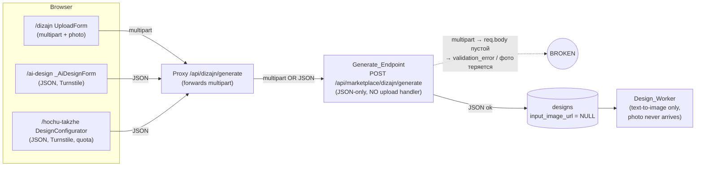
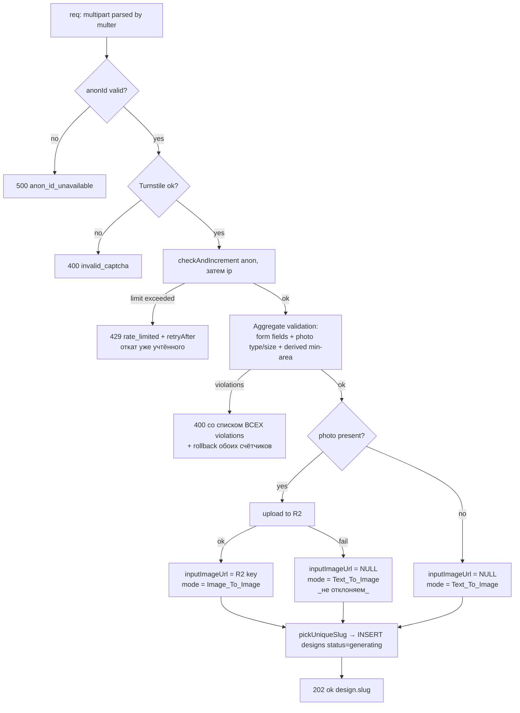

# Design Document

## Overview

AI_Design_Flagship консолидирует три исторические точки входа в AI-генерацию дизайна интерьера (`/dizajn` `UploadForm`, `/ai-design` `_AiDesignForm`, `/hochu-takzhe` `DesignConfigurator`) в **одну** каноническую страницу `/dizajn` с единой формой `Flagship_Form`. Две старые URL переводятся в постоянный (308) редирект на канон. По ходу консолидации устраняется **разрыв в цепочке запросов**: сегодня Next-прокси `app/api/dizajn/generate/route.ts` пересылает `multipart/form-data`, а backend `POST /api/marketplace/dizajn/generate` принимает только JSON и **не имеет обработчика загрузки изображений** — поэтому форма с фото (`UploadForm`) фактически не доходит до генератора, а `Design_Worker` (который уже умеет image-to-image) никогда не получает поле `input_image_url` от HTTP-пути.

Эта фича **расширяет**, а не переписывает существующие спеки:

- `.kiro/specs/ai-design-product` — базовый пайплайн (`designsTable`, `designWorker.ts`, `dizajnFormSchema.ts`, `designRateLimit.ts`, валидация, MVP-замок, очередь генерации, SEO-страница `/dizajn/{slug}`, агрегаты, sitemap).
- `.kiro/specs/ai-design-quality-fix` — identity-preservation, edit-image из пользовательского фото (`chooseHeroGenerationStrategy`, `generateHeroFromUserPhoto`), геометрическая валидация (`geometricValidator.ts`), cost guard (`designCostGuard.ts`, `BudgetExceededError`).

Ключевые проектные решения:

1. **Единый `Request_Contract` — `multipart/form-data` на всей цепочке.** Фото — бинарные данные; `multipart` переносит их без потери и без base64-раздувания. Прокси уже шлёт `multipart`; недостающее звено — приём `multipart` на backend (`multer` memory storage + загрузка в R2). Это минимальное изменение, выпрямляющее цепочку, а не её перепроектирование.
2. **`Generation_Mode` выбирается по наличию `Room_Photo`** и материализуется как `designs.input_image_url`. `Design_Worker` уже ветвит стратегию по `chooseHeroGenerationStrategy({ userPhotoUrl: design.inputImageUrl, isSeed: !design.anonId, style })`. Флагман просто наконец-то заполняет это поле для user-upload.
3. **`Area` (м²) — первичный пользовательский ввод; размеры комнаты в см выводятся детерминированно** на стороне формы и валидируются на backend. Это согласует «лёгкий» UX `/hochu-takzhe`/`/dizajn` (площадь + плитки) с существующим backend-контрактом (`widthCm/lengthCm/heightCm`).
4. **Anti-abuse и монетизация сохраняются как есть.** Серверный `Rate_Limiter` (Postgres fixed-window) — настоящая граница; клиентская `Free_Quota` (`localStorage`) — UX-триггер `Paywall_Modal`. Авторизация не вводится.
5. **SEO опирается на уже работающий `/dizajn/[slug]`**: ISR, JSON-LD (Article/BreadcrumbList/Service-Offer/ImageObject), OpenGraph/Twitter, canonical, `noindex` для незавершённых, исключение из `Sitemap`.

### Что НЕ входит в фичу

- Новый пайплайн генерации, новые AI-провайдеры, новая схема `designs` (кроме одного nullable-поля `palette`).
- Авторизация/аккаунты, реальная оплата `Paywall` (модалка-заглушка остаётся как в `/hochu-takzhe`).
- Разблокировка `Room_Type`, отличных от `bedroom` (MVP-замок остаётся).

## Architecture

### Текущее состояние (сломанная цепочка)



Проблема: при `multipart` `express.json()` не парсит тело, `validateDesignForm(req.body)` видит пустой объект; даже когда форма доходит, фото некуда сохранить — поля `input_image_url` HTTP-путь не заполняет. Поэтому `Image_To_Image_Mode` недостижим из веба.

### Целевое состояние (единый контракт)

```mermaid
flowchart LR
    subgraph Browser
      FF["/dizajn Flagship_Form\n(multipart: params + optional photo,\nTurnstile, Free_Quota)"]
    end
    RED["/ai-design, /hochu-takzhe"] -- "308" --> FF
    FF -- "multipart/form-data\n(+ optional image)" --> PR["Proxy_Route\nPOST /api/dizajn/generate\n(passthrough + anonId)"]
    PR -- "multipart/form-data\n(+ anonId)" --> GE["Generate_Endpoint\n(multer + Zod + R2 upload)"]
    GE -- "photo present" --> R2[(Object_Storage R2\ndizajn/uploads/...)]
    GE --> DB[(designs\ninput_image_url = R2 key | NULL\nstatus = generating)]
    GE -- "202 {slug}" --> FF
    FF -- "router.push" --> PP["Pending_Page /dizajn/{slug}\n(polling /status)"]
    W["Design_Worker"] -- "reads input_image_url" --> R2
    W -- "Image_To_Image | Text_To_Image" --> DB
    DB --> PUB["Public_Page /dizajn/{slug}\nISR + SEO_Metadata"]
```

### Порядок проверок в `Generate_Endpoint` (сохраняется из ai-design-product, расширяется фото-валидацией)



### Маршрутизация и редиректы

- Канон формы: `app/dizajn/page.tsx` рендерит `Flagship_Form`.
- `/ai-design` и `/hochu-takzhe` → **308** через `redirects()` в `next.config.*` (`permanent: true` ⇒ 308). Старые компоненты (`_AiDesignForm`, `DesignConfigurator`, страницы-обёртки) удаляются после переноса нужных UX-элементов (плитки, палитра, квота, paywall) в `Flagship_Form`.
- `/dizajn/{slug}` (`app/dizajn/[slug]/page.tsx`) — без изменений по контракту: `design`-slug → `Public_Page`/`Pending_Page`, аггрегатные комбинации → `Aggregate_Page`.

## Components and Interfaces

### 1. Flagship_Form (клиент, `app/dizajn/page.tsx` + новый клиентский компонент)

Единая форма, объединяющая лучшее из трёх: загрузку фото (`UploadForm`), Turnstile + per-field ошибки (`_AiDesignForm`), визуальные плитки + палитру + квоту + paywall (`DesignConfigurator`).

Поля и контролы:

| Поле | Контрол | Обязательность | Примечание |
|---|---|---|---|
| `Room_Photo` | file input + preview | опционально | JPG/PNG ≤ 8 МБ; клиентская предвалидация дублирует серверную |
| `roomType` | плитки | да | не-`bedroom` — `disabled` + бейдж «скоро» (`MVP_Room_Lock`) |
| `style` | плитки | да | 7 значений `STYLES` |
| `palette` | плитки палитр | да | новое поле, enum палитр |
| `priceSegment` \| `budget` | сегмент-плитки → `budget` ₽, либо явный ввод | да | `Price_Segment` маппится в `Budget` |
| `area` | числовой ввод, м² | да | первичный ввод; форма выводит `widthCm/lengthCm/heightCm` |
| Turnstile | `cf-turnstile` виджет | да | `data-action="ai_design_submit"` |
| Free_Quota | бейдж остатка + Paywall | — | `useGenerationQuota` |

Поведение submit:

1. Клиентская предвалидация (площадь, бюджет/сегмент, тип файла/размер, `roomType==='bedroom'`).
2. Если `Free_Quota.canGenerate === false` → открыть `Paywall_Modal`, **не** отправлять.
3. Собрать `FormData` (поля + опциональный `image`) + `cf-turnstile-response`; `POST /api/dizajn/generate` (multipart).
4. `202 {slug}` → `useGenerationQuota.record()` (списать 1) → `router.push('/dizajn/'+slug)`.
5. `400`/`429` → показать top-level + per-field сообщения по `violations`/`error`.

Деривация размеров из площади (детерминированная, на клиенте; backend перепроверяет):

```ts
// area (м²) → квадратная комната по умолчанию, обрезанная в допустимые границы.
// side = round(sqrt(area)*100) см, clamp в [WIDTH/LENGTH_CM_MIN..MAX]; height = 270.
function deriveRoomDims(areaSqm: number): { widthCm: number; lengthCm: number; heightCm: number }
```

Это даёт обратимое соответствие «площадь → размеры», достаточное для `checkMinArea` и worker-промптов; точные размеры здесь второстепенны (UX «лёгкого» сценария).

### 2. Proxy_Route (`app/api/dizajn/generate/route.ts`)

Минимальные изменения относительно текущего кода: он **уже** читает `req.formData()` и пересылает `multipart`, добавляя `anonId`. Сохраняем:

- Разрешение `anonId` из cookie `kiro_anon_id` или генерация UUID v4 + `Set-Cookie` (1 год, httpOnly, sameSite=lax).
- Проброс `Authorization: Bearer <internalApiToken>`.
- Без ручного `Content-Type` (fetch выставит boundary).
- Без потери данных изображения (бинарь переносится как часть `FormData`).

Контракт ответа прокси = контракт ответа backend (status passthrough, `no-store`).

### 3. Generate_Endpoint (`artifacts/api-server/src/routes/dizajn.ts`, `POST /generate`)

Расширяется для приёма `multipart/form-data`:

```ts
// multer memory storage, единственное опциональное поле файла "image".
const upload = multer({
  storage: multer.memoryStorage(),
  limits: { fileSize: 8 * 1024 * 1024 + 1 }, // +1 байт чтобы детектировать превышение как violation, а не ECONNRESET
});
router.post("/generate", upload.single("image"), handler);
```

Обработчик (порядок из flowchart):

1. `req.anonId` (из `anonIdMiddleware`); невалиден → `500 anon_id_unavailable`.
2. `verifyTurnstileToken` (поле `cf-turnstile-response`/`turnstileToken` теперь в `req.body` после multer); fail → `400 invalid_captcha`.
3. `checkAndIncrement("anon")`, затем `checkAndIncrement("ip")`; превышение → `429 rate_limited` (+ откат уже учтённого).
4. **Единая агрегирующая валидация** `validateGenerateRequest(req.body, req.file)`:
   - коэрсия строковых multipart-полей в числа (`widthCm/lengthCm/heightCm/budget/cityId`);
   - `validateDesignForm` (whitelist `roomType`/`style`, диапазоны, MVP-замок);
   - валидация `palette` (whitelist);
   - валидация фото: MIME ∈ {image/jpeg, image/png}, размер ≤ 8 МБ;
   - `checkMinArea(roomType, widthCm, lengthCm)` → код `room_too_small`;
   - возврат **всех** нарушений списком; любое нарушение → `400` + откат счётчиков.
5. Если фото валидно и присутствует → `uploadRoomPhoto(buffer, mime)` в R2 (`dizajn/uploads/{uuid}`):
   - успех → `inputImageUrl = <R2 key>`;
   - ошибка → лог, `inputImageUrl = null` (НЕ отклоняем — Req 4.6).
6. `pickUniqueSlug({ roomType, style })`.
7. `INSERT designs { slug, anonId, roomType, style, palette, cityId, area, budget, inputImageUrl, status:'generating', progress:0 }`.
8. `202 { ok:true, design:{ slug } }`.

Новый хелпер загрузки фото:

```ts
// Возвращает R2-ключ при успехе, бросает при сбое стораджа (ловится в handler → Text_To_Image).
async function uploadRoomPhoto(buf: Buffer, mime: "image/jpeg" | "image/png"): Promise<string>;
```

### 4. Generation validation module (`artifacts/api-server/src/lib/dizajnFormSchema.ts` + дополнение)

Дополняем существующий `validateDesignForm` агрегирующей обёрткой, собирающей нарушения формы, палитры и фото в один список (Req 5.7):

```ts
export const PALETTES = ["warm_neutral","white_wood","cool_gray","beige_sand","green_sage","blue_calm"] as const;
export type Palette = (typeof PALETTES)[number];

export interface PhotoMeta { mime: string; sizeBytes: number; }

export function validateGenerateRequest(
  body: unknown,
  photo: PhotoMeta | null,
): { ok: true; data: DesignFormInput & { palette: Palette } } | { ok: false; violations: DesignFormViolation[] };
```

Коды нарушений (машиночитаемые): `invalid_type`/`too_small`/`too_big`/`invalid_enum_value` (Zod), `mvp_room_locked`, `room_too_small`, `invalid_photo_type`, `photo_too_large`, `invalid_palette`.

### 5. Design_Worker (`artifacts/api-server/src/lib/designWorker.ts`) — без изменений контракта

Уже реализовано в quality-fix:

- `chooseHeroGenerationStrategy({ userPhotoUrl: design.inputImageUrl ?? null, isSeed: !design.anonId, style })` → для user-upload (фото есть, не seed) выбирает edit-image; иначе text2img.
- `generateHeroFromUserPhoto({ prompt, userPhotoUrl })` подаёт `image_urls=[userPhotoUrl]`, `input_fidelity:"high"` → редизайн **той же** комнаты (геометрия сохраняется).
- Геометрические повторы и предел стоимости — через `geometricValidator` + `enforceCostCeiling`/`BudgetExceededError`; при достижении предела статус → `failed` (Req 3.6, 3.7).
- Watchdog: `generating` > 10 мин → `failed`, `is_public=false`.

Флагман гарантирует лишь то, что `input_image_url` корректно заполнен HTTP-путём — после чего существующая логика worker даёт `Image_To_Image_Mode`. `palette` прокидывается в построение промпта (опционально, как дополнительный стилевой клаузис).

### 6. Public_Page / Pending_Page / Aggregate_Page / Sitemap — переиспользуются

`app/dizajn/[slug]/page.tsx` и `app/sitemap.ts` уже реализуют: ISR (`revalidate`), JSON-LD граф, OG/Twitter, canonical, `noindex` для незавершённых и для несуществующих slug (404), исключение незавершённых из агрегатов и sitemap (через `fetchPublishedDesignSlugs`/`fetchRecentDesigns`, фильтрующие `status='completed'`). Флагман не меняет их контракт; при необходимости делает `revalidate` конфигурируемым (Req 9.4/9.5).

## Data Models

### designs (существующая таблица, одно дополнение)

Используется как есть. Поля, релевантные фиче:

- `slug` (canonical URL ключ), `anonId` (владелец = `kiro_anon_id`; `null` ⇒ seed).
- `roomType`, `style`, `area` (numeric м²), `budget` (₽), `cityId`.
- `inputImageUrl` (`text`) — **R2-ключ фото пользователя**; `null` ⇒ `Text_To_Image_Mode`, заполнен ⇒ `Image_To_Image_Mode`.
- `resultImageUrl`, `views`, `detailCrops`, `materials`, `estimate`, `solutions`, `colorPalette`, `layoutJson`, `topDownPlanUrl`, `pickedFurniture`.
- `status` ∈ {`draft`,`generating`,`completed`,`failed`,`private`}, `progress`, `currentStep`, `errorMessage`.
- `isPublic` + индексы `designs_public_recent_idx` (`is_public AND status='completed'`) — основа агрегатов/sitemap.

**Дополнение (миграция):** новое nullable-поле для входной палитры (входной параметр, в отличие от `colorPalette`, который worker вычисляет из результата):

```sql
ALTER TABLE designs ADD COLUMN IF NOT EXISTS palette VARCHAR(40);
```

Решение хранить `palette` отдельной колонкой (а не в `layout_json`) — чтобы агрегаты/аналитика и worker-промпт читали её дёшево без парсинга JSON; nullable — для обратной совместимости с уже существующими записями.

### rate_limit_buckets (существующая)

`bucket_key` (`anon:<uuid>` / `ip:<addr>`), `counter`, `window_start`, `updated_at`. Fixed-window 24h. Лимиты заданы в `designRateLimit.ts` (`anon`, `ip`). `checkAndIncrement`/`decrement` — атомарные `INSERT ... ON CONFLICT`.

### Request_Contract (единый, multipart/form-data)

Поля на всех звеньях `Flagship_Form → Proxy_Route → Generate_Endpoint`:

| Поле | Тип в multipart | Источник | Назначение |
|---|---|---|---|
| `image` | file (бинарь) | форма (опц.) | → R2 `inputImageUrl` |
| `roomType` | text | плитки | whitelist + MVP-замок |
| `style` | text | плитки | whitelist |
| `palette` | text | плитки | whitelist → `designs.palette` |
| `widthCm`,`lengthCm`,`heightCm` | text(число) | деривация из `area` | `checkMinArea`, worker |
| `area` | text(число) | ввод м² | `designs.area` |
| `budget` | text(число) | сегмент/ввод | диапазон 50k..5M |
| `cityId` | text(число, опц.) | селект | `designs.cityId` |
| `cf-turnstile-response` | text | Turnstile | капча |
| `anonId` | text (добавляет прокси) | cookie | владелец |

Ответы: `202 {ok:true, design:{slug}}`; ошибки `400 {ok:false, error, violations?}`, `429 {ok:false, error:"rate_limited", retryAfterSeconds, kind}`, `500 {ok:false, error}`.

### Free_Quota (клиент, localStorage `sfera_design_quota_v1`)

`{ used:number, tier:"anon"|"pro" }`. `FREE_ANON=1`. `remaining = max(0, limit-used)`. `record()` после 202. Между вкладками синхронизируется через `storage` event. Это UX-граница, не security.

## Correctness Properties

*A property is a characteristic or behavior that should hold true across all valid executions of a system — essentially, a formal statement about what the system should do. Properties serve as the bridge between human-readable specifications and machine-verifiable correctness guarantees.*

The prework analysis grouped 50+ acceptance criteria into the testable properties below. Redundant criteria were consolidated: all field-whitelist/range/photo-type/photo-size/min-area rejections collapse into one comprehensive rejection property (Property 5); mode-selection criteria (3.1/3.2/3.4/4.4) collapse into Property 1; SEO metadata criteria (1.5/9.2/9.3) collapse into Property 13; non-completed exclusion criteria (10.1/10.2/10.3) collapse into Property 14. Worker-internal geometry/cost behavior (3.6/3.7/4.5) is owned by `.kiro/specs/ai-design-quality-fix` and is not re-tested here.

### Property 1: Generation mode is determined solely by photo presence

*For any* generation request, the resulting `Design_Project` is created in `Image_To_Image_Mode` when (and only when) a valid `Room_Photo` was accepted and persisted (`input_image_url` non-null), and in `Text_To_Image_Mode` otherwise.

**Validates: Requirements 3.1, 3.2, 3.4, 4.4, 4.7**

### Property 2: Accepted photo is stored and linked

*For any* request carrying a valid `Room_Photo`, after successful handling the photo is written to `Object_Storage` and the created `Design_Project.input_image_url` references exactly that stored object.

**Validates: Requirements 3.5, 4.2**

### Property 3: Storage failure degrades to text-to-image without rejecting

*For any* otherwise-valid request whose `Room_Photo` fails to save to `Object_Storage`, the endpoint still creates the `Design_Project` (responds 202), with `input_image_url = null`, `status = generating`, in `Text_To_Image_Mode`.

**Validates: Requirements 4.6**

### Property 4: Unified contract round-trips fields and photo bytes

*For any* valid set of form fields and any photo byte buffer, encoding them as the `Request_Contract` (`multipart/form-data`) and passing through `Proxy_Route` to `Generate_Endpoint` preserves every field value and the exact photo bytes (no data loss), with only `anonId` added by the proxy.

**Validates: Requirements 4.1, 4.3**

### Property 5: Invalid input is rejected without creating a project

*For any* request in which at least one field violates the contract — `roomType` outside the whitelist, `style` outside the whitelist, `budget` outside 50 000..5 000 000 ₽, derived room area below the minimum for the `Room_Type` (code `room_too_small`), `Room_Photo` of a type other than JPG/PNG, or `Room_Photo` exceeding 8 МБ — the `Generate_Endpoint` responds with a validation error (400) and creates no `Design_Project`.

**Validates: Requirements 5.1, 5.2, 5.3, 5.4, 5.5, 5.6**

### Property 6: All violations are reported together

*For any* request containing K ≥ 1 independent validation violations, the `Generate_Endpoint` response lists all K violations, not only the first.

**Validates: Requirements 5.7**

### Property 7: MVP room lock rejects non-allowed room types with its own code

*For any* `Room_Type` that is a valid member of the room-type whitelist but is not in the MVP-allowed subset, the `Generate_Endpoint` rejects the request with code `mvp_room_locked`.

**Validates: Requirements 6.2**

### Property 8: Captcha gate precedes and gates all side effects

*For any* request with a missing or invalid `Turnstile` token, the `Generate_Endpoint` responds with `invalid_captcha`, creates no `Design_Project`, and consumes no `Rate_Limiter` counter.

**Validates: Requirements 7.2**

### Property 9: Rate limiting checks both keys and blocks over-limit requests

*For any* request that passes captcha, the `Rate_Limiter` is consulted for both the `Anon_Id` and the IP key; and *for any* key whose count would exceed its limit, the endpoint responds with `rate_limited`, a `retryAfterSeconds` ≥ 0, and creates no `Design_Project`.

**Validates: Requirements 7.3, 7.4**

### Property 10: Validation failure rolls back consumed rate-limit counters

*For any* request that passes captcha and is counted by the `Rate_Limiter` but then fails validation, both the `Anon_Id` and IP counters return to their pre-request values.

**Validates: Requirements 7.5**

### Property 11: Exhausted free quota opens the paywall instead of generating

*For any* `Free_Quota` state whose remaining count is zero, submitting the `Flagship_Form` opens the `Paywall_Modal` and issues no generation request.

**Validates: Requirements 8.3**

### Property 12: Successful start consumes exactly one quota unit

*For any* starting `Free_Quota` state, recording a successful generation (HTTP 202) increases `used` by exactly one and decreases `remaining` by exactly one (never below zero).

**Validates: Requirements 8.4**

### Property 13: Completed projects expose full SEO metadata

*For any* `Design_Project` with `Generation_Status = completed`, its `Public_Page` exposes a canonical URL equal to `/dizajn/{slug}`, OpenGraph and Twitter tags, and a JSON-LD graph containing Article, BreadcrumbList, Service/Offer, and ImageObject entries.

**Validates: Requirements 1.5, 9.2, 9.3**

### Property 14: Non-completed projects are excluded from indexing everywhere

*For any* `Design_Project` whose `Generation_Status` is not `completed`, its `Public_Page` emits `noindex`, it is absent from the `Sitemap`, and it is absent from every `Aggregate_Page` listing.

**Validates: Requirements 10.1, 10.2, 10.3**

### Property 15: Route parsing classifies every slug deterministically

*For any* URL segment, route parsing returns a full-design route when the segment is a valid full design slug, an aggregate route with the correct `room`/`style` when it is a valid aggregate combination (`{room}-{style}`, `{room}`, or `{style}`), and otherwise returns nothing (driving a 404 with `noindex`).

**Validates: Requirements 9.6, 10.4**

### Property 16: Pending page polls until a terminal status

*For any* `Generation_Status`, the `Pending_Page` continues polling if and only if the status is non-terminal (`generating`), and stops once the status is `completed` or `failed`.

**Validates: Requirements 2.8**

### Property 17: Completed projects persist in the sitemap despite transient unavailability

*For any* `Design_Project` with `Generation_Status = completed`, it remains in the published-design set used to build the `Sitemap` regardless of temporary unavailability of its result assets (sitemap membership depends on status, not on asset reachability).

**Validates: Requirements 10.5**

## Error Handling

### Generate_Endpoint error taxonomy

| Condition | Status | Body `error` | Side effects |
|---|---|---|---|
| `anonId` missing/invalid (middleware not mounted) | 500 | `anon_id_unavailable` | none |
| Turnstile missing/invalid | 400 | `invalid_captcha` | none (no counter consumed) |
| `Anon_Id` or IP over limit | 429 | `rate_limited` (+ `retryAfterSeconds`, `kind`) | other key rolled back if already counted |
| Field/photo/min-area validation failed | 400 | `validation_error` (+ `violations[]`) | both counters rolled back |
| MVP room locked | 400 | within `violations[]` as `mvp_room_locked` | both counters rolled back |
| R2 photo upload failed | 202 | — (success, degraded) | design created in `Text_To_Image_Mode`, logged |
| Slug pick / INSERT DB error | 500 | `internal_error` | none (no AI spend yet) |

Rules:

- **Order is fixed**: anonId → captcha → rate-limit(anon, ip) → aggregate validation → photo upload → slug → INSERT. This preserves Property 8 (captcha gates side effects) and Property 10 (rollback) exactly as in the existing `ai-design-product` handler.
- **Rollback is best-effort and idempotent** (`decrement` clamps at 0). Failure to roll back is logged, never surfaced to the user (they already receive a 4xx).
- **Photo upload failure is non-fatal** (Property 3): caught, logged, `input_image_url` left null, generation proceeds as text-to-image.

### Proxy_Route errors

- Body not parseable as `multipart/form-data` → `400 invalid_form`.
- Upstream unreachable → `502 upstream_unreachable`.
- Upstream non-JSON → pass through status with `{ok:false, error:"upstream_error"}`.
- Always `Cache-Control: no-store`; always `Set-Cookie` when a fresh `anonId` is minted.

### Worker error handling (existing, unchanged)

- Image-to-image geometry not preserved → bounded retries; on exhausting the cost ceiling (`BudgetExceededError`) → `status = failed`, `is_public = false` (Req 3.6, 3.7).
- Text-to-image failure → `status = failed`, no retries, no hidden recovery (Req 3.8).
- Watchdog: any row `generating` > 10 min → `failed`, `is_public = false`.
- All fail paths set `is_public = false` so half-baked rows never reach catalog/sitemap (supports Property 14).

### Client (Flagship_Form) error handling

- Per-field messages from `violations[]`; top-level message keyed by `error` code (`invalid_captcha`, `rate_limited` with retry hint, `room_too_small`, `mvp_room_locked`, `upstream_unreachable`, generic fallback).
- Turnstile token is single-use: reset the widget after any failed submit so the user can retry.
- Client-side pre-validation (area, budget/segment, photo type/size, `roomType==='bedroom'`) avoids burning a Turnstile token on obviously bad input, but the server remains the source of truth.

## Testing Strategy

### Dual approach

- **Property-based tests** verify the universal properties above across generated inputs (the pure/logic core: validation, mode selection, contract round-trip, rate-limit rollback, quota arithmetic, route parsing, SEO/sitemap inclusion predicates).
- **Unit/example tests** cover concrete behaviors and edge cases (redirect status codes, form rendering, single-success navigation, worker text2img failure path).
- **Integration tests** (1–3 examples, mocked R2/AI) cover wiring that does not vary with input: multipart upload reaching R2, proxy passthrough end-to-end.

### Property-based testing

- Library: **fast-check** (already used across the repo — see `artifacts/api-server/__tests__/dizajn/*.property.test.ts`), run under the existing node test runner.
- Minimum **100 iterations** per property test.
- Each property test is tagged with a comment referencing this document, format:
  `// Feature: ai-design-flagship, Property {number}: {property text}`
- One property → one property-based test.
- Generators:
  - Form payloads: valid and invalid `roomType`/`style`/`palette`, `budget` inside/outside range, `area` mapping to dims below/above min-area thresholds.
  - Photos: arbitrary byte buffers, MIME ∈ {image/jpeg, image/png, other}, sizes straddling the 8 МБ boundary (edge cases 5.5/5.6).
  - Rate-limit keys and pre-seeded counters straddling the limit.
  - Quota states `{used, limit}` including `remaining == 0`.
  - Design rows across all `status` values and slug strings (valid full slug, valid aggregate combos, junk) for SEO/route properties.
- External dependencies (R2, Fal AI, Turnstile verify) are **mocked** in property tests to keep 100+ iterations cheap and deterministic; this is why mode-selection/persistence/rollback are property-tested (logic) while actual R2 round-trips are integration-tested.

### Property-to-test map

| Property | Layer under test | Key generator |
|---|---|---|
| 1 Mode selection | endpoint + `chooseHeroGenerationStrategy` | photo present/absent |
| 2 Photo stored & linked | endpoint + mocked R2 | valid photos |
| 3 Storage-failure fallback | endpoint + R2 mock throwing | valid requests |
| 4 Contract round-trip | form-encode → proxy → endpoint decode | fields + byte buffers |
| 5 Invalid input rejected | `validateGenerateRequest` | invalid field/photo variants |
| 6 All violations returned | `validateGenerateRequest` | K independent violations |
| 7 MVP room lock | `validateGenerateRequest` | locked room types |
| 8 Captcha gate | endpoint + Turnstile mock | failing tokens |
| 9 Rate limit both keys | endpoint + `designRateLimit` | seeded counters |
| 10 Rollback | endpoint + counter snapshot | requests failing validation |
| 11 Paywall on zero quota | `useGenerationQuota` + submit | `remaining==0` states |
| 12 Quota decrement | `useGenerationQuota.record` | arbitrary start states |
| 13 SEO metadata | `[slug]` metadata/JSON-LD builders | completed designs |
| 14 Non-completed excluded | metadata + sitemap + aggregate filters | all statuses |
| 15 Route parsing | `parseRoute` | slugs/combos/junk |
| 16 Polling predicate | `shouldContinuePolling` | all statuses |
| 17 Sitemap persistence | published-slugs query/filter | completed + missing assets |

### Example/integration tests

- 308 redirects from `/ai-design` and `/hochu-takzhe` to `/dizajn` (Req 1.3, 1.4).
- `/dizajn` renders exactly one `Flagship_Form` with all controls, locked room tiles marked «скоро», quota badge incl. «0 осталось» (Req 1.1, 2.1–2.6, 6.1, 8.1, 8.2).
- On mocked 202, form navigates to `/dizajn/{slug}` and calls `record()` once (Req 2.7, 8.4 example side).
- Multipart upload integration: a request with a real JPEG reaches a mocked R2 `put` and sets `input_image_url` (Req 4.2 wiring).
- Worker text2img failure sets `status=failed` with no retry (Req 3.8).
- `revalidate` export present on `[slug]` page (Req 9.4); sitemap contains `/dizajn` and aggregate combos (Req 9.7).

### Regression guard for the broken chain

A focused integration test asserts the previously-broken path now works end-to-end: a `multipart/form-data` request with a photo, submitted through `Proxy_Route`, results in `Generate_Endpoint` persisting a non-null `input_image_url` and returning 202 — closing the gap described in the Overview.
