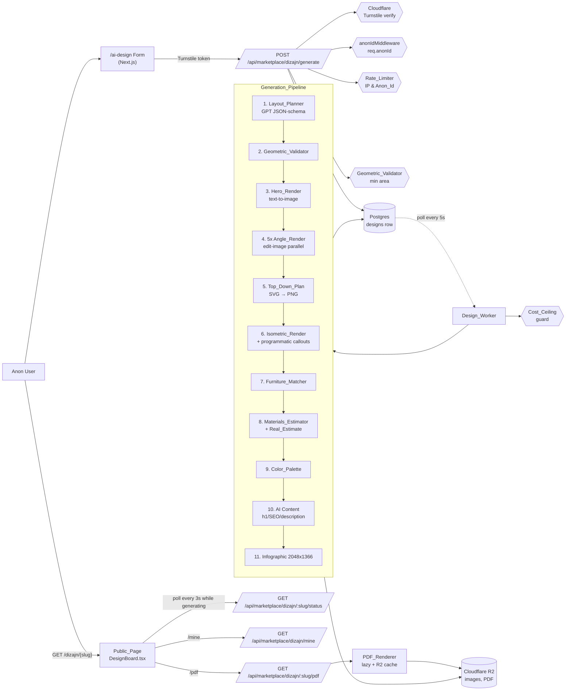
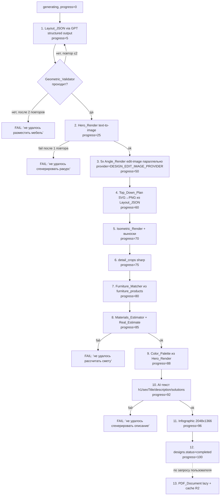
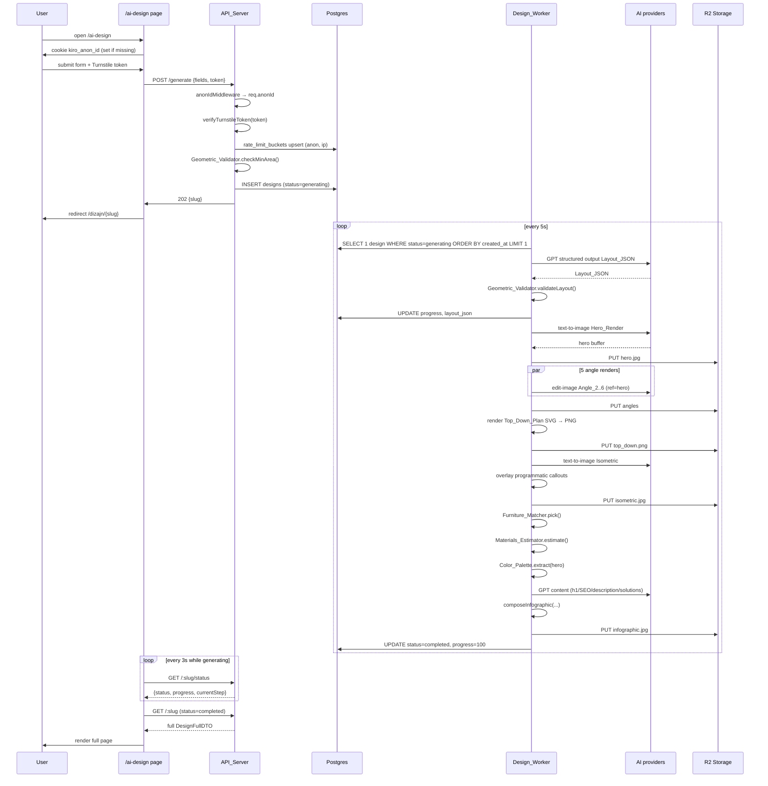

# Design Document: AI_Design_Product

## Overview

`AI_Design_Product` — самостоятельная продуктовая линия на домене chestnye-mastera.ru. Анонимный пользователь без авторизации заполняет форму на `/ai-design`, через 3–5 минут получает законченный дизайн-проект (`Design_Project`) на странице `/dizajn/{slug}` и может скачать PDF.

Дизайн принципиально расширяет, а не переписывает существующую инфраструктуру:

- таблица `designs` получает новые поля и индексы (миграция в этом спеке);
- `Design_Worker` (`artifacts/api-server/src/lib/designWorker.ts`) превращается в детерминированный конечный автомат с десятью шагами `Generation_Pipeline` и явным `Cost_Ceiling`-guard'ом;
- `falAi.ts`, `designContent.ts`, `infographicComposer.ts`, `colorExtraction.ts`, R2-загрузка остаются в строю и переиспользуются;
- появляются новые модули: `Captcha_Provider` (`lib/turnstile.ts`), `Rate_Limiter` для дневных лимитов (`lib/designRateLimit.ts`), `Anon_Id_Middleware` (`middlewares/anonIdMiddleware.ts`), `Geometric_Validator` (`lib/geometricValidator.ts`), `Layout_Planner` (`lib/layoutPlanner.ts`), `Top_Down_Plan_Renderer` (`lib/topDownPlan.ts`), `Isometric_Callout_Renderer` (`lib/isometricCallouts.ts`), `Furniture_Matcher` (`lib/furnitureMatcher.ts`), `Materials_Estimator` (`lib/materialsEstimator.ts`), `Cost_Guard` (`lib/designCostGuard.ts`), `PDF_Renderer` (`lib/pdfRenderer.ts`);
- появляются новые таблицы: `furniture_products`, `finishing_materials`, `rate_limit_buckets`. Городские коэффициенты работ хранятся как новый столбец в существующей `cities`.

В дизайне зафиксированы пять инженерных решений, потребовавших обоснования:

1. **`Captcha_Provider` — Cloudflare Turnstile** (vs hCaptcha). Решающий аргумент — UX-friction: Turnstile в 90 % случаев проходит «невидимо», hCaptcha регулярно требует разгадывать картинки. Бесплатно без лимита, малый JS-bundle, простой verify-endpoint.
2. **`Rate_Limiter` — Postgres** (vs Redis). В стэке нет Redis, нагрузка ничтожна. Атомарный `INSERT … ON CONFLICT DO UPDATE` на одной таблице `rate_limit_buckets` обеспечивает идемпотентность без явных локов.
3. **`PDF_Renderer` — Puppeteer (`@sparticuz/chromium-min`)** (vs PDFKit). PDF дублирует разметку публичной страницы, и Puppeteer переиспользует уже написанный CSS вместо ручной верстки. Кириллица — любой системный шрифт без embedded TTF.
4. **`PDF` — ленивый рендер с кэшем в R2** (vs eager в пайплайне). Большинство пользователей не нажимают «Скачать PDF»; eager-рендер в каждом проекте поджигает 3–8 секунд CPU и режет `Cost_Ceiling`. Lazy + R2-cache даёт тот же UX без оверхеда.
5. **Identity_Preservation — фиксированный пилот FLUX Kontext Pro vs gpt-image-1.5 edit с пятью измеримыми критериями**. Решение принимается до запуска прод-генераций; победитель закрепляется в env `DESIGN_EDIT_IMAGE_PROVIDER`, читается воркером без пересборки.

Стратегически продукт меняет роль AI-дизайна: 50 редакторских `Showcase_Project` остаются как SEO-витрина, форма создаёт пользовательские проекты — оба режима живут в одной таблице, отличаясь только наличием `anon_id`.

## Architecture

### Высокоуровневая диаграмма компонентов



### Generation_Pipeline и его прогресс

`Design_Worker` обрабатывает одну запись `designs` со статусом `generating` за тик (5 секунд), от старой к новой по `created_at` (Requirement 5.1). После каждого крупного шага (Requirement 5.2) воркер делает `UPDATE designs SET progress=… , current_step=… WHERE id=…`.



**Обязательные шаги** (Requirement 14.1): 1 (Layout_JSON), 2 (Hero_Render), 8 (Real_Estimate), 10 (AI-текст). Их сбой → `failed`.
**Опциональные** (Requirement 14.1): часть Angle_Render помимо Hero, 4 (Top_Down_Plan), 5 (Isometric), 7 (мебель), 9 (палитра), 11 (Infographic), 13 (PDF). Их сбой → пайплайн идёт дальше с пустыми полями.

### Data-flow одной генерации



### Cost-guard и budget enforcement

Каждый AI-вызов пишется в `design_generations(designId, costKopeks, status, …)` (существующая таблица). Перед каждым следующим шагом `Design_Worker` берёт `SELECT SUM(cost_kopeks) FROM design_generations WHERE design_id = ?`. Если сумма превысила `Cost_Ceiling` (Requirement 14.5), пайплайн прерывается с `failed` и `error_message = "превышен бюджет генерации"`. Лимит хранится в env `DESIGN_COST_CEILING_KOPEKS` (значение по умолчанию: 3000 копеек ≈ 30 ₽ ≈ $0.30 при курсе 100). Реализация: `lib/designCostGuard.ts`, вызывается из `processDesign()` после каждого AI-вызова.

### Identity_Preservation: пилот и фиксация выбора

Пилот (Requirement 7.6) проводится один раз на стадии разработки и не является частью runtime. Артефакт пилота — отдельный документ `.kiro/specs/ai-design-product/identity-preservation-pilot.md`, создаваемый в задаче 1.x и фиксирующий:

1. **Выборку**: 14 проектов (по 2 на каждый из 7 стилей) для `bedroom` 16 м² с одинаковым `Layout_JSON` для обеих веток. Для каждого проекта генерируется Hero_Render + 5 Angle_Render через `gpt_image_1_5_edit` и через `flux_kontext_pro`. Итого 14 × 6 × 2 = 168 рендеров.
2. **Метрики**:
   - **CLIP image similarity** между Hero_Render и каждым Angle_Render (через `@xenova/transformers` или внешний CLIP-сервис), целевое значение ≥ 0.85.
   - **Δ E (CIELAB)** между палитрой Hero_Render и Angle_Render (используется существующий `colorExtraction.ts` для извлечения 5 цветов с обеих сторон, сравнение по доминирующему цвету), целевое значение ≤ 5.
   - **Стоимость одного Angle_Render** в копейках (берётся из `design_generations.cost_kopeks`).
3. **Решение**: побеждает провайдер с большей долей пар, прошедших оба порога. Если разница меньше 1 победы — выбирается более дешёвый.
4. **Фиксация**: env-переменная `DESIGN_EDIT_IMAGE_PROVIDER ∈ {gpt_image_1_5_edit, flux_kontext_pro}`, дефолт после пилота прописывается в `.env.example` и читается воркером через `lib/designConfig.ts.getEditImageProvider()`. Обе обёртки (существующая `falGenerateGptImageEdit` и новая `falGenerateFluxKontextPro`) дают одинаковый интерфейс `FalGenerationResult`, что позволяет переключаться без переделки пайплайна.

### Расположение в репозитории

| Артефакт | Путь |
| --- | --- |
| HTTP-маршруты формы и polling | `artifacts/api-server/src/routes/dizajn.ts` (расширение существующего файла) |
| Маршрут PDF | `artifacts/api-server/src/routes/dizajn.ts` (`GET /:slug/pdf`) |
| Маршрут «мои дизайны» | `artifacts/api-server/src/routes/dizajn.ts` (`GET /mine`) |
| Маршрут polling статуса | `artifacts/api-server/src/routes/dizajn.ts` (`GET /:slug/status`) |
| Admin endpoint для Showcase_Project | `artifacts/api-server/src/routes/admin/dizajnShowcase.ts` (новый, feature-flag) |
| Воркер | `artifacts/api-server/src/lib/designWorker.ts` (рефакторинг под FSM) |
| Anon_Id middleware | `artifacts/api-server/src/middlewares/anonIdMiddleware.ts` (новый) |
| Captcha verify | `artifacts/api-server/src/lib/turnstile.ts` (новый) |
| Rate limiter | `artifacts/api-server/src/lib/designRateLimit.ts` (новый) |
| Layout planner | `artifacts/api-server/src/lib/layoutPlanner.ts` (новый) |
| Geometric validator | `artifacts/api-server/src/lib/geometricValidator.ts` (новый) |
| Top-down plan SVG | `artifacts/api-server/src/lib/topDownPlan.ts` (новый) |
| Isometric callouts | `artifacts/api-server/src/lib/isometricCallouts.ts` (новый, заменяет hardcoded `buildIsometricCalloutsSvg`) |
| Furniture matcher | `artifacts/api-server/src/lib/furnitureMatcher.ts` (новый) |
| Materials estimator | `artifacts/api-server/src/lib/materialsEstimator.ts` (новый) |
| Cost guard | `artifacts/api-server/src/lib/designCostGuard.ts` (новый) |
| PDF renderer | `artifacts/api-server/src/lib/pdfRenderer.ts` (новый) |
| Существующие модули | `falAi.ts`, `designContent.ts`, `infographicComposer.ts`, `colorExtraction.ts` (без поломки контракта) |
| Front | `artifacts/marketplace/components/dizajn/DesignBoard.tsx`, новый `app/ai-design/page.tsx`, новый `app/dizajn/mine/page.tsx` |
| Миграция | `artifacts/api-server/migrations/2026-01-15-ai-design-product.sql` (один файл) |
| Drizzle-схемы | `lib/db/src/schema/designs.ts` (расширение), новые `furniture-products.ts`, `finishing-materials.ts`, `rate-limit-buckets.ts`, расширение `settings.ts` |

### Совместимость с существующей кодовой базой

| Существующий модуль | Что меняется в этой фиче | Что не трогаем |
|---|---|---|
| `designWorker.ts` | новые шаги: Layout_JSON, Geometric_Validator, Top_Down_Plan, Iso-callouts, furniture/materials picking, Real_Estimate, cost guard | стиль организации шагов, watchdog 10 минут, запись в `design_generations` |
| `falAi.ts` | новая обёртка `falGenerateFluxKontextPro` | существующие `falGenerate*` остаются как есть |
| `designContent.ts` | новый экспорт `generateLayoutJson(input)` через `response_format: json_schema` | существующая `generateDesignContent` для текстов остаётся |
| `colorExtraction.ts` | без изменений | весь модуль |
| `infographicComposer.ts` | заменить хардкоженный `buildFloorPlanSvg` на вставку готового PNG `top_down_plan_url`, удалить хардкоженный `buildIsometricCalloutsSvg` (теперь выноски рисуются на этапе `Isometric_Render`) | сама компоновка 2048×1366, шрифты, цвета |
| `objectStorage.ts` | без изменений; используем существующий paтtern `uploadJpegToR2` для PNG/SVG/PDF | весь модуль |
| `DesignBoard.tsx` | новые блоки: «Подобранная мебель», «Скачать PDF», «Вид сверху» получает `top_down_plan_url` вместо placeholder | существующая разметка для views, palette, materials, estimate, solutions |
| cookie `kiro_anon_id` | добавляется server-side `anonIdMiddleware` для случаев, когда cookie ещё не выставлена front-end'ом (Requirement 4.2) | сама cookie, её срок жизни 365 дней, формат UUID v4 |

## Components and Interfaces

Все новые модули кладутся в `artifacts/api-server/src/lib/` (для совместимости с импортами в `designWorker.ts`) и в `artifacts/api-server/src/middlewares/` (для middleware). UI-часть — `artifacts/marketplace/components/DesignBoard*.tsx`.

### Anon_Id_Middleware (Requirement 4.2)

Express middleware, который читает cookie `kiro_anon_id`, проверяет её на UUID v4, и при отсутствии или невалидном значении генерирует новую и ставит её в response. Кладёт `req.anonId` для downstream-кода.

Регистрируется в `app.ts` **после** `cookieParser()` (строка 139) и **до** `app.use("/api", router)` (строка 1006). Это гарантирует, что любой эндпоинт под `/api/marketplace/dizajn` уже видит `req.anonId` без ручного парсинга в каждом route.

```ts
// middlewares/anonIdMiddleware.ts
import type { Request, Response, NextFunction } from "express";
import { randomUUID } from "node:crypto";

const COOKIE_NAME = "kiro_anon_id";
const COOKIE_MAX_AGE_MS = 365 * 24 * 60 * 60 * 1000;
const UUID_RE = /^[0-9a-f]{8}-[0-9a-f]{4}-[0-9a-f]{4}-[0-9a-f]{4}-[0-9a-f]{12}$/i;

declare global {
  namespace Express {
    interface Request { anonId?: string; }
  }
}

export function anonIdMiddleware(req: Request, res: Response, next: NextFunction): void {
  const fromCookie = req.cookies?.[COOKIE_NAME];
  if (typeof fromCookie === "string" && UUID_RE.test(fromCookie)) {
    req.anonId = fromCookie;
    return next();
  }
  const fresh = randomUUID();
  res.cookie(COOKIE_NAME, fresh, {
    httpOnly: true,
    secure: process.env.NODE_ENV === "production",
    sameSite: "lax",
    maxAge: COOKIE_MAX_AGE_MS,
    path: "/",
  });
  req.anonId = fresh;
  next();
}
```

### Captcha_Provider (Cloudflare Turnstile)

**Решение и обоснование.** Сравнили Cloudflare Turnstile и hCaptcha по пяти критериям:

| Критерий | Cloudflare Turnstile | hCaptcha |
| --- | --- | --- |
| Стоимость | Бесплатно, без лимита | Бесплатно до 1 000 проверок/мес |
| UX-friction | Чаще всего «невидимый» (managed challenge) | Чек-боксы, иногда puzzle-картинки |
| Доступность из РФ | Стабильно через Cloudflare CDN | Доступен, но иногда медленнее |
| Размер JS на странице | ~25 KB | ~70 KB |
| Серверная верификация | Один POST на `https://challenges.cloudflare.com/turnstile/v0/siteverify` | Один POST на `https://hcaptcha.com/siteverify` |

Выбор — **Cloudflare Turnstile**: ради UX (анонимные пользователи в воронке не должны разгадывать картинки) и низкого bundle-размера. Если в продакшне Turnstile окажется слабым против целевых ботов, замена на hCaptcha делается в одном модуле без переделки роутов.

**Интерфейс модуля.**

```ts
// lib/turnstile.ts
export interface TurnstileVerifyResult {
  success: boolean;
  errorCodes: string[];        // непустой массив при success=false
  challengeTs: string | null;  // ISO-8601 от Cloudflare
  hostname: string | null;
  action: string | null;       // "ai_design_submit"
}

export async function verifyTurnstileToken(input: {
  token: string;
  remoteIp: string | null;
  expectedAction?: string;
}): Promise<TurnstileVerifyResult>;
```

**Конфигурация.**

- `TURNSTILE_SITE_KEY` — публичный ключ, рендерится в `<form>` на `/ai-design`.
- `TURNSTILE_SECRET_KEY` — серверный ключ, читается только в `lib/turnstile.ts`.
- `expectedAction` — `"ai_design_submit"`. Несовпадение действия трактуется как `success=false`.
- В dev-окружении без `TURNSTILE_SECRET_KEY` функция возвращает `success=true`, чтобы не блокировать E2E.

**Где вызывается.** Первая проверка в `POST /api/marketplace/dizajn/generate`, до парсинга остальных полей формы (Requirement 3.2). При `success=false` — `400 invalid_captcha`, без записи в `designs` и без обращений к AI-провайдерам.

### Rate_Limiter

**Решение: Postgres**, не Redis. В стэке нет Redis, нагрузка ничтожна (десятки запросов/час), атомарный upsert через `INSERT … ON CONFLICT DO UPDATE` решает race condition без явных локов, отдельной инфраструктуры не требуется.

Отдельная таблица `rate_limit_buckets` (см. Data Models) хранит один счётчик на ключ `bucket_key` + начало текущего 24-часового окна. Окно реализуется как fixed window: при первом запросе `window_start = NOW()`, при следующих счётчик растёт; когда `NOW() - window_start > 24h` — счётчик и `window_start` сбрасываются. Это ослабляет точность (в худшем случае пользователь делает 2× лимита за стык окон), но проще и достаточно для антибот-защиты MVP.

**Интерфейс.**

```ts
// lib/designRateLimit.ts
export type RateLimitKind = "anon" | "ip";

export interface RateLimitResult {
  allowed: boolean;
  remaining: number;
  retryAfterSeconds: number;
}

const LIMITS: Record<RateLimitKind, number> = {
  anon: 3, // Requirement 3.4
  ip: 5,   // Requirement 3.3
};

/**
 * Атомарный инкремент счётчика и проверка лимита.
 * При выходе за окно счётчик сбрасывается до 1.
 */
export async function checkAndIncrement(
  kind: RateLimitKind,
  rawKey: string,
): Promise<RateLimitResult>;

/**
 * Откат инкремента — Requirement 3.6: отказы по валидации формы и
 * Geometric_Validator.preflight в лимит не попадают.
 */
export async function decrement(kind: RateLimitKind, rawKey: string): Promise<void>;
```

**Реализация атомарного шага** (упрощённо):

```sql
INSERT INTO rate_limit_buckets (bucket_key, counter, window_start, updated_at)
VALUES ($1, 1, NOW(), NOW())
ON CONFLICT (bucket_key) DO UPDATE
SET counter = CASE
      WHEN NOW() - rate_limit_buckets.window_start > INTERVAL '24 hours' THEN 1
      ELSE rate_limit_buckets.counter + 1
    END,
    window_start = CASE
      WHEN NOW() - rate_limit_buckets.window_start > INTERVAL '24 hours' THEN NOW()
      ELSE rate_limit_buckets.window_start
    END,
    updated_at = NOW()
RETURNING counter, window_start;
```

**Порядок проверок в `POST /generate`** (Requirement 3.2, 3.6):

1. `verifyTurnstileToken(...)` — fail → 400.
2. `checkAndIncrement("anon", req.anonId!)` и `checkAndIncrement("ip", clientIp)` — fail → 429.
3. Валидация формы — fail → 400 + `decrement` обоих счётчиков.
4. `Geometric_Validator.checkMinArea(...)` — fail → 400 + `decrement`.
5. `INSERT INTO designs (...)` со `status = "generating"`. Запись считается «использованной» в лимите.

При сбое в воркере по `Cost_Ceiling` (Requirement 3.7) `decrement` намеренно **не** вызывается: пользователь уже потратил AI-вызовы, лимит должен учитывать.

### Geometric_Validator (Requirement 2)

Геометрический валидатор работает в двух режимах:

1. **Pre-flight (`checkMinArea`).** Срабатывает в HTTP-обработчике до INSERT. Сверяет `area_sqm = (width_cm * length_cm) / 10000` с порогом из таблицы.
2. **Post-Layout (`validateLayout`).** Срабатывает в воркере сразу после получения `Layout_JSON`. Проверяет вмещение, пересечения и проходы.

**Минимальные площади (Requirement 2.2).**

| `room_type` | Минимум, м² |
| --- | --- |
| bedroom | 6 |
| kitchen | 4 |
| bathroom | 2 |
| living_room | 8 |
| hallway | 1.5 |
| nursery | 6 |
| apartment | 18 |

**Алгоритм проверки прохода 60 см** (Requirement 2.6) — выбран **BFS на сетке** с шагом 5 см:

1. Дискретизируем комнату в матрицу `cells[width_cm/5][length_cm/5]`. Для комнаты 8×8 м это 160×160 = 25 600 ячеек, BFS укладывается в десятки миллисекунд.
2. Помечаем все ячейки, занятые мебелью (с учётом `rotation_deg`), как `BLOCKED`.
3. Расширяем `BLOCKED` зону на 30 см во все стороны (морфологическая дилатация на радиус 6 ячеек). Идея: после дилатации центр клетки `FREE` означает, что в эту точку помещается окружность радиусом 30 см, то есть проход шириной не меньше 60 см.
4. Помечаем ячейку у двери как стартовую `START`.
5. Для каждого функционального предмета (для `bedroom` это `bed` и `wardrobe` — Requirement 2.6) запускаем BFS от `START` по `FREE` ячейкам. Если BFS дошёл до соседней с предметом `FREE` ячейки — проход есть.

Это даёт точное определение «проход 60 см от двери до функциональной мебели» и легко обобщается на L-образные комнаты в будущем.

**Интерфейс.**

```ts
// lib/geometricValidator.ts
export type Wall = "north" | "east" | "south" | "west";

export interface RoomDims {
  widthCm: number;
  lengthCm: number;
  heightCm: number;
  doorWall: Wall;
  doorOffsetCm: number;
  doorWidthCm: number;
  windowWall?: Wall | null;
  windowOffsetCm?: number | null;
  windowWidthCm?: number | null;
}

export interface FurnitureItem {
  id: string;
  type: string;
  widthCm: number;
  depthCm: number;
  heightCm: number;
  xCm: number;
  yCm: number;
  rotationDeg: 0 | 90 | 180 | 270;
}

export interface ValidationViolation {
  code: "OUT_OF_ROOM" | "INTERSECTS" | "BLOCKS_DOOR"
      | "PATH_TOO_NARROW" | "NO_PATH_TO_FUNCTIONAL_ITEM";
  itemIds: string[];
  detailRu: string;     // для подсказки в повторном GPT-запросе
}

export interface ValidationResult {
  ok: boolean;
  violations: ValidationViolation[];
}

export function checkMinArea(
  roomType: string,
  widthCm: number,
  lengthCm: number,
): { ok: boolean; areaSqm: number; minSqm: number };

export function validateLayout(
  room: RoomDims,
  furniture: FurnitureItem[],
): ValidationResult;
```

**Подсказка для повтора.** При нарушениях `Layout_Planner` вызывает GPT повторно с системным сообщением «Предыдущий план нарушал: <list>. Попробуй заново. Не более 2 попыток.» Полный текст ошибок сохраняется в `design_generations.provider_response` для аудита.

### Layout_Planner (Requirement 6)

Обёртка над AI_Content_Provider, формирующая `Layout_JSON` через JSON-schema structured output (`response_format: { type: "json_schema", json_schema: {...} }`). Использует тот же `OpenAI` клиент, что и `generateDesignContent`.

**Полная JSON-схема Layout_JSON** (передаётся в `response_format`):

```json
{
  "name": "RoomLayout",
  "strict": true,
  "schema": {
    "type": "object",
    "additionalProperties": false,
    "required": ["room", "door", "window", "furniture"],
    "properties": {
      "room": {
        "type": "object",
        "additionalProperties": false,
        "required": ["roomType", "widthCm", "lengthCm", "heightCm"],
        "properties": {
          "roomType": {
            "type": "string",
            "enum": ["bedroom","kitchen","bathroom","living_room","hallway","nursery","apartment"]
          },
          "widthCm":  { "type": "integer", "minimum": 200, "maximum": 800 },
          "lengthCm": { "type": "integer", "minimum": 200, "maximum": 800 },
          "heightCm": { "type": "integer", "minimum": 220, "maximum": 350 }
        }
      },
      "door": {
        "type": "object",
        "additionalProperties": false,
        "required": ["wall", "offsetCm", "widthCm"],
        "properties": {
          "wall":    { "type": "string", "enum": ["north","east","south","west"] },
          "offsetCm":{ "type": "integer", "minimum": 0, "maximum": 800 },
          "widthCm": { "type": "integer", "minimum": 70, "maximum": 110 }
        }
      },
      "window": {
        "type": ["object", "null"],
        "additionalProperties": false,
        "required": ["wall", "offsetCm", "widthCm"],
        "properties": {
          "wall":    { "type": "string", "enum": ["north","east","south","west"] },
          "offsetCm":{ "type": "integer", "minimum": 0, "maximum": 800 },
          "widthCm": { "type": "integer", "minimum": 60, "maximum": 400 }
        }
      },
      "furniture": {
        "type": "array", "minItems": 1, "maxItems": 12,
        "items": {
          "type": "object",
          "additionalProperties": false,
          "required": ["id","type","widthCm","depthCm","heightCm","xCm","yCm","rotationDeg"],
          "properties": {
            "id":          { "type": "string", "pattern": "^[a-z0-9_-]{1,32}$" },
            "type": {
              "type": "string",
              "enum": ["bed","wardrobe","desk","chair","nightstand","rug","dresser","shelf","sofa","armchair","tv_unit","coffee_table","dining_table","kitchen_island","sink","toilet","bathtub","shower","mirror","cabinet"]
            },
            "widthCm":    { "type": "integer", "minimum": 20, "maximum": 400 },
            "depthCm":    { "type": "integer", "minimum": 20, "maximum": 400 },
            "heightCm":   { "type": "integer", "minimum": 10, "maximum": 280 },
            "xCm":        { "type": "integer", "minimum": 0,  "maximum": 800 },
            "yCm":        { "type": "integer", "minimum": 0,  "maximum": 800 },
            "rotationDeg":{ "type": "integer", "enum": [0, 90, 180, 270] }
          }
        }
      }
    }
  }
}
```

`additionalProperties: false` на каждом уровне обязателен — иначе GPT начинает добавлять `"comments"` и ломает парсинг. Все числа integer в сантиметрах: дробные см избыточны для интерьерного плана. `rotationDeg` ограничен enum'ом 0/90/180/270, что позволяет использовать AABB вместо OBB в `Geometric_Validator` и достаточен для bedroom MVP.

**Интерфейс.**

```ts
// lib/layoutPlanner.ts
export type LayoutJson = {
  room: { roomType: string; widthCm: number; lengthCm: number; heightCm: number };
  door: { wall: Wall; offsetCm: number; widthCm: number };
  window: { wall: Wall; offsetCm: number; widthCm: number } | null;
  furniture: FurnitureItem[];
};

export async function generateLayoutJson(input: {
  roomType: string;
  widthCm: number;
  lengthCm: number;
  heightCm: number;
  style: string;
  budget: number;
  features?: string[];
  previousViolations?: ValidationViolation[];
}): Promise<LayoutJson>;
```

`previousViolations` подаётся при повторных попытках (Requirement 2.7) — конкретный список нарушений включается в подсказку модели, чтобы она знала, что именно поправить.

### Top_Down_Plan_Renderer (Requirement 8)

**Стэк отрисовки:** SVG генерируется как строка → `sharp` конвертирует в PNG → загрузка в R2 как `dizajn/plans/{designId}.png`. SVG не сохраняется отдельно, потому что `DesignBoard.tsx` потребляет один URL изображения и не различает форматы.

**Выбор `sharp` для SVG → PNG**: модуль уже стоит в зависимостях `api-server` и используется в `colorExtraction.ts` и `infographicComposer.ts`; libvips/librsvg внутри `sharp` корректно рендерит SVG до 2048×2048 с антиалиасингом. Альтернатива `@resvg/resvg-js` даёт более точный rendering, но добавила бы новую зависимость без видимой выгоды.

```ts
// lib/topDownPlan.ts
import type { LayoutJson } from "./layoutPlanner.js";

export async function renderTopDownPlanPng(
  layout: LayoutJson,
): Promise<Buffer>;

export async function uploadTopDownPlan(
  designId: number,
  png: Buffer,
): Promise<string /* R2 key */>;
```

**Шаблон bedroom**:
- чёрно-белая схема, оси с подписями длин стен в см (Requirement 8.4),
- прямоугольник на каждый предмет мебели с подписями (Requirement 8.3),
- для главной мебели (`bed`, `wardrobe`) подпись содержит габариты в формате `Кровать 160×200`,
- стены, дверь (с дугой открывания), окно — по координатам из `Layout_JSON` (Requirement 8.2).

Остальные типы помещения дают placeholder; шаблон bedroom — единственный реализованный на MVP. **Важное ограничение Requirement 8.5:** для `bedroom` программная отрисовка — единственный вариант, fallback на AI **запрещён** даже при ошибке. При сбое `sharp.png()` (например, невалидный SVG) `Design_Worker` логирует ошибку и оставляет `top_down_plan_url = null`, страница не показывает блок «Вид сверху» (Requirement 14.4).

### Isometric_Callout_Renderer (Requirement 9)

Заменяет хардкоженный `buildIsometricCalloutsSvg` из `infographicComposer.ts` (он будет удалён) на координаты, вычисляемые из `Layout_JSON`.

**Изометрическая проекция.** Для AI-сгенерированного `Isometric_Render` нет точных параметров камеры — это пиксельный рендер, а не 3D-сцена. Поэтому делаем калибровочную проекцию: считаем, что комната в кадре нарисована стандартной isometric-проекцией под углом 30° с равномерным масштабом, центрированная в середине изображения. Формулы:

```
screen_x = (x_cm - y_cm) * cos(30°) * scale + cx
screen_y = (x_cm + y_cm) * sin(30°) * scale - z_cm * scale + cy
```

где `(cx, cy)` — пиксельный центр изображения, `scale` — единый коэффициент пикселей на см, подбираемый так, чтобы прямоугольник комнаты целиком влезал в кадр с отступом 10 %. Точка предмета: `(x_cm + width/2, y_cm + depth/2, height_cm)` — верхняя грань bbox.

Эта аппроксимация неидеальна: если AI нарисовал комнату не строго изометрически, выноски могут «съезжать» на 10–15 пикселей. Для MVP это допустимо, и риск минимизируется тем, что `buildIsometricPrompt` явно требует от модели «axonometric isometric view» (так уже зашито в `designWorker.ts`). Когда в будущей итерации Isometric_Render будет рисоваться программно (например, через Three.js на сервере), формула станет точной без переписывания вызывающего кода.

**Композитинг.** SVG со всеми выносками рендерится как один файл размером совпадающим с PNG-исходником и накладывается через `sharp(pngBuffer).composite([{ input: svgBuffer, top: 0, left: 0 }]).jpeg()`. Готовый JPEG сохраняется в `dizajn/isometric/{designId}.jpg` и кладётся в массив `designs.views` на позицию 5 (Requirement 9.4 + совместимость с текущим `DesignBoard.tsx`).

```ts
// lib/isometricCallouts.ts
export async function composeIsometricWithCallouts(
  baseImage: Buffer,
  layout: LayoutJson,
  roomType: string,
): Promise<Buffer>;
```

Список типов мебели для выносок (Requirement 9.2): для `bedroom` — `bed`, `wardrobe`, `nightstand`, `desk`. Подписи раскладываются по углам кадра, чтобы не перекрываться.

### Furniture_Matcher (Requirement 10)

Чистая функция без I/O помимо одного `SELECT` из `furniture_products`. Результат записывается в новое поле `designs.picked_furniture` (JSONB-массив `PickedFurnitureRow[]`).

```ts
// lib/furnitureMatcher.ts
export interface PickedFurnitureRow {
  layoutId: string;            // FurnitureItem.id из Layout_JSON
  type: string;
  sku: string | null;          // null = «не подобрано»
  name: string | null;
  pricePaidKopeks: number;     // 0 если sku=null
  partnerUrl: string | null;
  imageUrl: string | null;
}

export async function pickFurniture(input: {
  layout: LayoutJson;
  roomType: string;
  style: string;
  budgetRub: number;
}): Promise<PickedFurnitureRow[]>;
```

**Условия отбора SKU** (Requirement 10.3):
- `is_available = true`,
- `room_types @> ARRAY[roomType]`,
- `style_tags` содержит выбранный стиль или совместимый (см. таблица совместимости стилей ниже),
- `|width - layoutItem.widthCm| ≤ 15 см` И аналогично для depth и height.

Таблица совместимости стилей:

| Базовый стиль | Совместимые |
| --- | --- |
| modern | modern, minimalism, scandinavian |
| scandinavian | scandinavian, minimalism, japandi |
| minimalism | minimalism, modern, scandinavian, japandi |
| japandi | japandi, scandinavian, minimalism |
| loft | loft, modern |
| neoclassic | neoclassic, classic, modern |
| classic | classic, neoclassic |

**Постпроцесс по бюджету** (Requirement 10.4): если суммарная цена выбранных SKU превышает 45 % от `budget` (доля мебели в распределении сметы), самые дорогие SKU заменяются на более дешёвые альтернативы из тех же кандидатов. Если для типа предмета нет ни одного подходящего SKU (Requirement 10.5), `sku=null`, `pricePaidKopeks=0`, пайплайн продолжается; в UI показывается заглушка «уточняется».

### Materials_Estimator (Requirement 11)

Считает 4 компоненты: материалы, мебель, работы (по `cities.work_coefficient_kopeks_per_sqm`), прочие расходы (10 % от первых трёх). Пишет результат в существующее поле `designs.estimate` (`DesignEstimateItem[]`), сохраняя совместимость с текущим UI.

```ts
// lib/materialsEstimator.ts
export async function buildRealEstimate(input: {
  layout: LayoutJson;
  roomType: string;
  style: string;
  cityId: number | null;
  pickedFurniture: PickedFurnitureRow[];
}): Promise<DesignEstimateItem[]>;
```

**Формула** (Requirement 11.3):
- `materialsKopeks = Σ category∈{walls,floor,ceiling,other} (price_per_unit × surfaceArea(category))`,
- `furnitureKopeks = Σ pickedFurniture[i].pricePaidKopeks`,
- `worksKopeks = workCoeffKopeksPerSqm × roomAreaSqm`. Если `cityId IS NULL`, используется `DEFAULT_WORK_COEFF_KOPEKS_PER_SQM = 800_000` (8000 ₽/м² по умолчанию).
- `otherKopeks = round(0.1 × (materials + furniture + works))`.

Площади поверхностей: пол = ceiling = `width × length / 10000`; стены = `(2 × (width + length) × heightCm / 10000) - 4` (вычитаем 4 м² на дверь и окно как упрощение MVP).

Возвращает массив из ровно 4 элементов в фиксированном порядке: `["Отделочные материалы", "Мебель", "Работы", "Прочие расходы"]` (Requirement 11.5). Если все четыре компоненты получились нулевыми (Requirement 11.7), массив содержит четыре нуля без подмены на минимум — `Math.round(0) = 0` и нигде нет `Math.max(default, value)`.

### Cost_Guard (Requirement 14.5)

Перед каждым AI-вызовом и сразу после — `enforceCostCeiling(designId)`. При превышении бросает `BudgetExceededError`, который `processDesign()` ловит и переводит запись в `failed` с `error_message = "превышен бюджет генерации"`.

```ts
// lib/designCostGuard.ts
export class BudgetExceededError extends Error {
  constructor(public readonly designId: number, public readonly spentKopeks: number) {
    super(`превышен бюджет генерации (${spentKopeks} коп.)`);
    this.name = "BudgetExceededError";
  }
}

export async function enforceCostCeiling(designId: number): Promise<void>;
```

Лимит читается из env `DESIGN_COST_CEILING_KOPEKS` (default 3000).

### PDF_Renderer (Requirement 13)

**Решение: Puppeteer (через `@sparticuz/chromium-min`)**, не PDFKit.

Сравнение:

| Критерий | Puppeteer + HTML/CSS | PDFKit |
| --- | --- | --- |
| Кириллица | Любой системный шрифт через CSS, без TTF embedding | Требует embedded DejaVu Sans / Roboto |
| Объём кода | Минимальный — переиспользует CSS публичной страницы | Высокий — ручное позиционирование таблиц, картинок, текстов |
| Размер бандла | ~80 МБ (chromium-min) | ~5 МБ |
| Время рендера | 3–8 с на 10-страничный документ | < 1 с |
| Качество вёрстки таблиц/картинок | Нативное HTML | Ручная работа |

PDF фактически дублирует разметку публичной `/dizajn/{slug}` (та же информация, тот же стиль). Puppeteer переиспользует уже написанный CSS и сокращает объём дополнительной работы. Размер бандла — единичная стоимость деплоя. PDFKit пришлось бы повторно реализовать вёрстку 10–14 страниц с таблицами, 6 ракурсами, инфографикой и многострочным описанием — это много кода без видимой выгоды.

**Lazy + R2-cache** (Requirement 13.4–13.5). Большинство пользователей не нажимают «Скачать PDF», и предварительный рендер в каждом проекте поджигает CPU и не вписывается в `Cost_Ceiling`. Реализация:

1. `GET /api/marketplace/dizajn/:slug/pdf` проверяет существование `dizajn/pdf/{designId}.pdf` в R2. Если есть — стримит напрямую с `Content-Disposition: attachment`.
2. Если нет — синхронно рендерит, сохраняет в R2, отдаёт.
3. Внутри есть soft-lock через флаг `designs.pdf_rendering_at` (timestamp): если другой запрос уже рендерит, текущий ждёт до 30 секунд опросом R2.

```ts
// lib/pdfRenderer.ts
export async function renderDesignPdf(designId: number, html: string): Promise<Buffer>;
export async function getOrRenderPdf(designId: number): Promise<Buffer>;
```

При ошибке рендера ответ `503 pdf_temporarily_unavailable` (Requirement 13.6); страница `/dizajn/{slug}` остаётся доступной.

### routes/dizajn.ts — изменения и новые эндпоинты

Существующие `POST /generate`, `GET /:slug`, `GET /`, `POST /:slug/save`, `POST /:slug/lead`, `GET /img/:type/:filename` сохраняются. Добавляются три новых route:

```ts
// НОВЫЙ: лёгкий polling endpoint (Requirement 5.3)
router.get("/:slug/status", async (req, res) => {
  const slug = req.params.slug ?? "";
  const [row] = await db
    .select({
      status: designsTable.status,
      progress: designsTable.progress,
      currentStep: designsTable.currentStep,
      errorMessage: designsTable.errorMessage,
    })
    .from(designsTable)
    .where(eq(designsTable.slug, slug))
    .limit(1);
  if (!row) return res.status(404).json({ ok: false, error: "not_found" });
  res.set("Cache-Control", "no-store");
  res.json({
    ok: true,
    status: row.status,
    progress: row.progress,
    currentStep: row.currentStep,
    errorMessage: row.errorMessage,
  });
});

// НОВЫЙ: список «мои дизайны» (Requirement 4.3)
router.get("/mine", async (req, res) => {
  if (!req.anonId) return res.status(401).json({ ok: false, error: "no_anon_id" });
  const rows = await db.select({
    slug: designsTable.slug,
    roomType: designsTable.roomType,
    style: designsTable.style,
    status: designsTable.status,
    progress: designsTable.progress,
    resultImageUrl: designsTable.resultImageUrl,
    createdAt: designsTable.createdAt,
  }).from(designsTable)
    .where(eq(designsTable.anonId, req.anonId))
    .orderBy(desc(designsTable.createdAt))
    .limit(50);
  res.set("Cache-Control", "no-store");
  res.json({ items: rows });
});

// НОВЫЙ: скачивание PDF (Requirement 13.2)
router.get("/:slug/pdf", async (req, res) => {
  const slug = req.params.slug ?? "";
  const [d] = await db.select({ id: designsTable.id, status: designsTable.status })
    .from(designsTable).where(eq(designsTable.slug, slug)).limit(1);
  if (!d || d.status !== "completed") return res.status(404).end();
  try {
    const buf = await getOrRenderPdf(d.id);
    res.setHeader("Content-Type", "application/pdf");
    res.setHeader("Content-Disposition", `attachment; filename="dizajn-${slug}.pdf"`);
    res.setHeader("Cache-Control", "public, max-age=3600");
    res.end(buf);
  } catch (e) {
    console.error("[dizajn/pdf]", e);
    res.status(503).json({ ok: false, error: "pdf_temporarily_unavailable" });
  }
});
```

`POST /generate` дописывается так: первым шагом `verifyTurnstileToken(token, clientIp)`, потом `checkAndIncrement` для anon и ip, потом `Geometric_Validator.checkMinArea`, потом INSERT. Существующая логика обработки multipart-файла «Было» сохраняется только для `Showcase_Project` (опциональное поле `inputImageUrl`); пользовательский путь через форму `/ai-design` файл не загружает (Requirement 1).

### routes/admin/dizajnShowcase.ts — feature-flagged endpoint (Requirement 15.4–15.5)

```ts
// Подключается в app.ts; отдельный feature-flag через env.
const router = Router();
router.use(requireRole("admin"));

router.post("/", async (req, res) => {
  if (process.env.ENABLE_SHOWCASE_ADMIN_API !== "true") {
    return res.status(404).end();
  }
  // Принимает body с roomType/style/площадью + опциональными h1/description/materials/estimate/solutions.
  // Если эти поля переданы — записывает их в designs, hasSeedContent в Design_Worker
  // возвращает true (через существующую логику), AI-текст не перегенерируется.
  // ...
});
export default router;
```

### Изменения в lib/designWorker.ts

`processDesign(designId)` переписывается с явной разметкой шагов и единым cost-guard'ом:

```ts
async function processDesign(designId: number): Promise<void> {
  const design = await loadDesign(designId);
  const ctx = { designId, bucketId: process.env.DEFAULT_OBJECT_STORAGE_BUCKET_ID! };

  try {
    // Шаг 1. Layout_JSON (required)
    const layout = await runStepRequired("layout_json", 5, async () => {
      return await generateAndValidateLayout(design); // до 2 повторов с violations
    });
    await db.update(designsTable).set({ layoutJson: layout }).where(eq(designsTable.id, design.id));
    await enforceCostCeiling(designId);

    // Шаг 2. Hero_Render (required)
    const hero = await runStepRequired("hero_render", 25, () => generateHero(design, layout));
    await enforceCostCeiling(designId);

    // Шаг 3. 5 Angle_Render через выбранный edit-провайдер (optional each)
    await runStepOptionalEach("angle_renders", 50, () => generateAngleRendersInParallel(design, hero, layout));
    await enforceCostCeiling(designId);

    // Шаг 4. Top_Down_Plan (optional)
    if (design.roomType === "bedroom") {
      await runStepOptional("top_down_plan", 60, () => renderAndUploadTopDownPlan(design, layout, ctx));
    }
    // Шаг 5. Isometric_Render с выносками (optional)
    await runStepOptional("isometric_render", 70, () => renderIsometricWithCallouts(design, layout, ctx));
    await enforceCostCeiling(designId);

    // Шаг 6. Detail crops (optional)
    await runStepOptional("detail_crops", 75, () => buildDetailCrops(design, ctx));

    // Шаг 7. Furniture_Matcher (optional)
    const picked = await runStepOptional("pick_furniture", 80,
      () => pickFurniture({ layout, roomType: design.roomType, style: design.style, budgetRub: design.budget ?? 0 }));

    // Шаг 8. Real_Estimate (required)
    await runStepRequired("real_estimate", 85,
      () => buildRealEstimate({ layout, roomType: design.roomType, style: design.style, cityId: design.cityId, pickedFurniture: picked ?? [] }));

    // Шаг 9. Color_Palette (optional)
    await runStepOptional("color_palette", 88, () => extractAndStorePalette(design, hero));

    // Шаг 10. AI-текст (required)
    await runStepRequired("ai_text", 92, () => generateAndStoreContent(design));
    await enforceCostCeiling(designId);

    // Шаг 11. Infographic (optional)
    await runStepOptional("infographic", 96, () => composeAndUploadInfographic(design));

    await db.update(designsTable).set({
      status: "completed", progress: 100, currentStep: null, updatedAt: new Date(),
    }).where(eq(designsTable.id, design.id));
  } catch (e) {
    if (e instanceof BudgetExceededError) {
      await markFailed(design.id, "превышен бюджет генерации");
    } else if (e instanceof RequiredStepFailedError) {
      await markFailed(design.id, e.userMessage);
    } else {
      throw e;
    }
  }
}
```

`runStepRequired`, `runStepOptional`, `runStepOptionalEach` — обёртки, которые логируют `currentStep`, обновляют `designs.progress`, ловят ошибки внутри opt-веток и возвращают `null` без переброса (для `runStepOptional`); для `runStepRequired` бросают `RequiredStepFailedError(userMessage)` после допустимых повторов.

### UI: изменения в DesignBoard.tsx и форма /ai-design

Без переписывания: добавляются три блока и одна кнопка.

- **Блок «Подобранная мебель»** (Requirement 10.7). Источник — `design.pickedFurniture` (новое поле в DTO). Карточки: `imageUrl` 1×1, название, цена, кнопка-ссылка `partnerUrl`. Для `sku=null` — карточка-плейсхолдер «уточняется».
- **Блок «Вид сверху»** (Requirement 8.7). Источник — `design.topDownPlanUrl`. Если поле пустое — блок не рендерится (Requirement 14.4).
- **Блок «Скачать PDF»** (Requirement 13.1). Кнопка показана только при `status=completed` и при отсутствии флага `pdfRendering`. На клиенте — простой `<a href="/api/marketplace/dizajn/{slug}/pdf" download>`.
- **Прогресс-индикатор** (Requirement 5.4). Используется новый endpoint `GET /:slug/status`. Polling через `setTimeout(3000)` до перехода в `completed` или `failed`. Подпись текущего шага читается из `currentStep`.

Форма `/ai-design`:

- Поля: `roomType` (select из 7 значений, кроме `bedroom` — disabled с подписью «скоро» — Requirement 1.3), `style`, `width_cm`, `length_cm`, `height_cm`, `budget`, опционально город и доп. флаги (`worksZone`, `accentWall`).
- Подсказки рядом с полями размеров (Requirement 1.7) — статический мап `roomType → "обычно 12–18 м²"`.
- Turnstile widget (Requirement 3.1): `<div class="cf-turnstile" data-sitekey={NEXT_PUBLIC_TURNSTILE_SITE_KEY} data-action="ai_design_submit"/>`. Submit заблокирован, пока `cf-turnstile-response` не получен.


## Correctness Properties

*A property is a characteristic or behavior that should hold true across all valid executions of a system — essentially, a formal statement about what the system should do. Properties serve as the bridge between human-readable specifications and machine-verifiable correctness guarantees.*

Эта фича — продуктовый пайплайн с большим количеством pure-логики (`Geometric_Validator`, `pickFurniture`, `buildRealEstimate`, `Top_Down_Plan` рендер, `extractPalette`) и небольшой долей внешних вызовов (Fal.ai, OpenRouter, R2, Postgres). Property-based testing уместен для pure-частей, для оркестрации пайплайна (с моками внешних провайдеров) и для contract-testing формы и rate-limiter. Шаги, тестируемые как INTEGRATION/SMOKE/EXAMPLE, отдельно описаны в Testing Strategy ниже и здесь не повторяются — они закреплены в подсекции «Что НЕ тестируем как PBT» в конце этого раздела.

Перед формулировкой свойств выполнен property reflection (см. prework): 60+ testable пунктов из 15 требований сжаты в 23 свойства за счёт двух движений — (а) объединения близких инвариантов одного компонента в одно охватывающее свойство (например, AABB-containment + non-intersection + door clearance — одно свойство геометрического валидатора, а не три), (б) удаления подмножеств, логически следующих из других свойств (например, structural enum-валидация полей формы — частный случай общего «schema accepts iff all fields valid»).

### Property 1: Form schema accepts valid input and rejects with full violation list

*For any* поданная форма с произвольной комбинацией полей из доменов `roomType`, `style`, `widthCm`, `lengthCm`, `heightCm`, `budgetRub`, и optional флагов, серверная Zod-схема SHALL принять её тогда и только тогда, когда все поля одновременно лежат в допустимых диапазонах из Requirement 1; при отказе ответ SHALL содержать список нарушений по каждому невалидному полю.

**Validates: Requirements 1.1, 1.2, 1.4, 1.5, 1.6, 1.10**

### Property 2: POST /generate has consistent transactional effects

*For any* валидная форма с валидным Captcha-токеном и не превышающим суточный лимит `Anon_Id`/IP, после `POST /api/marketplace/dizajn/generate` в `designs` SHALL появиться ровно одна новая запись с `anon_id` = переданному cookie, `slug` соответствующим pattern `^[a-z0-9-]+$`, `status = 'generating'`, и SHALL быть возвращён ответ 202 с этим `slug`. *For any* невалидная форма (нарушение хотя бы одного из: Captcha, rate-limit, schema, min-area) ни одна новая запись `designs` SHALL не появляться, и ни один AI-провайдер SHALL не вызываться.

**Validates: Requirements 1.8, 1.9, 1.10, 2.3**

### Property 3: MVP room gating

*For any* `roomType` из enum, отличный от `bedroom`, `POST /generate` SHALL возвращать 400 с `error = 'mvp_room_locked'`, и `designs` row SHALL не создаваться.

**Validates: Requirements 1.3**

### Property 4: Captcha verifies before any other validation

*For any* `POST /generate` с невалидным или отсутствующим Turnstile-токеном, ответ SHALL быть 400 с `error = 'invalid_captcha'`, и проверки (rate-limit, min-area, schema на остальные поля) SHALL не запускаться (мониторим через spies на остальные модули). При успешном `Turnstile.verify` остальные проверки запускаются в зафиксированном порядке.

**Validates: Requirements 3.2**

### Property 5: Daily rate-limiter enforces (anonId, ipHash) thresholds with strict 24h window

*For any* последовательность из N попыток создания `Design_Project` с одним `Anon_Id` за окно `(now - 24h, now]`, успешными SHALL быть не более `MAX_ANON_DAILY = 3`; для одного `ipHash` — не более `MAX_IP_DAILY = 5`. Записи `designs` старше 24 часов SHALL не учитываться. Невалидные по форме или min-area попытки (Requirement 1.10, 2.3) SHALL не учитываться, потому что не попадают в `designs`.

**Validates: Requirements 3.3, 3.4, 3.5, 3.6, 3.7**

### Property 6: Min-area pre-flight matches fixed thresholds

*For any* пара `(roomType, areaSqm)`, `checkMinArea` SHALL вернуть `ok = true` тогда и только тогда, когда `areaSqm ≥ MIN_AREAS[roomType]`, где `MIN_AREAS` — таблица из Requirement 2.2. При `ok = false` запись `designs` SHALL не создаваться.

**Validates: Requirements 2.1, 2.2, 2.3, 2.9**

### Property 7: Geometric_Validator detects out-of-room, intersection and door blockage

*For any* `Layout_JSON`, `validateLayout` SHALL вернуть `ok = true` тогда и только тогда, когда одновременно: каждый AABB предмета мебели полностью лежит внутри прямоугольника комнаты, никакие два AABB не пересекаются с допуском более 1 см, и дверной 60×60 см коридор внутрь комнаты свободен от любого AABB. *For any* мутация валидного `Layout_JSON` нарушением одного из трёх условий — `validateLayout` SHALL вернуть `ok = false` с соответствующим `code`.

**Validates: Requirements 2.4, 2.5, 2.6**

### Property 8: Geometric_Validator finds 60-cm path to functional items

*For any* `Layout_JSON` для типа `bedroom`, `validateLayout` SHALL вернуть `ok = true` относительно path-checking тогда и только тогда, когда от центра дверного проёма существует путь шириной не менее 60 см до каждого функционального предмета (`bed`, `wardrobe`), вычисленный через grid 5 см с Минковским-расширением 30 см. Добавление любого предмета на путь приводит к `code = PATH_TOO_NARROW` или `NO_PATH_TO_FUNCTIONAL_ITEM`.

**Validates: Requirements 2.6**

### Property 9: Layout_Planner retries at most twice on validation failure

*For any* поведение GPT, возвращающее layout, не проходящий `Geometric_Validator`, `Layout_Planner` SHALL вызвать GPT не более 3 раз (1 первичная + 2 повтора). Если все 3 layout не валидны или JSON-схема нарушена, `Design_Worker` SHALL установить `designs.status = 'failed'` и SHALL не вызывать ни один AI_Image_Provider.

**Validates: Requirements 2.7, 2.8, 6.5**

### Property 10: Anon_Id cookie is issued exactly once and persisted as owner

*For any* `POST /generate` без cookie `kiro_anon_id`, ответ SHALL содержать `Set-Cookie: kiro_anon_id=<UUID v4>; Max-Age >= 31536000`, и созданная запись `designs.anon_id` SHALL равняться этому новому UUID, а не любому ранее ассоциированному значению из серверной сессии.

**Validates: Requirements 4.2**

### Property 11: My_Designs_List returns own designs sorted DESC with required keys

*For any* набор записей `designs` для произвольных `Anon_Id`, `GET /api/marketplace/dizajn/mine` SHALL вернуть точно те записи, у которых `anon_id` совпадает с cookie запроса, отсортированные по `created_at DESC`, и каждый элемент SHALL содержать поля `slug`, `roomType`, `style`, `status`, `progress`, `resultImageUrl`, `createdAt`.

**Validates: Requirements 4.1, 4.3, 4.7**

### Property 12: Public_Page visibility and ownership badge

*For any* кортеж `(designAnonId, currentCookieAnonId, isPublic, status)`, `Public_Page` SHALL рендерить `Design_Project` тогда и только тогда, когда `status ∈ {'generating', 'completed'} AND (designAnonId = currentCookieAnonId OR (isPublic = true AND status ≠ 'private'))`. Бейдж «ваш проект» SHALL отображаться тогда и только тогда, когда `designAnonId = currentCookieAnonId AND designAnonId IS NOT NULL`.

**Validates: Requirements 4.4, 4.5, 4.6, 15.3**

### Property 13: Worker selects one oldest generating row per tick, with watchdog and monotonic progress

*For any* набор записей `designs` со статусом `generating`, один тик `Design_Worker` SHALL обработать ровно одну запись — самую старую по `created_at`. *For any* запись `designs` с `status = 'generating' AND updated_at < now - 10m`, watchdog SHALL перевести её в `failed` с `error_message = 'Stuck for over 10 minutes'`. *For any* успешное прохождение шага Generation_Pipeline, `designs.progress` SHALL монотонно увеличиваться, и `progress = 100` SHALL соответствовать `status = 'completed'`.

**Validates: Requirements 5.1, 5.2, 5.3, 5.7, 15.2**

### Property 14: Layout_JSON round-trip and persistence

*For any* валидный `LayoutJson`, выполняется `JSON.parse(JSON.stringify(layout))` deepEquals `layout` (round-trip), а после `processDesign` поле `designs.layout_json` SHALL содержать тот же layout, что вернул `Layout_Planner`. *For any* объект, не соответствующий JSON-схеме Layout_JSON, парсер SHALL отвергать его и вызывать retry.

**Validates: Requirements 6.1, 6.2, 6.3, 6.4**

### Property 15: 6-view composition and env-driven edit-image provider

*For any* успешный прогон Generation_Pipeline, `designs.views` SHALL содержать ровно `6 - k` элементов, где `k` — количество ракурсов из 5 Angle_Render, упавших с persistent error после 1 повтора. Элементы SHALL быть отсортированы по `position`, без заполнителей для пропущенных позиций. *For any* значение env-переменной `AI_DESIGN_EDIT_PROVIDER ∈ {'gpt_image_1_5_edit', 'flux_kontext_pro'}`, для генерации Angle_Render SHALL вызываться ровно соответствующая обёртка `falGenerateGptImageEdit` или `falGenerateFluxKontextPro`, ровно 5 раз с `image_urls = [Hero_Render.imageUrl]`.

**Validates: Requirements 7.1, 7.2, 7.3, 7.4, 7.5, 7.7, 7.8**

### Property 16: Top_Down_Plan is deterministic and structurally complete

*For any* `LayoutJson`, `renderTopDownPlan(layout)` SHALL не вызывать AI-провайдеры, SHALL возвращать SVG, в котором: один прямоугольник внешних стен, один SVG-элемент для двери в правильной стене с правильным `offsetCm`, окно (если есть) на правильной стене, по одному `rect` для каждого предмета мебели с координатами `(xCm * scale + 60, yCm * scale + 60)` и размерами AABB с учётом `rotationDeg` (с допуском ±2 px), и текстовые подписи с длинами всех 4 стен. Тот же layout SHALL давать байт-в-байт идентичный SVG.

**Validates: Requirements 8.1, 8.2, 8.3, 8.4, 8.5**

### Property 17: Isometric callouts are derived from Layout_JSON, not hardcoded

*For any* `LayoutJson` с непустым множеством функциональных типов `F` (для bedroom: `bed, wardrobe, desk, nightstand`), `renderIsometricWithCallouts` SHALL накладывать ровно `|F|` SVG-выносок, каждая из которых соответствует одному типу из `F`. *For any* пара `LayoutJson` `L1, L2`, отличающихся положением функционального предмета на ненулевой вектор `(Δx, Δy)`, координаты соответствующей выноски в результирующих SVG SHALL отличаться (т. е. это не константа).

**Validates: Requirements 9.2, 9.3**

### Property 18: Furniture_Matcher honors dim/style constraints and budget guard

*For any* `LayoutJson`, стиль и бюджет, для каждого предмета `LayoutItem` результат `matchFurniture` SHALL удовлетворять: либо `pick.status = 'matched'` с `|pick.dimsCmActual.w - LayoutItem.widthCm| ≤ 15` и аналогично по depth/height, `pick.type = LayoutItem.type`, и стиль SKU совместим с заданным; либо `pick.status = 'not_matched'`, если множество кандидатов, удовлетворяющих условиям, пусто. Сумма `priceKopeks` всех `matched` picks SHALL не превышать `budgetRub × 0.55 × 1.05 × 100`.

**Validates: Requirements 10.3, 10.4, 10.5**

### Property 19: Real_Estimate arithmetic identity and structure

*For any* `LayoutJson`, набор `furniturePicks`, `cityWorksCoefficientKopeksPerSqm`, `estimateRealCost` SHALL вернуть `RealEstimate`, в котором: `totalKopeks = materialsCostKopeks + furnitureCostKopeks + worksCostKopeks + otherExpensesKopeks`, `otherExpensesKopeks = round((materialsCost + furnitureCost + worksCost) × 0.10)`, `worksCostKopeks = round(floorAreaSqm × cityCoefficient)` (или с дефолтным коэффициентом, если `cityId IS NULL`), и `estimateRows.length = 4` с фиксированным порядком категорий `['Отделочные материалы', 'Мебель', 'Работы', 'Прочие расходы']`. *For any* вход с нулевыми `floorAreaSqm`, пустыми picks и нулевым коэффициентом — `totalKopeks = 0` без подмены на default.

**Validates: Requirements 11.2, 11.3, 11.4, 11.5, 11.7**

### Property 20: Color_Palette extraction returns 5 valid HEX colors

*For any* JPEG-буфер из R2, `extractPalette(buffer, 5)` SHALL вернуть массив длиной 5, каждый элемент SHALL содержать `hex` соответствующий регулярному выражению `^#[0-9A-F]{6}$`.

**Validates: Requirements 12.1**

### Property 21: PDF artifact composition is ordered, cached and self-referential

*For any* успешный `processDesign`, `designs.pdf_url IS NOT NULL` после завершения. *For any* содержимое сгенерированного PDF, страницы SHALL появляться в фиксированном порядке: Cover → Plan → Isometric → Views → Palette → Materials → Estimate → Solutions → Furniture, и URL `chestnye-mastera.ru/dizajn/{slug}` SHALL присутствовать на обложке и в нижнем колонтитуле каждой страницы. *For any* повторный `GET /:slug/pdf`, `PDF_Renderer` SHALL вызываться ровно один раз — последующие запросы отдают кэш из R2.

**Validates: Requirements 13.3, 13.4, 13.5, 13.7**

### Property 22: Pipeline status semantics with Cost_Ceiling guard

*For any* прогон Generation_Pipeline:

- если все обязательные шаги (`Layout_JSON`, Hero_Render, AI-текст h1/seoTitle/description, `Real_Estimate`) завершились успешно, `designs.status` SHALL установиться в `'completed'` независимо от состояния опциональных шагов;
- если хотя бы один обязательный шаг завершился с ошибкой после допустимых повторов, `designs.status` SHALL установиться в `'failed'` с `error_message` указанием конкретного шага;
- *for any* момент в пайплайне, перед каждым AI-вызовом, если `designs.totalCostKopeks ≥ COST_CEILING_KOPEKS`, тот вызов SHALL не выполняться, статус SHALL стать `'failed'` с `error_message = 'превышен бюджет генерации'`;
- `designs.totalCostKopeks` SHALL монотонно увеличиваться по ходу пайплайна.

**Validates: Requirements 14.1, 14.2, 14.3, 14.5, 14.6, 14.7**

### Property 23: Slug generation is well-formed and unique

*For any* пара `(roomType, style)`, сгенерированный `slug` SHALL соответствовать pattern `^[a-z0-9-]+$`, длина SHALL быть ≤ 160 символов, и SHALL содержать как минимум `roomType.replace('_','-')` и `style` в качестве значимых сегментов. При коллизии (т. е. `pickUniqueSlug.isTaken` возвращает true для базы) — следующий вариант с суффиксом-номером SHALL быть уникальным относительно ранее выданных в этой же сессии.

**Validates: Requirements 1.8**

### Что НЕ тестируем как PBT

Не каждый acceptance criterion из requirements.md удобно проверять property-based тестом. Ниже — карта пунктов, для которых выбран другой тип проверки, с обоснованием. Эти пункты НЕ дублируются в свойствах 1–23 выше; их покрытие закреплено в Testing Strategy.

| Acceptance criterion | Почему не PBT | Что вместо |
|---|---|---|
| 1.1, 1.7 — состав полей формы | Фиксированный contract, не вариативное поведение | Unit / DOM-test |
| 5.4, 5.5, 5.6 — UI polling FSM | UI behavior, проще через React Testing Library с fake timers | Component test |
| 7.6 — пилот Identity_Preservation | Это процесс на стадии разработки, не runtime | SMOKE: чек существования pilot-документа |
| 8.7, 10.7, 11.6, 12.3 — UI-блоки | Snapshot/component-test точнее | Component test |
| 10.1, 11.1 — DDL таблиц | Декларативная конфигурация | SMOKE: schema check |
| 10.2 — количество SKU 100..200 | One-shot data check | SMOKE: COUNT(*) |
| 14.1 — мета-классификация шагов | Метаправило для Property 13 и Property 22 | Unit-test, что список шагов соответствует |
| 15.1 — два режима через `anon_id IS NULL` | Конвенция владения, не вариативная логика | Unit-test обоих сценариев |
| 15.4 — admin endpoint `Showcase_Project` | Один-два сценария | Unit-test с мок-body |
| 15.5 — feature-flag `ENABLE_SHOWCASE_ADMIN_API` | Бинарный переключатель | Unit-test с env-vary |

## Error Handling

### Классификация ошибок и их обработка (сводка)

Ниже — обобщающая таблица всех источников ошибок в фиче и их обработки. Подробное поведение каждого шага и retry-политика описаны ниже в подсекциях «Классификация шагов Generation_Pipeline» и «Поведение при ошибках по шагам».

| Источник | Тип ошибки | Действие |
|---|---|---|
| Валидация формы (Requirement 1) | Поле вне допустимого диапазона | 400 + поле `errors[fieldName]`, без INSERT, `decrement` лимита |
| `verifyTurnstileToken` (Requirement 3.2) | `success: false` или сетевой сбой | 400 `invalid_captcha` (или 503 `captcha_unavailable`), без INSERT, без вызова rate-limit |
| `Rate_Limiter` (Requirement 3.3–3.5) | `allowed: false` | 429 + `retryAfterSeconds`, без INSERT |
| `Geometric_Validator.checkMinArea` (Requirement 2.3) | `area < min` | 400 + `error: "too_small_area"`, без INSERT |
| `generateLayoutJson` (Requirement 6.5) | Невалидный JSON | До 2 повторов; затем `failed`, `error_message = "не удалось получить план комнаты"` |
| `Geometric_Validator.validateLayout` (Requirement 2.7–2.8) | Layout не проходит | До 2 повторов с `violations` в подсказке; затем `failed`, `error_message = "не удалось разместить мебель в заданных размерах"` |
| Hero_Render fail (Requirement 14.6) | Любая ошибка | 1 повтор; затем `failed`, `error_message = "не удалось сгенерировать ракурс"` |
| Angle_Render fail (Requirement 7.7) | Любая ошибка | 1 повтор; затем пропускается, `views` остаётся без него, пайплайн продолжается |
| `renderTopDownPlanPng` для bedroom (Requirement 8.5) | Любая ошибка | Лог + `top_down_plan_url = null`, без AI fallback |
| `composeIsometricWithCallouts` (Requirement 9.5) | Любая ошибка | 1 повтор; пропуск без заполнителя |
| `pickFurniture` (Requirement 10.5) | Нет SKU под item | `sku = null` для item, пайплайн продолжается |
| `extractPalette` (Requirement 12.4) | Любая ошибка | Лог + `color_palette = null` |
| `buildRealEstimate` (Requirement 14.6) | Любая ошибка | 1 повтор; `failed`, `error_message = "не удалось рассчитать смету"` |
| `generateDesignContent` (Requirement 14.6) | Любая ошибка | 1 повтор; `failed`, `error_message = "не удалось сгенерировать описание"` |
| `composeInfographic` (Requirement 14.2) | Любая ошибка | Лог + поле остаётся пустым, страница рендерится без блока |
| `BudgetExceededError` (Requirement 14.5) | Сумма cost_kopeks > ceiling | `failed`, `error_message = "превышен бюджет генерации"` |
| Watchdog 10 минут (Requirement 5.7) | Запись зависла в `generating` | `failed`, `error_message = "Stuck for over 10 minutes"` |
| `renderDesignPdf` (Requirement 13.6) | Любая ошибка | 503 + `pdf_temporarily_unavailable`, страница доступна |

### Классификация шагов Generation_Pipeline

| Шаг | Категория | Допустимые повторы | Стоимость USD (примерно) |
| --- | --- | --- | --- |
| `Layout_JSON` | обязательный | 2 повтора | 0.005–0.01 |
| `Geometric_Validator` | обязательный | детерминированный, без AI | 0 |
| Hero_Render | обязательный | 1 повтор | 0.04 |
| Angle_Render × 5 | опциональный (каждый) | 1 повтор | 0.02 каждый |
| `Top_Down_Plan` | опциональный | 0 (детерминированный, без AI) | 0 |
| `Isometric_Render` | опциональный | 1 повтор | 0.02 |
| `Furniture_Matcher` | опциональный | 0 (DB read) | 0 |
| `Materials_Estimator` | опциональный | 0 (DB read + math) | 0 |
| `Color_Palette` | опциональный | 0 (sharp + k-means) | 0 |
| AI-content (`h1/seoTitle/description`) | обязательный | 1 повтор | 0.02 |
| `Infographic` | опциональный | 0 (sharp+SVG) | 0 |
| `PDF_Renderer` | опциональный | 0 (PDFKit) | 0 |

Сумма «по плану»: ~0.04 (hero) + 5 × 0.02 (angles) + 0.02 (isometric) + 0.02 (content) + 0.01 (layout) ≈ **0.21 USD** при `gpt_image_1_5_edit` — оставляет ~30% запас до `Cost_Ceiling = 0.30 USD`. При `flux_kontext_pro` (≈0.04 за edit) — ~0.04 + 5 × 0.04 + 0.02 + 0.02 + 0.01 ≈ **0.31 USD** — это уже на границе ceiling, поэтому пилот напрямую влияет на финансовую устойчивость и зафиксирован как обязательный (Requirement 7.6).

### Поведение при ошибках по шагам

**`Layout_JSON` (обязательный):**

- `OpenAI 5xx | timeout`: 1 повтор с экспоненциальной задержкой (1с, 3с).
- `Schema validation fail`: 2 повтора с feedback-prompt'ом.
- `Geometric_Validator violations`: 2 повтора с feedback-prompt'ом, содержащим `ValidationViolation.detailRu`.
- После 3 неудачных попыток (любая комбинация причин) → `status = 'failed'`, `error_message = 'не удалось получить план комнаты'` (если schema/timeouts) или `'не удалось разместить мебель в заданных размерах'` (если validator). AI_Image_Provider не вызывается. Cost не превышает ~0.03 USD.

**Hero_Render (обязательный):**

- `Fal.ai 5xx | timeout`: 1 повтор.
- При повторной неудаче → `status = 'failed'`, `error_message = 'не удалось сгенерировать главное изображение'`. Угловые ракурсы не запускаются.

**Angle_Render × 5 (опциональный, каждый):**

- `Fal.ai 5xx | timeout`: 1 повтор.
- При повторной неудаче конкретного угла — этот угол исключается из `designs.views`; остальные 4 угла продолжаются. Pipeline продолжается.

**`Isometric_Render` (опциональный):**

- 1 повтор. При неудаче — `designs.isometric_view_url = NULL`, callouts SVG не накладывается, pipeline продолжается. Public_Page не отображает блок «3D-планировка».

**Captcha verify error (внешний):**

- Сетевые ошибки до Cloudflare → 503 `captcha_unavailable` с предложением «попробуйте через минуту». INSERT не происходит.
- `Turnstile: success = false` → 400 `invalid_captcha`.

**Rate-limiter:**

- Превышение лимита по `anonId` → 429 `rate_limit { reason: 'anon_daily', retryAfterSeconds }`.
- Превышение по `ipHash` → 429 `rate_limit { reason: 'ip_daily', retryAfterSeconds }`.

**Cost_Ceiling guard:**

- Перед каждым AI-вызовом — проверка `designs.totalCostKopeks < COST_CEILING_KOPEKS`. При превышении → `status = 'failed'`, `error_message = 'превышен бюджет генерации'`. Запрос засчитывается в rate-limiter (Requirement 3.7).

**Watchdog:**

- В каждом тике `Design_Worker` (раз в 5 секунд) перед выбором новой задачи `UPDATE designs SET status='failed', error_message='Stuck for over 10 minutes' WHERE status='generating' AND updated_at < now - 10m`. Это полностью реализованный механизм; новые шаги `progress_step` пишутся вместе с `updated_at`, чтобы зависшая задача не считалась «свежей» только из-за обновления прогресса.

**PDF_Renderer:**

- Любая ошибка (PDFKit, R2 upload, OOM) → `designs.pdf_url = NULL`, `error_message` не пишется (это опциональный шаг). Public_Page показывает «PDF временно недоступен, вся информация есть на странице» (Requirement 13.6).

**Логирование (Requirement 14.7):**

Каждая ошибка шага логируется через `console.error` с структурой:

```ts
{
  designId,
  step: 'layout_planning' | 'hero_render' | ...,
  error: errorMessage,
  totalCostKopeks: design.totalCostKopeks,
  attemptNumber,
}
```

Дополнительно в `design_generations` пишется запись со `status = 'failed'` и `error_message`.

### Идемпотентность повторного `processDesign`

Если `Design_Worker` упал в середине шага (не watchdog, а краш Node-процесса), и при следующем `tick()` запись со `status = "generating"` снова берётся в работу — каждый шаг пайплайна написан так, чтобы пере-выполниться без побочных эффектов. Конкретно: ключи R2 детерминированы (`dizajn/results/{designId}_view_{N}.jpg`, `dizajn/plans/{designId}.png`, `dizajn/isometric/{designId}.jpg`, `dizajn/pdf/{designId}.pdf` — перезаписываются), записи в `design_generations` не идемпотентны (создаётся новая строка на каждый AI-вызов), но для cost-guard это безопасно — сумма растёт, и при втором запуске `enforceCostCeiling` сработает раньше. `designs.layout_json` пишется один раз после успешной валидации и не зависит от того, сколько раз шаг перевыполнялся. Это допустимый компромисс на MVP — повторное выполнение пайплайна редкое (только при краше Node-процесса) и не превышает Cost_Ceiling существенно.

## Testing Strategy

Тестирование делится на четыре уровня — property-based тесты, unit-тесты на конкретные примеры/edge-cases, integration-тесты с моками внешних сервисов и smoke-тесты конфигурации.

### Property-based testing — обязательная часть для алгоритмических компонентов

**Библиотека:** [`fast-check`](https://github.com/dubzzz/fast-check) — TypeScript-нативный property-based тестер, совместим с Vitest/Jest, нет зависимости от внешних сервисов. Установка: `npm install --save-dev fast-check`.

**Конфигурация:** каждый property test SHALL запускать минимум 100 итераций (`fc.assert(prop, { numRuns: 100 })`). Для дорогостоящих properties (path-finding, full pipeline через моки) — `numRuns: 100`, для дешёвых (slug, AABB) — `numRuns: 500`.

**Тэгирование:** каждый property test SHALL начинаться с комментария

```
// Feature: ai-design-product, Property N: <property text>
```

где N и текст соответствуют свойствам из секции Correctness Properties.

**Покрытие свойств — план файлов:**

| Property | Файл теста | Тестируемый модуль |
| --- | --- | --- |
| 1, 2, 3 | `tests/dizajn/generate-form.property.test.ts` | `routes/dizajn.ts`, `lib/turnstile.ts` (mock) |
| 4 | `tests/dizajn/captcha-order.property.test.ts` | order of validations in `routes/dizajn.ts` |
| 5 | `tests/dizajn/rate-limiter.property.test.ts` | `lib/designRateLimit.ts` |
| 6 | `tests/dizajn/min-area.property.test.ts` | `lib/geometricValidator.ts:checkMinArea` |
| 7, 8 | `tests/dizajn/geometric-validator.property.test.ts` | `lib/geometricValidator.ts:validateLayout` |
| 9 | `tests/dizajn/layout-planner-retry.property.test.ts` | `lib/layoutPlanner.ts` |
| 10, 11, 12 | `tests/dizajn/anon-ownership.property.test.ts` | `routes/dizajn.ts` GET/POST + `DesignBoard.tsx` predicate |
| 13 | `tests/dizajn/worker-fsm.property.test.ts` | `lib/designWorker.ts` (модели работы воркера через mock-DB) |
| 14 | `tests/dizajn/layout-json-roundtrip.property.test.ts` | `lib/layoutPlanner.ts:LayoutJsonSchema` |
| 15 | `tests/dizajn/views-composition.property.test.ts` | `processDesign` через моки |
| 16 | `tests/dizajn/topdown-plan.property.test.ts` | `lib/topDownPlan.ts` |
| 17 | `tests/dizajn/isometric-callouts.property.test.ts` | `lib/isometricCallouts.ts` |
| 18 | `tests/dizajn/furniture-matcher.property.test.ts` | `lib/furnitureMatcher.ts` |
| 19 | `tests/dizajn/real-estimate.property.test.ts` | `lib/materialsEstimator.ts` |
| 20 | `tests/dizajn/color-palette.property.test.ts` | `lib/colorExtraction.ts` |
| 21 | `tests/dizajn/pdf-renderer.property.test.ts` | `lib/pdfRenderer.ts` |
| 22 | `tests/dizajn/pipeline-status.property.test.ts` | `processDesign` через моки + cost guard |
| 23 | `tests/dizajn/slug.property.test.ts` | `lib/slug.ts` (расширение существующего модуля) |

**Кастомные генераторы (Arbitraries):**

Каждый property-test файл импортирует из общего модуля `tests/dizajn/arbitraries.ts`:

- `arbRoomDims()` — случайная `RoomDims` с допустимыми диапазонами;
- `arbLayoutJson()` — генерирует случайный валидный `LayoutJson` (мебель не пересекается, в пределах комнаты, проход свободен) — используется как «золотой стандарт» для inverse-тестов;
- `arbInvalidLayoutJson()` — берёт результат `arbLayoutJson` и применяет случайную мутацию (сдвиг, увеличение размера, добавление пересекающегося предмета);
- `arbFurnitureCatalogEntry()`, `arbFinishingMaterialEntry()`;
- `arbAnonId()`, `arbIpHash()`;
- `arbStatusProgressTuple()`.

### Unit tests — для конкретных примеров и контрактов

**Библиотека:** Vitest (уже настроен в репозитории через корневой `package.json`).

Unit-тесты дополняют property-тесты и покрывают:

- enum-валидацию (примеры на каждое значение `roomType` и `style`);
- регрессии конкретных багов (когда баг найден — свойство/пример добавляется на него);
- интерфейсные контракты с существующими модулями (`falGenerateGptImage`, `extractPalette`, `composeInfographic`);
- snapshot-тесты для `DesignBoard.tsx`, страницы `/ai-design`, страницы `/dizajn/mine`;
- snapshot SVG для `topDownPlan` на одном эталонном bedroom-layout (визуальная регрессия).

### Integration tests — с моками внешних сервисов

**Цели:**

- end-to-end проверка `POST /generate` → запись в БД → `Design_Worker` → `completed` (моки Cloudflare Turnstile, OpenAI, Fal.ai, R2);
- проверка `GET /:slug/pdf` с реальным PDFKit-рендером и `pdf-parse` для верификации текста;
- проверка `GET /mine` с двумя `Anon_Id`'ами, чтобы убедиться в строгой изоляции;
- проверка одного шага watchdog'а в realistic timing (insert row с updated_at = now-11m → tick → assert failed).

**Tooling:** Vitest + supertest для HTTP, in-memory PG (`pg-mem`) или test-PG-инстанс с миграциями. Cloudflare Turnstile mock — через локальный HTTP-сервер на свободном порту. Fal.ai/OpenAI — через `nock` или собственный mock-server. Образцы R2 заменяются in-memory mock'ом с тем же интерфейсом, что у `objectStorageClient`.

### Smoke tests — для конфигурации и данных

- **Caталог мебели:** `count(*) FROM furniture_products WHERE 'bedroom' = ANY(room_types) AND is_available = true BETWEEN 100 AND 200` (Requirement 10.2).
- **Каталог материалов:** для каждой `category ∈ {walls, floor, ceiling, other}` и для каждого стиля из `['scandinavian','loft','minimalism','neoclassic','japandi','classic','modern']` — есть хотя бы один SKU с `'bedroom' = ANY(room_types)`.
- **Городские коэффициенты:** `cities.works_coefficient_kopeks_per_sqm IS NOT NULL` для всех городов из топ-30 по popula­tion.
- **Шрифт PDF:** `assets/fonts/DejaVuSans.ttf` существует и читается.
- **Env-переменные:** `TURNSTILE_SITE_KEY`, `TURNSTILE_SECRET_KEY`, `AI_DESIGN_EDIT_PROVIDER`, `AI_DESIGN_USD_TO_KOPEKS_RATE`, `DEFAULT_OBJECT_STORAGE_BUCKET_ID`, `AI_INTEGRATIONS_OPENAI_API_KEY`, `FAL_KEY` заданы в продовом окружении.

### Pilot и offline скрипт Identity_Preservation

Протокол пилота (10 фиксированных входов × 2 провайдера) запускается отдельным скриптом `scripts/src/identity-preservation-pilot.ts`. Скрипт читает CSV-файл `scripts/data/identity-preservation-inputs.csv`, для каждого входа дважды прогоняет 5-Angle генерацию (один раз с каждым провайдером), считает CLIP similarity (через локальную ONNX-модель `Xenova/clip-vit-base-patch32`), сохраняет результаты в `scripts/data/identity-preservation-results.csv` с колонками `provider, request_id, mean_clip, min_clip, total_cost_usd, latency_ms, failed_count`.

Manual blind eval — отдельная Google-таблица, ссылка на которую публикуется в `docs/ai-design/identity-preservation-pilot.md` вместе с CSV. Финальное решение — PR, выставляющий `AI_DESIGN_EDIT_PROVIDER` в production env, с приложенным CSV и блинд-eval-резолюцией.

### Гарантии перед релизом

Перед перевод feature-flag'а `AI_DESIGN_PRODUCT_ENABLED` в `true` в production:

1. Все 23 property-теста зелёные на CI с `numRuns ≥ 100`.
2. `npm run build` чист (`tsc --noEmit`).
3. Smoke-тесты каталогов и env-конфигурации зелёные.
4. Pilot Identity_Preservation проведён и `AI_DESIGN_EDIT_PROVIDER` зафиксирован.
5. Один прогон end-to-end в staging-окружении: форма submit → 3-минутное ожидание → готовый `/dizajn/{slug}` со всеми блоками + скачанный PDF, открывающийся в Acrobat и поддерживающий кириллицу.

## Data Models

### Миграция таблицы `designs` (расширение)

```sql
-- artifacts/api-server/migrations/2026-01-15-ai-design-product.sql
-- Расширения существующей таблицы designs. Все поля nullable, чтобы старые
-- строки продолжали работать.

ALTER TABLE designs
  ADD COLUMN layout_json jsonb,
  ADD COLUMN top_down_plan_url text,
  ADD COLUMN picked_furniture jsonb,
  ADD COLUMN progress integer NOT NULL DEFAULT 0,
  ADD COLUMN current_step varchar(60),
  ADD COLUMN pdf_url text,
  ADD COLUMN pdf_rendering_at timestamp;

COMMENT ON COLUMN designs.layout_json IS 'Layout_JSON: room/door/window/furniture[] (Requirement 6)';
COMMENT ON COLUMN designs.top_down_plan_url IS 'R2 ключ или public URL Top_Down_Plan PNG (Requirement 8.6)';
COMMENT ON COLUMN designs.picked_furniture IS 'PickedFurnitureRow[] (Requirement 10.6)';
COMMENT ON COLUMN designs.progress IS 'Прогресс пайплайна 0..100 (Requirement 5.2)';
COMMENT ON COLUMN designs.current_step IS 'Имя текущего шага пайплайна (Requirement 5.4)';
COMMENT ON COLUMN designs.pdf_url IS 'R2 ключ PDF после первого рендера (Requirement 13.5)';
COMMENT ON COLUMN designs.pdf_rendering_at IS 'Soft-lock для concurrent PDF render запросов';
```

В `lib/db/src/schema/designs.ts` добавляются типы:

```ts
import type { LayoutJson } from "@workspace/db/types/layout";
import type { PickedFurnitureRow } from "@workspace/db/types/furniture";

// в pgTable("designs", { ... })
layoutJson: jsonb("layout_json").$type<LayoutJson>(),
topDownPlanUrl: text("top_down_plan_url"),
pickedFurniture: jsonb("picked_furniture").$type<PickedFurnitureRow[]>(),
progress: integer("progress").notNull().default(0),
currentStep: varchar("current_step", { length: 60 }),
pdfUrl: text("pdf_url"),
pdfRenderingAt: timestamp("pdf_rendering_at"),
```

`LayoutJson` и `PickedFurnitureRow` выносятся в `lib/db/src/types/*.ts` как чистые типы, чтобы избежать циркулярного импорта между схемой БД и `api-server/lib`.

### Новая таблица `furniture_products` (Requirement 10.1)

```sql
CREATE TABLE furniture_products (
  id            serial PRIMARY KEY,
  sku           varchar(80) NOT NULL UNIQUE,
  name          varchar(200) NOT NULL,
  brand         varchar(100),
  price_kopeks  integer NOT NULL CHECK (price_kopeks >= 0),
  width_cm      integer NOT NULL CHECK (width_cm > 0),
  depth_cm      integer NOT NULL CHECK (depth_cm > 0),
  height_cm     integer NOT NULL CHECK (height_cm > 0),
  type          varchar(40) NOT NULL,
  style_tags    varchar(40)[] NOT NULL DEFAULT '{}',
  room_types    varchar(40)[] NOT NULL DEFAULT '{}',
  image_url     text,
  partner_url   text,
  is_available  boolean NOT NULL DEFAULT true,
  created_at    timestamp NOT NULL DEFAULT NOW(),
  updated_at    timestamp NOT NULL DEFAULT NOW()
);

CREATE INDEX furniture_products_picker_idx
  ON furniture_products (type, is_available, price_kopeks)
  WHERE is_available = true;

CREATE INDEX furniture_products_styles_gin
  ON furniture_products USING gin (style_tags);

CREATE INDEX furniture_products_rooms_gin
  ON furniture_products USING gin (room_types);
```

Drizzle-схема в `lib/db/src/schema/furniture-products.ts`:

```ts
export const furnitureProductsTable = pgTable("furniture_products", {
  id: serial("id").primaryKey(),
  sku: varchar("sku", { length: 80 }).notNull().unique(),
  name: varchar("name", { length: 200 }).notNull(),
  brand: varchar("brand", { length: 100 }),
  priceKopeks: integer("price_kopeks").notNull(),
  widthCm: integer("width_cm").notNull(),
  depthCm: integer("depth_cm").notNull(),
  heightCm: integer("height_cm").notNull(),
  type: varchar("type", { length: 40 }).notNull(),
  styleTags: varchar("style_tags", { length: 40 }).array().notNull().default(sql`'{}'`),
  roomTypes: varchar("room_types", { length: 40 }).array().notNull().default(sql`'{}'`),
  imageUrl: text("image_url"),
  partnerUrl: text("partner_url"),
  isAvailable: boolean("is_available").notNull().default(true),
  createdAt: timestamp("created_at").notNull().defaultNow(),
  updatedAt: timestamp("updated_at").notNull().defaultNow(),
});
```

### Новая таблица `finishing_materials` (Requirement 11.1)

```sql
CREATE TABLE finishing_materials (
  id                      serial PRIMARY KEY,
  sku                     varchar(80) NOT NULL UNIQUE,
  name                    varchar(200) NOT NULL,
  brand                   varchar(100),
  category                varchar(20) NOT NULL CHECK (category IN ('walls','floor','ceiling','other')),
  unit                    varchar(10) NOT NULL CHECK (unit IN ('sqm','pcs')),
  price_per_unit_kopeks   integer NOT NULL CHECK (price_per_unit_kopeks >= 0),
  style_tags              varchar(40)[] NOT NULL DEFAULT '{}',
  room_types              varchar(40)[] NOT NULL DEFAULT '{}',
  partner_url             text,
  is_available            boolean NOT NULL DEFAULT true,
  created_at              timestamp NOT NULL DEFAULT NOW(),
  updated_at              timestamp NOT NULL DEFAULT NOW()
);

CREATE INDEX finishing_materials_picker_idx
  ON finishing_materials (category, is_available, price_per_unit_kopeks)
  WHERE is_available = true;

CREATE INDEX finishing_materials_styles_gin
  ON finishing_materials USING gin (style_tags);

CREATE INDEX finishing_materials_rooms_gin
  ON finishing_materials USING gin (room_types);
```

### Расширение таблицы `cities` (Requirement 11.4)

Решение: новая колонка `work_coefficient_kopeks_per_sqm` непосредственно в `cities`, не отдельная таблица. Это избегает join'а на горячем пути `Materials_Estimator` и удобно ведётся CRM.

```sql
ALTER TABLE cities
  ADD COLUMN work_coefficient_kopeks_per_sqm integer;

COMMENT ON COLUMN cities.work_coefficient_kopeks_per_sqm IS
  'Стоимость работ ₽ × 100 за 1 м² помещения для Real_Estimate (Requirement 11.4). NULL = использовать общероссийское значение по умолчанию (DEFAULT_WORK_COEFF_KOPEKS_PER_SQM=800000).';
```

В `lib/db/src/schema/settings.ts`:

```ts
workCoefficientKopeksPerSqm: integer("work_coefficient_kopeks_per_sqm"),
```

### Новая таблица `rate_limit_buckets` (Requirement 3.3–3.4)

```sql
CREATE TABLE rate_limit_buckets (
  bucket_key    varchar(150) PRIMARY KEY,   -- 'anon:UUID' или 'ip:1.2.3.4'
  counter       integer NOT NULL DEFAULT 0,
  window_start  timestamp NOT NULL DEFAULT NOW(),
  updated_at    timestamp NOT NULL DEFAULT NOW()
);

CREATE INDEX rate_limit_buckets_window_idx
  ON rate_limit_buckets (window_start);
```

```ts
export const rateLimitBucketsTable = pgTable("rate_limit_buckets", {
  bucketKey: varchar("bucket_key", { length: 150 }).primaryKey(),
  counter: integer("counter").notNull().default(0),
  windowStart: timestamp("window_start").notNull().defaultNow(),
  updatedAt: timestamp("updated_at").notNull().defaultNow(),
});
```

Старые записи с `window_start < NOW() - 7 days` могут чиститься фоновым cron'ом раз в сутки (опционально, не блокирует работу).
