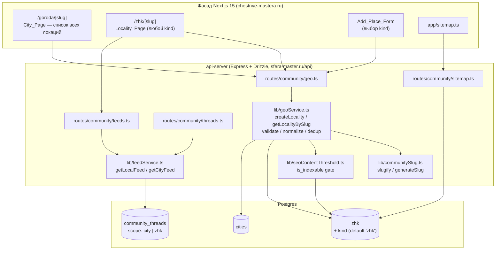
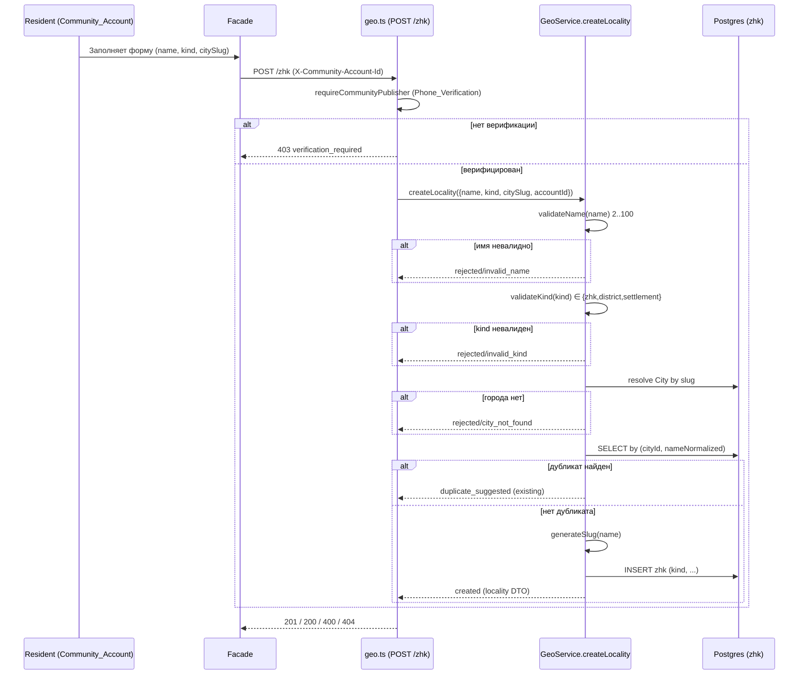
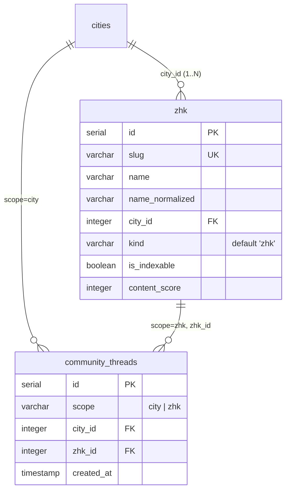

# Design Document — Community Generalized Locality (Стадия 2)

## Overview

Эта спецификация обобщает единицу локальности гео-сообщества «ХочуТакже» с бинарной модели `City → ЖК` до универсальной модели `City → Locality`, где каждая Locality имеет тип (`Locality_Kind`): `zhk` (новостройка), `district` (район/микрорайон, старый фонд) или `settlement` (посёлок/частный сектор).

Ключевое проектное решение — **обратно совместимое обобщение существующей таблицы `zhk`**, а не создание новой таблицы. Мы добавляем к `zhk` дискриминирующую колонку `kind` со значением по умолчанию `'zhk'`. Это сохраняет:

- все существующие строки, слаги, имена и атрибуты без изменений;
- маршрут фасада `/zhk/[slug]` для всех типов локаций;
- механизм тем (`community_threads.scope = 'zhk'`) для привязки к любой Locality;
- источник sitemap (`routes/community/sitemap.ts`), фильтрующий по `is_indexable`;
- сервисный слой (`geoService.ts`, `feedService.ts`) с минимальными правками.

Дизайн грунтуется на реальном коде:

- Схема: `lib/db/src/schema/zhk.ts` (таблица `zhk`), `lib/db/src/schema/community-threads.ts` (дискриминатор `scope`).
- Сервис: `artifacts/api-server/src/lib/geoService.ts` (`createZhk`, `getZhkBySlug`, `shapeZhkAttributes`, дедуп по `(cityId, nameNormalized)`), `src/lib/communitySlug.ts` (`slugify`/`generateSlug`).
- Маршруты: `src/routes/community/geo.ts`, `feeds.ts`, `threads.ts`, `sitemap.ts`.
- Стиль миграции: `artifacts/api-server/migrations/2026-01-20-community-baseline.sql` (идемпотентный DDL через `IF NOT EXISTS` / `DO $$`).

Дизайн выражает **поведение** (по требованиям), сохраняя терминологию кода: где в коде фигурирует «ЖК»/`zhk`, мы обобщаем семантику до Locality, оставляя физические имена (`zhkTable`, `getZhkBySlug`, `/zhk/[slug]`, `scope = 'zhk'`) неизменными ради обратной совместимости.

### Стратегия именования (обратная совместимость)

| Аспект | Решение | Причина |
|---|---|---|
| Таблица БД | Остаётся `zhk` | нулевой риск для прод-данных |
| Новая колонка | `kind varchar(16) NOT NULL DEFAULT 'zhk'` | тип по умолчанию сохраняет старые строки как ЖК |
| Маршрут фасада | `/zhk/[slug]` для всех kind | сохранение существующих URL и SEO |
| Thread scope | `scope = 'zhk'` для любой Locality | переиспользование механизма лент |
| Сервисные функции | сохраняем `createZhk`/`getZhkBySlug`, добавляем обобщённые обёртки | не ломаем вызовы |

## Architecture

### Высокоуровневая архитектура (High-Level Design)



### Поток создания Locality (Add_Place_Form)



### Проектные решения и обоснования

- **Дискриминатор `kind` в существующей таблице**, а не отдельная таблица per-kind: минимизирует миграционный риск, сохраняет все FK (`community_threads.zhk_id`, `community_accounts.zhk_id`), индексы и слаги. Требование 9 (безопасность миграции) прямо предписывает этот подход.
- **Значение по умолчанию `'zhk'`**: единственный корректный способ проставить тип для всех дострадийных строк без миграции данных (Requirement 9.1, 9.6). Даже если бэкфилл не выполнится, значение по умолчанию на уровне колонки трактует их как ЖК.
- **Единый namespace слагов сохраняется**: `generateSlug` уже проверяет глобальную уникальность по `cities` + `zhk`; так как районы/посёлки живут в той же таблице `zhk`, инвариант уникальности слагов (Requirement 1.6) выполняется без изменений.
- **Переиспользование `scope = 'zhk'`** для тем всех локаций-не-городов (Requirement 8.1): `community_threads.zhkId` уже указывает на `zhk.id`, поэтому темы района привязываются идентично темам ЖК.
- **SEO-гейт `is_indexable` не зависит от `kind`**: та же колонка, та же логика порога контента применяется единообразно (Requirement 6.1), поэтому районы попадают в sitemap ровно как ЖК (Requirement 7.1).

## Components and Interfaces

### 1. Data layer — `lib/db/src/schema/zhk.ts`

Добавляется колонка `kind` и её тип. Экспортируется тип-объединение `LocalityKind`.

```typescript
/** Тип локальной единицы сообщества (Requirement 1.2). */
export type LocalityKind = "zhk" | "district" | "settlement";

/** Допустимые значения Locality_Kind (Requirement 1.2, 1.5). */
export const LOCALITY_KINDS = ["zhk", "district", "settlement"] as const;

/** Значение по умолчанию — обратная совместимость (Requirement 1.4, 9.1, 9.6). */
export const DEFAULT_LOCALITY_KIND: LocalityKind = "zhk";

// в zhkTable добавляется колонка:
//   kind: varchar("kind", { length: 16 }).notNull().default("zhk")
//   + индекс (city_id, kind) для листинга/фильтрации по городу
```

### 2. Geo service — `lib/geoService.ts`

Обобщается доменный сервис. Существующие функции (`createZhk`, `getZhkBySlug`, `shapeZhkAttributes`, `validateZhkName`, `normalizeZhkName`) сохраняются как есть (обратная совместимость вызовов); добавляются обобщённые интерфейсы и валидатор `kind`. `ZhkView` расширяется полем `kind`.

```typescript
/** Проверить, что kind принадлежит множеству Locality_Kind (Requirement 1.5). */
export function validateLocalityKind(kind: unknown): kind is LocalityKind;

/** Нормализовать/разрешить kind: undefined|null → 'zhk' (Requirement 1.4). */
export function resolveLocalityKind(kind: unknown): LocalityKind | null;

/** Публичный DTO локации — расширяет ZhkView полем kind. */
export interface LocalityView extends ZhkView {
  kind: LocalityKind;
}

export interface CreateLocalityInput {
  name: string;
  citySlug: string;
  kind?: LocalityKind | null;      // отсутствует → 'zhk' (Requirement 1.4)
  createdByAccountId?: number | null;
}

export type CreateLocalityResult =
  | { status: "created"; locality: LocalityView }
  | { status: "duplicate_suggested"; existing: LocalityView }
  | { status: "rejected";
      reason: "invalid_name" | "invalid_kind" | "city_not_found";
      message: string };

/** Обобщённое создание Locality (Requirement 1.2–1.5, 4.x, 5.x). */
export async function createLocality(
  input: CreateLocalityInput,
): Promise<CreateLocalityResult>;

/** Резолв Locality по slug — как getZhkBySlug, но с kind в DTO. */
export async function getLocalityBySlug(slug: string): Promise<LocalityView | null>;

/** Список локаций города, отсортированный по name_normalized asc,
 *  без группировки по kind (Requirement 2.4). */
export async function listLocalitiesByCity(cityId: number): Promise<LocalityView[]>;
```

`createZhk` переопределяется как тонкий делегат: `createZhk(input) → createLocality({ ...input, kind: "zhk" })`, чтобы существующий вызов в `geo.ts` POST `/zhk` сохранил поведение и получил kind по умолчанию.

### 3. Route layer — `routes/community/geo.ts`

- `POST /zhk` принимает опциональное поле `kind` в теле; передаёт в `createLocality`. Новый код ответа `rejected/invalid_kind` → HTTP 400.
- `GET /zhk/:zhkSlug` возвращает `locality` с полем `kind` (через `getLocalityBySlug`).
- `GET /city/:citySlug` возвращает список локаций через `listLocalitiesByCity` (сортировка по `name_normalized asc`, все kind вперемешку — Requirement 2.4). Существующее поле ответа `zhk` сохраняется для совместимости фасада; в него включаются все локации.

### 4. Feed / thread layer — `routes/community/feeds.ts`, `threads.ts`, `lib/feedService.ts`

Без изменения логики. `getLocalFeed(localityId, query)` уже фильтрует `community_threads` по `zhk_id` и `scope = 'zhk'` независимо от типа локации (Requirement 2.2, 8.1, 8.2). Публикация темы района сохраняет `scope = 'zhk'`, `zhk_id = localityId` (Requirement 8.1).

### 5. SEO layer — `lib/seoContentThreshold.ts`, `routes/community/sitemap.ts`

Логика `is_indexable` и sitemap читает/пишет `zhk.is_indexable` без ветвления по `kind` (Requirement 6.1, 7.1). Для детерминированного плоского вывода sitemap (Requirement 7.3) добавляется сортировка `ORDER BY slug ASC` и дедупликация в чистом маппере `toCommunitySitemap`.

### 6. Facade — Next.js

- `/zhk/[slug]`: рендерит Locality_Page для любого kind; title/description/canonical непусты (Requirement 6.6); при `is_indexable = false` — директива `noindex` (Requirement 6.7).
- `/goroda/[slug]`: единый список локаций (Requirement 2.4).
- `Add_Place_Form`: селектор kind из `{zhk, district, settlement}` (Requirement 4.1).

## Data Models

### Обобщённая таблица `zhk` (Locality_Record)

```typescript
export const zhkTable = pgTable(
  "zhk",
  {
    id: serial("id").primaryKey(),
    slug: varchar("slug", { length: 100 }).notNull().unique("zhk_slug_key"),
    name: varchar("name", { length: 100 }).notNull(),
    nameNormalized: varchar("name_normalized", { length: 100 }).notNull(),
    cityId: integer("city_id").notNull().references(() => citiesTable.id, { onDelete: "cascade" }),

    // НОВОЕ: дискриминатор типа локальности (Requirement 1.2, 1.4, 9.1, 9.6).
    kind: varchar("kind", { length: 16 }).notNull().default("zhk"),

    // Атрибуты (Requirement 1.7) — отображаются только при заполнении.
    developer: varchar("developer", { length: 200 }),
    completionDate: varchar("completion_date", { length: 40 }),
    buildings: jsonb("buildings").$type<ZhkBuilding[]>(),

    status: varchar("status", { length: 20 }).notNull().default("NON_LIVING"),
    isSeeded: boolean("is_seeded").notNull().default(false),
    contentScore: integer("content_score").notNull().default(0),
    isIndexable: boolean("is_indexable").notNull().default(false),
    createdByAccountId: integer("created_by_account_id").references(
      (): AnyPgColumn => communityAccountsTable.id, { onDelete: "set null" }),
    seoTitle: varchar("seo_title", { length: 70 }),
    seoDescription: varchar("seo_description", { length: 180 }),
    h1: varchar("h1", { length: 100 }),
    bodyMd: text("body_md"),
    createdAt: timestamp("created_at").notNull().defaultNow(),
  },
  (t) => ({
    cityNameNormalizedIdx: index("zhk_city_name_normalized_idx").on(t.cityId, t.nameNormalized),
    cityStatusIdx: index("zhk_city_status_idx").on(t.cityId, t.status),
    // НОВОЕ: листинг/фильтрация локаций города (Requirement 2.4).
    cityKindIdx: index("zhk_city_kind_idx").on(t.cityId, t.kind),
  }),
);
```

Инварианты модели:

- `kind ∈ {zhk, district, settlement}` — гарантируется валидацией сервиса при записи; на уровне БД действует `DEFAULT 'zhk'` (плюс опциональный `CHECK`, см. миграцию).
- `nameNormalized = lower(trim(name))` — вычисляется сервисом, ключ дедупликации `(cityId, nameNormalized)` (Requirement 4.8, 5.2).
- `slug` глобально уникален по `cities` + `zhk` (Requirement 1.6).
- Каждая строка `zhk` ссылается ровно на один `cityId` (Requirement 1.1).

### Связь с `community_threads`

Без изменений схемы. Для Locality любого kind: `scope = 'zhk'`, `zhk_id = locality.id` (Requirement 8.1). Для города: `scope = 'city'`, `city_id`.



### Идемпотентная миграция (Requirement 9)

Файл: `artifacts/api-server/migrations/2026-XX-XX-locality-kind.sql`. Аддитивный, идемпотентный DDL в стиле baseline-миграции.

```sql
-- Migration: Community Generalized Locality (Стадия 2)
-- Spec: .kiro/specs/community-generalized-locality/
-- Requirements: 1.2, 1.4, 9.1–9.6
--
-- Аддитивно: добавляет колонку zhk.kind с DEFAULT 'zhk'. Существующие строки
-- получают kind='zhk' через DEFAULT (Requirement 9.1). Слаги/имена/атрибуты
-- не изменяются (Requirement 9.2). Повторный прогон безопасен (Requirement 9.3).

BEGIN;

-- 1. Колонка kind с типом по умолчанию 'zhk' (Requirement 1.4, 9.1, 9.6).
--    ADD COLUMN IF NOT EXISTS + DEFAULT атомарно проставляет 'zhk' всем
--    существующим строкам — 0 удалённых, 0 добавленных (Requirement 9.2).
ALTER TABLE zhk
  ADD COLUMN IF NOT EXISTS kind varchar(16) NOT NULL DEFAULT 'zhk';

COMMENT ON COLUMN zhk.kind IS
  'Locality_Kind: zhk|district|settlement; default zhk (Requirement 1.2, 1.4)';

-- 2. Страховочный бэкфилл на случай ранее добавленной nullable-колонки
--    (идемпотентно; для чистого случая — no-op) (Requirement 9.1).
UPDATE zhk SET kind = 'zhk' WHERE kind IS NULL;

-- 3. CHECK-ограничение допустимых значений (Requirement 1.5).
DO $$
BEGIN
  IF NOT EXISTS (
    SELECT 1 FROM information_schema.table_constraints
    WHERE constraint_name = 'zhk_kind_check' AND table_name = 'zhk'
  ) THEN
    ALTER TABLE zhk ADD CONSTRAINT zhk_kind_check
      CHECK (kind IN ('zhk', 'district', 'settlement'));
  END IF;
END $$;

-- 4. Индекс листинга локаций города (Requirement 2.4).
CREATE INDEX IF NOT EXISTS zhk_city_kind_idx ON zhk (city_id, kind);

COMMIT;
```

Свойства миграции:

- **Идемпотентность** (Requirement 9.3): `ADD COLUMN IF NOT EXISTS`, `CREATE INDEX IF NOT EXISTS`, охранённый `DO $$` для CHECK — повторный прогон не меняет данные и не падает.
- **Атомарность/откат** (Requirement 9.4): всё в одной транзакции `BEGIN/COMMIT`; при ошибке — полный откат.
- **Zero downtime** (Requirement 9.5): аддитивный `ADD COLUMN ... DEFAULT` в Postgres ≥ 11 не переписывает таблицу и не блокирует чтение существующих строк; страницы/ленты продолжают обслуживаться.
- **Сохранность данных** (Requirement 9.2): ни одна существующая колонка/строка не меняется; количество локаций в каждом городе неизменно.

## Correctness Properties

*A property is a characteristic or behavior that should hold true across all valid executions of a system — essentially, a formal statement about what the system should do. Properties serve as the bridge between human-readable specifications and machine-verifiable correctness guarantees.*

Properties below are derived from the prework analysis. Redundant acceptance criteria were consolidated (e.g., all Local_Feed criteria into one property, all migration-preservation criteria into two, all sitemap criteria into one) so that each property provides unique validation value.

### Property 1: Locality kind resolution

*For any* create request, the resolved kind SHALL equal the explicitly supplied kind when it is one of `zhk`/`district`/`settlement`, SHALL equal `zhk` when kind is absent or null, and the request SHALL be rejected without persisting any record when kind is any value outside that set.

**Validates: Requirements 1.2, 1.3, 1.4, 1.5, 9.6**

### Property 2: Slug format and global uniqueness

*For any* name string, `slugify(name)` SHALL match `^[a-z0-9-]{1,100}$`; and *for any* sequence of created Cities and Localities, all assigned slugs SHALL be pairwise distinct across the combined `cities` + `zhk` namespace.

**Validates: Requirements 1.6**

### Property 3: Attribute shaping shows only filled attributes

*For any* Locality_Record, the Locality_Page DTO SHALL include exactly those attributes (developer, completionDate, buildings) whose value is non-null and non-empty after trimming, and SHALL omit every attribute whose value is null or empty after trimming.

**Validates: Requirements 1.7**

### Property 4: Create then resolve round-trip

*For any* valid create input (trimmed name length 2..100, valid kind, existing City), creation SHALL succeed synchronously, return the created slug, store `name_normalized = lower(trim(name))`, associate the record with exactly one City, and the created Locality SHALL be immediately resolvable by that slug with its Local_Feed available.

**Validates: Requirements 1.1, 4.2, 4.3, 4.4, 4.8**

### Property 5: Name length validation boundary

*For any* name string, creation SHALL be accepted with respect to length if and only if the trimmed length is between 2 and 100 inclusive; otherwise it SHALL be rejected without persisting any record.

**Validates: Requirements 4.6**

### Property 6: City-not-found rejection

*For any* citySlug that matches no existing City, creation SHALL be rejected with a city-not-found indication and SHALL persist no Locality_Record.

**Validates: Requirements 4.7**

### Property 7: Deduplication within a city

*For any* existing Locality and any submission whose `lower(trim(name))` is character-for-character equal to that Locality's `name_normalized` in the same City, the system SHALL create no new record, return the existing Locality (slug and name) unchanged, and SHALL apply this comparison only among Localities of the same City and independently of Locality_Kind.

**Validates: Requirements 5.1, 5.2, 5.3**

### Property 8: Local_Feed content and ordering

*For any* Locality and any set of Community_Threads, the Local_Feed SHALL contain exactly the threads bound to that Locality's id, ordered by creation date descending with ties broken by thread id descending, and this feed logic SHALL be identical for every Locality_Kind.

**Validates: Requirements 2.1, 2.2, 3.1, 8.2**

### Property 9: City listing order across kinds

*For any* City, the City_Page locality list SHALL contain all Localities belonging to that City regardless of kind, ordered by `name_normalized` ascending, without grouping by kind.

**Validates: Requirements 2.4**

### Property 10: Unknown slug is not found

*For any* slug that matches no Locality_Record, resolution SHALL return a not-found result and SHALL provide no Local_Feed.

**Validates: Requirements 2.5, 3.5**

### Property 11: Empty feed for empty locality

*For any* existing Locality with zero bound Community_Threads, the Local_Feed SHALL be empty (zero threads) and SHALL NOT return an error.

**Validates: Requirements 2.6**

### Property 12: is_indexable threshold consistency

*For any* Locality and any sequence of thread additions/removals, after recomputation the Locality's `is_indexable` SHALL equal whether its current content satisfies the Content_Threshold, this evaluation SHALL depend only on content and not on Locality_Kind, and a Locality that has never been evaluated SHALL have `is_indexable = false`.

**Validates: Requirements 6.1, 6.2, 6.3, 6.4, 6.5**

### Property 13: SEO metadata completeness

*For any* Locality of any kind, the Locality_Page SHALL provide a non-empty title, a non-empty text description, and an absolute canonical URL corresponding to that Locality's slug.

**Validates: Requirements 6.6**

### Property 14: Noindex gating

*For any* Locality, the Locality_Page SHALL include a noindex directive if and only if that Locality's `is_indexable` is `false`.

**Validates: Requirements 6.7**

### Property 15: Sitemap includes exactly indexable slugs

*For any* set of Locality_Records, the Community_Sitemap_Source output SHALL contain exactly the slugs of Localities whose `is_indexable` is `true`, with no duplicates, as a single flat list ordered by slug ascending, and SHALL be an empty list (without error) when no Locality is indexable.

**Validates: Requirements 7.1, 7.2, 7.3, 7.4**

### Property 16: Thread scoping reuses existing scope mechanism

*For any* Locality of any kind, a published thread SHALL be stored with `scope = 'zhk'` bound to that Locality's id; and *for any* City, a published city thread SHALL be stored with `scope = 'city'` bound to that City's id.

**Validates: Requirements 8.1, 8.3**

### Property 17: Publish to nonexistent target is rejected

*For any* publish request targeting a nonexistent Locality or nonexistent City, the system SHALL reject the publication, create neither a thread nor a Locality nor a City, and return a missing-target error.

**Validates: Requirements 8.5**

### Property 18: Migration preserves data and defaults to zhk

*For any* pre-migration dataset, after applying the Migration every previously existing Locality_Record SHALL retain its slug, name, and attribute values unchanged, the per-City count of Locality_Records SHALL be unchanged (0 added, 0 removed), and every previously existing Locality_Record SHALL have kind `zhk`, yielding behavior functionally equivalent to pre-Stage-2 (same threads, order, attributes, is_indexable, availability).

**Validates: Requirements 3.3, 3.4, 9.1, 9.2**

### Property 19: Migration idempotence

*For any* dataset to which the Migration has already been applied, re-applying the Migration SHALL succeed without error and leave all Locality_Records, their kinds, slugs, names, and attributes unchanged.

**Validates: Requirements 9.3**

## Error Handling

The service layer uses discriminated result unions (no exceptions for expected rejections), mirroring the existing `CreateZhkResult` pattern in `geoService.ts`. The route layer maps result variants to HTTP codes.

| Condition | Requirement | Service result | HTTP |
|---|---|---|---|
| Invalid kind | 1.5 | `rejected/invalid_kind` | 400 |
| Name length invalid | 4.6 | `rejected/invalid_name` | 400 |
| City not found (create) | 4.7 | `rejected/city_not_found` | 404 |
| Duplicate name in city | 5.1 | `duplicate_suggested` (existing) | 200 |
| No Phone_Verification | 4.5, 8.4 | (route gate) `verification_required` | 403 |
| Missing account id | 4.5 | (route gate) `account_required` | 401 |
| Unknown locality slug | 2.5, 3.5 | resolver → `null` | 404 `{ notFound: true }` |
| Publish to missing target | 8.5 | `rejected/no_target` (or not_found) | 400 / 404 |
| Rate limit exceeded | ops | — | 429 |
| Unexpected error | — | thrown → caught | 500 `internal_error` |

Migration error handling:

- Entire migration wrapped in a single transaction (`BEGIN/COMMIT`); any failed step rolls back all partial changes, leaving the database identical to its pre-run state (Requirement 9.4).
- Idempotent guards (`IF NOT EXISTS`, guarded `DO $$` for the CHECK constraint) ensure re-runs neither error nor mutate data (Requirement 9.3).
- Additive `ADD COLUMN ... DEFAULT` avoids table rewrite and read locks so pages/feeds stay available during migration (Requirement 9.5).

Sitemap degradation: on query failure the sitemap route returns HTTP 200 with empty lists (existing behavior in `sitemap.ts`) so the facade sitemap never breaks (Requirement 7.4-safe).

## Testing Strategy

### Dual approach

- **Unit / example tests**: specific behaviors and access-control scenarios that are not universally quantified — Add_Place_Form renders the three kind options (4.1), publish/create without Phone_Verification is rejected (4.5, 8.4), Resident can post to City_Feed when no locality matches (2.3), and facade route `/zhk/[slug]` renders for each kind (3.2).
- **Integration tests**: infrastructure and concurrency behaviors unsuitable for PBT — concurrent same-name submissions produce at most one record (5.4), and mid-migration failure rolls back fully (9.4). These run 1–3 representative cases against a real/ephemeral Postgres.
- **Smoke tests**: one-shot operational checks — migration uses non-blocking additive DDL / zero-downtime posture (9.5).
- **Property-based tests**: the 19 correctness properties above, each verifying a universal statement over generated inputs.

### Property-based testing

PBT is appropriate here because the core logic is composed of pure/deterministic functions and clear input→output behavior: kind resolution, `slugify`, attribute shaping, name validation, `name_normalized` computation, deduplication, feed filtering/sorting, city listing order, sitemap mapping, and the migration transform (verified against an ephemeral database with generated seed datasets).

- **Library**: `fast-check` with the existing Vitest runner (matches `artifacts/api-server/__tests__/**` and the existing `*.property.test.ts` convention, e.g. `layout-json-roundtrip.property.test.ts`). Do not hand-roll a PBT harness.
- **Iterations**: each property test runs a minimum of 100 iterations (`fc.assert(fc.property(...), { numRuns: 100 })`).
- **DB-backed properties** (create/dedup/feed/threshold/migration): run against an ephemeral/transactional Postgres, rolling back per iteration to keep runs isolated and cost-effective. Pure-function properties (kind resolution, slug, attribute shaping, name validation, sitemap mapping) run in-memory without a database.
- **Generators**:
  - names: arbitrary Unicode incl. Cyrillic, leading/trailing whitespace, whitespace-only, boundary lengths (1/2/100/101), punctuation-only;
  - kind: valid set plus invalid strings/`null`/`undefined`;
  - localities: mixed kinds per city, mixed `is_indexable`, mixed empty/non-empty attributes, zero-thread and many-thread cases;
  - threads: varied `createdAt` incl. ties (same timestamp, distinct ids) to exercise the tie-break ordering.
- **Traceability**: every property test is tagged with a comment in the form
  `// Feature: community-generalized-locality, Property {number}: {property_text}`
  and references the design property it implements.

### Coverage mapping

| Property | Primary target under test |
|---|---|
| 1 | `resolveLocalityKind` / `validateLocalityKind` |
| 2 | `slugify` / `generateSlug` |
| 3 | `shapeLocalityAttributes` |
| 4 | `createLocality` + `getLocalityBySlug` |
| 5 | `validateName` |
| 6 | `createLocality` (city resolution) |
| 7 | `createLocality` (dedup) |
| 8 | `feedService.getLocalFeed` |
| 9 | `listLocalitiesByCity` |
| 10 | `getLocalityBySlug` |
| 11 | `feedService.getLocalFeed` (empty) |
| 12 | `seoContentThreshold` recompute |
| 13, 14 | facade Locality_Page metadata builder |
| 15 | `toCommunitySitemap` + query ordering |
| 16 | `feedService.createLocalTopic` / city publish |
| 17 | publish target resolution |
| 18, 19 | migration transform vs. ephemeral DB |
