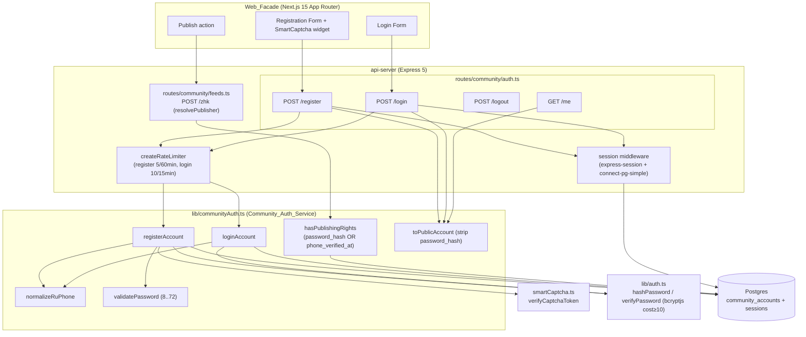
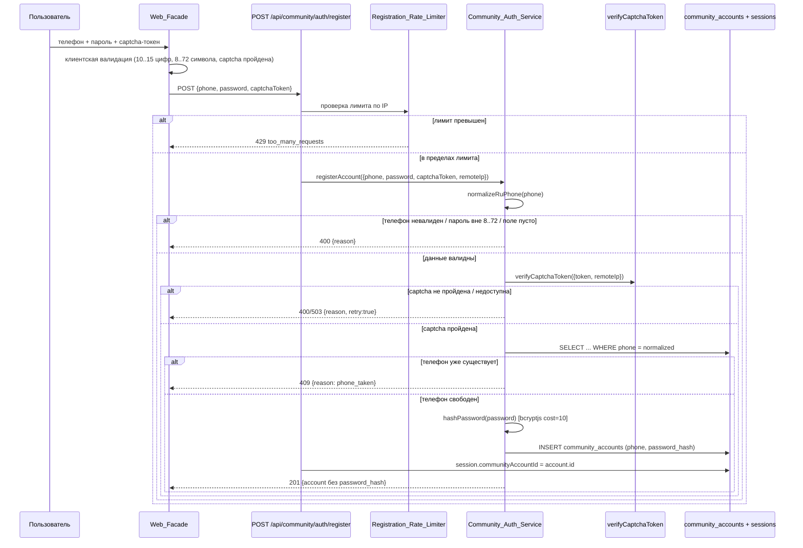

# Design Document

## Overview

Эта фича заменяет неработающий SMS-гейт публикации в сообществе «ХочуТакже» на **форумную регистрацию по паролю**. Телефон остаётся логином, а доступ подтверждается паролем (bcryptjs-хеш) — ровно по той же модели, что уже работает для мастеров (`masters.pwa_login` / `masters.pwa_password_hash`, `POST /api/master-pwa/auth/login`) и операторов (`users.login` / `users.password_hash`, `POST /api/auth/login`).

Ключевые архитектурные решения фиксируются существующим кодом, который мы **обобщаем, а не переписываем**:

- **`communityAuth.ts`** уже содержит `normalizeRuPhone`, чистый предикат `hasPublishingRights(account)` и Drizzle-репозиторий поверх `community_accounts`. Мы обобщаем предикат и добавляем функции регистрации/входа рядом с существующими (SMS-путь `requestPhoneCode` / `confirmPhoneCode` остаётся в коде, но перестаёт быть единственным путём получения прав).
- **`smartCaptcha.ts` / `verifyCaptchaToken`** уже реализует серверную проверку Yandex SmartCaptcha с таймаутом и fail-closed на сетевых ошибках — переиспользуется как есть.
- **`createRateLimiter`** (`rateLimit.ts`) — существующий in-memory скользящий лимитер по IP (тот же паттерн, что в `master-pwa.ts` и `auth.ts`) — переиспользуется для регистрации и входа.
- **`express-session` + `connect-pg-simple`** (таблица `sessions` в Postgres, cookie `connect.sid`) уже сконфигурированы в `app.ts`. Мы добавляем поле `communityAccountId` в `SessionData` рядом с существующими `userId` / `masterId`.
- **`bcryptjs`** через `lib/auth.ts` (`hashPassword` cost=10, `verifyPassword`) — переиспользуется без изменений.

Обратная совместимость — центральное требование: аккаунты с проставленным `phone_verified_at` (Legacy_Verified_Account, подтверждённые по старому SMS-пути) должны сохранять право публикации. Поэтому предикат `hasPublishingRights` обобщается с «`phone_verified_at != null`» до «`password_hash` задан **ИЛИ** `phone_verified_at` задан».

Контекст публикующего аккаунта переносится с текущего заголовка `X-Community-Account-Id` на `Community_Session`: `resolvePublisher` в `feeds.ts` (и `resolveAccountId` в `community/auth.ts`) начинают читать идентификатор из сессии вместо заголовка.

### Область изменений

| Слой | Модуль | Изменение |
|------|--------|-----------|
| Схема БД | `lib/db/src/schema/community-accounts.ts` | Добавить nullable-колонку `password_hash varchar` |
| Миграция | `artifacts/api-server/migrations/2026-xx-xx-community-password.sql` | Аддитивная `ALTER TABLE ... ADD COLUMN IF NOT EXISTS password_hash` |
| Домен | `lib/communityAuth.ts` | Обобщить `hasPublishingRights`; добавить `registerAccount`, `loginAccount`, `toPublicAccount`, `validatePassword` |
| HTTP | `routes/community/auth.ts` | Добавить `POST /register`, `POST /login`, `POST /logout`, `GET /me`; резолвить аккаунт из сессии |
| HTTP | `routes/community/feeds.ts` | `resolvePublisher` читает `req.session.communityAccountId` вместо заголовка |
| Сессия | `types/express-session.d.ts` | Добавить `communityAccountId?: number` |
| Web | Web_Facade (Next.js 15 App Router) | Формы регистрации/входа + виджет SmartCaptcha + установка сессии |

### Вне области действия

Доставка SMS, коды через Telegram/MAX, восстановление/сброс пароля, любые изменения аутентификации мастеров и операторов — как зафиксировано в requirements.

## Architecture



### Поток регистрации (Requirement 1, 2, 6, 7)



## Components and Interfaces

### 1. Community_Auth_Service (`lib/communityAuth.ts`) — обобщение

Существующие функции (`verifyLeadContext`, `requestPhoneCode`, `confirmPhoneCode`, `linkMaxOptional`, `normalizeRuPhone`) сохраняются. Добавляются password-функции и обобщается предикат прав.

```typescript
/** Password_Policy: длина от 8 до 72 символов включительно (Requirement 2.2). */
export const PASSWORD_MIN_LENGTH = 8;
export const PASSWORD_MAX_LENGTH = 72; // верхняя граница bcrypt (байты пароля)

export type PasswordValidation =
  | { ok: true }
  | { ok: false; reason: "password_missing" | "password_invalid" };

/** Чистая проверка Password_Policy (Requirement 2.2, 2.3). */
export function validatePassword(raw: unknown): PasswordValidation;

/**
 * Проекция Community_Account в публичный DTO: гарантированно БЕЗ password_hash
 * (Requirement 1.4, 3.2, 4.4, 6.2). Единственный способ сериализовать аккаунт
 * в HTTP-ответ.
 */
export interface PublicCommunityAccount {
  id: number;
  phone: string;
  role: string;
  zhkId: number | null;
  maxUserId: string | null;
  phoneVerifiedAt: Date | null;
  hasPublishingRights: boolean;
  createdAt: Date;
}
export function toPublicAccount(account: CommunityAccount): PublicCommunityAccount;

/** Причина отказа регистрации (Requirement 2). */
export type RegisterRejectionReason =
  | "phone_missing" | "phone_invalid"
  | "password_missing" | "password_invalid"
  | "phone_taken"
  | "captcha_missing" | "captcha_failed" | "captcha_unavailable";

export type RegisterResult =
  | { ok: true; account: CommunityAccount }
  | { ok: false; reason: RegisterRejectionReason; retry: boolean };

export interface RegisterInput {
  phone: string;
  password: string;
  captchaToken: string;
  remoteIp?: string | null;
}

/**
 * Зарегистрировать Community_Account (Requirement 1, 2, 6).
 * Порядок: обязательные поля → normalizeRuPhone → Password_Policy → captcha →
 * уникальность телефона → hashPassword → INSERT. Пароль хранится только как хеш.
 */
export async function registerAccount(
  input: RegisterInput,
  deps?: CommunityAuthDeps,
): Promise<RegisterResult>;

export type LoginResult =
  | { ok: true; account: CommunityAccount }
  | { ok: false }; // единая ошибка, не раскрывающая фактор (Requirement 3.7)

export interface LoginInput { phone: string; password: string; }

/**
 * Аутентифицировать по телефону и паролю (Requirement 3, 6.3).
 * Отказ ЕДИНЫЙ для «неизвестный телефон / нет хеша / неверный пароль»
 * (Requirement 3.4–3.7).
 */
export async function loginAccount(
  input: LoginInput,
  deps?: CommunityAuthDeps,
): Promise<LoginResult>;

/**
 * ОБОБЩЁННЫЙ предикат прав публикации (Requirement 5).
 * Права даются, если задан непустой password_hash ИЛИ проставлен
 * phone_verified_at (обратная совместимость с Legacy_Verified_Account).
 */
export function hasPublishingRights(
  account: Pick<CommunityAccount, "phoneVerifiedAt" | "passwordHash"> | null | undefined,
): boolean;
```

Инъектируемые зависимости расширяются, чтобы тесты гоняли логику без БД/сети/bcrypt-сети:

```typescript
export interface CommunityAuthDeps {
  accounts?: CommunityAccountRepository; // findByPhone, createWithPassword, ...
  verifyCaptcha?: CaptchaVerifier;       // по умолчанию verifyCaptchaToken
  hashPassword?: (pw: string) => Promise<string>;    // по умолчанию lib/auth
  verifyPassword?: (pw: string, hash: string) => Promise<boolean>;
  now?: () => number;
}
```

Репозиторий `CommunityAccountRepository` дополняется методами:

```typescript
findByPhone(phone: string): Promise<CommunityAccount | null>;
createWithPassword(phone: string, passwordHash: string): Promise<CommunityAccount>;
```

### 2. HTTP-слой (`routes/community/auth.ts`) — новые маршруты

Монтируется под `/api/community/auth` (уже подключён в `routes/index.ts`). Все маршруты собираются через существующую фабрику `createAuthRouter(deps)` для тестируемости.

| Метод | Путь | Тело | Успех | Ошибки |
|-------|------|------|-------|--------|
| POST | `/register` | `{phone, password, captchaToken}` | 201 `{account}` (сессия установлена) | 400 (phone/password), 409 (`phone_taken`), 400/503 (captcha), 429 (rate limit) |
| POST | `/login` | `{phone, password}` | 200 `{account}` (сессия установлена) | 401 (единая ошибка), 429 (rate limit) |
| POST | `/logout` | — | 200 `{ok:true}` | 200 `{ok:true, noSession:true}` если сессии не было |
| GET | `/me` | — | 200 `{account}` | 401 (нет валидной сессии) |

Rate-лимитеры создаются паттерном из `master-pwa.ts`:

```typescript
const registerRateLimit = createRateLimiter({ windowMs: 60 * 60_000, maxAttempts: 5 });  // R7.1
const loginRateLimit    = createRateLimiter({ windowMs: 15 * 60_000, maxAttempts: 10 }); // R7.3
```

Установка сессии мирроринг `master-pwa.ts` / `auth.ts`:

```typescript
(req.session as any).communityAccountId = account.id;
```

Выход — `req.session.destroy` для полной аутентификации-сессии (мирроринг оператора) либо очистка поля (мирроринг мастера); используем `destroy` для соответствия Requirement 4.1 (после выхода идентификатор недоступен).

### 3. Резолвинг публикующего аккаунта — сессия вместо заголовка

`resolvePublisher` (feeds.ts) и `resolveAccountId` (auth.ts) переключаются с `X-Community-Account-Id` на сессию:

```typescript
export async function resolvePublisher(
  req: Request,
  loadAccount: (id: number) => Promise<CommunityAccount | null>,
): Promise<PublisherResolution> {
  const accountId = (req.session as any).communityAccountId as number | undefined;
  if (!accountId || !Number.isInteger(accountId) || accountId <= 0) {
    return { ok: false, status: 401, body: { error: "unauthorized" } };
  }
  const account = await loadAccount(accountId);
  if (!hasPublishingRights(account)) {
    return { ok: false, status: 403, body: { error: "forbidden", reason: "publishing_rights_required" } };
  }
  return { ok: true, account: account! };
}
```

### 4. Web_Facade (Next.js 15 App Router)

- Компонент формы регистрации: поля телефона (10–15 цифр), пароля (8–72 символа), встроенный виджет Yandex SmartCaptcha, инжектирующий `smart-token`. Клиентская валидация до обращения к API (Requirement 8.1, 8.3, 8.4).
- Компонент формы входа: телефон + пароль (Requirement 8.2).
- Отправка через `fetch(..., { credentials: "include" })`, чтобы cookie `connect.sid` устанавливалась/передавалась.
- При отказе API — показ причины, сохранение всех полей кроме пароля, который очищается (Requirement 8.6).
- При инициировании публикации без валидной сессии — предложение регистрации/входа (Requirement 8.7).

## Data Models

### community_accounts (расширение)

Добавляется одна аддитивная nullable-колонка. Существующие строки (в т.ч. Legacy_Verified_Account) не затрагиваются.

```typescript
// lib/db/src/schema/community-accounts.ts (добавляемое поле)
passwordHash: varchar("password_hash", { length: 100 }), // bcryptjs-хеш; NULL = пароль не задан
```

Миграция (аддитивная, идемпотентная — паттерн существующих community-миграций):

```sql
-- 2026-xx-xx-community-password.sql
ALTER TABLE community_accounts
  ADD COLUMN IF NOT EXISTS password_hash varchar(100);
```

Итоговая модель Community_Account:

| Колонка | Тип | Назначение |
|---------|-----|-----------|
| `id` | serial PK | идентификатор аккаунта, хранится в сессии |
| `phone` | varchar(30) NOT NULL UNIQUE | Normalized_Phone (`+7XXXXXXXXXX`), логин |
| `password_hash` | varchar(100) NULL | **новое** — bcryptjs-хеш Password; NULL = пароль не задан |
| `phone_verified_at` | timestamp NULL | завершённая старая SMS-верификация (обратная совместимость) |
| `role` | varchar(20) NOT NULL default `resident` | `resident` \| `master` |
| `zhk_id` | integer NULL | привязка к ЖК |
| `max_user_id` | varchar(80) NULL | опциональный Max_Login (не гейт) |
| `created_at` | timestamp NOT NULL default now() | — |

### Community_Session

Хранится существующим `express-session` + `connect-pg-simple` в таблице `sessions` (Postgres). Расширяется тип:

```typescript
// types/express-session.d.ts
declare module "express-session" {
  interface SessionData {
    userId?: number;              // оператор (существует)
    masterId?: number;            // мастер (существует)
    communityAccountId?: number;  // НОВОЕ — Community_Account
    user?: { id?: number; login?: string; name?: string; role?: string };
  }
}
```

Срок действия сессии (Requirement 4.5, «не более 30 дней»): cookie `maxAge` для community-контекста — 30 дней. Текущая глобальная конфигурация в `app.ts` = 1 день; community-маршруты при установке сессии выставляют `req.session.cookie.maxAge = 30 * 24 * 60 * 60 * 1000`.

### Состояния прав публикации (обобщённый предикат)

| `password_hash` | `phone_verified_at` | `hasPublishingRights` | Требование |
|-----------------|---------------------|-----------------------|------------|
| задан (непустой) | любое | **true** | 5.1 |
| null/пусто | задан | **true** (Legacy_Verified_Account) | 5.2 |
| null/пусто | null | **false** | 5.3 |

<!-- PBT-ASSESSMENT: Эта фича — доменная логика с чистыми функциями (нормализация
     телефона, валидация пароля, предикат прав, аутентификация, санитизация DTO)
     и универсальными свойствами (round-trip, идемпотентность, инварианты). PBT
     ПРИМЕНИМА к доменному слою. Слой Web_Facade (рендер форм) и конфигурация
     сессионного middleware — НЕ PBT (пример-/интеграционные тесты). -->

## Correctness Properties

*Свойство — это характеристика или поведение, которое должно оставаться истинным для всех валидных выполнений системы; по сути, формальное утверждение о том, что система должна делать. Свойства служат мостом между человекочитаемой спецификацией и машинно-проверяемыми гарантиями корректности.*

Свойства ниже относятся к **доменному слою** (`lib/communityAuth.ts`) и его роут-обёрткам, где вход варьируется значимо и оправданы 100+ итераций. Слой Web_Facade (рендер форм), таймауты captcha, конфигурация срока сессии и логирование покрываются примерами/интеграционными/smoke-тестами (см. Testing Strategy).

### Property 1: Нормализация телефона канонична и идемпотентна

*Для любой* строки телефона: если `normalizeRuPhone` возвращает не-null результат, то результат имеет формат `+7` и ровно 11 цифр, повторное применение `normalizeRuPhone` к результату даёт тот же результат (идемпотентность), и любые два представления одного номера (через `8`, `+7`, `7`, 10 цифр, с произвольными нецифровыми разделителями) дают одинаковый канонический ключ; регистрация и вход используют именно этот канонический ключ до проверки уникальности и сохранения.

**Validates: Requirements 1.5, 2.1, 3.3**

### Property 2: Валидация пароля соответствует Password_Policy

*Для любой* строки пароля `validatePassword` возвращает `ok: true` тогда и только тогда, когда длина строки не меньше 8 и не больше 72 символов включительно; в противном случае возвращает отказ с причиной «недопустимый пароль» (или «отсутствует поле» для пустого/отсутствующего значения). Границы 7/8/72/73 обязаны присутствовать среди сгенерированных входов.

**Validates: Requirements 2.2, 2.3**

### Property 3: Успешная регистрация — полный инвариант

*Для любого* входа с нормализуемым телефоном, отсутствующим в репозитории, паролем длиной 8–72 символа и проходящим captcha-токеном: `registerAccount` создаёт ровно один Community_Account, у которого `phone` равен `normalizeRuPhone(raw)`, `password_hash` непустой и не равен открытому паролю, `hasPublishingRights` истинно немедленно, а роут-хендлер устанавливает `session.communityAccountId` равным id созданного аккаунта.

**Validates: Requirements 1.1, 1.2, 1.3, 1.5, 1.6**

### Property 4: Отказ регистрации не создаёт состояния

*Для любого* входа, нарушающего хотя бы одно предусловие (ненормализуемый телефон, пустое обязательное поле, пароль вне 8–72, уже существующий нормализованный телефон, отсутствующий/пустой captcha-токен, или captcha-токен, не прошедший проверку): `registerAccount` возвращает отказ с соответствующей причиной, не создаёт ни одного Community_Account и не устанавливает Community_Session; при пустом captcha-токене серверная проверка captcha не вызывается вовсе.

**Validates: Requirements 2.1, 2.2, 2.3, 2.4, 2.5, 2.6, 2.8, 7.2**

### Property 5: Хеширование пароля — верифицируемый round-trip

*Для любого* пароля длиной 8–72 символа: `verifyPassword(password, hashPassword(password))` истинно, `hashPassword(password)` не равен открытому паролю, а `verifyPassword(other, hashPassword(password))` для любого несовпадающего `other` ложно.

**Validates: Requirements 6.1, 6.3**

### Property 6: Вход аутентифицирует по паре и не раскрывает фактор

*Для любого* репозитория аккаунтов и входа `{phone, password}`: `loginAccount` возвращает успех тогда и только тогда, когда телефон нормализуется, существует аккаунт с этим нормализованным телефоном, у него задан непустой `password_hash` и `verifyPassword(password, password_hash)` истинно; во всех остальных случаях (ненормализуемый телефон, неизвестный телефон, отсутствующий хеш, неверный пароль) возвращается структурно идентичный отказ без указания несовпавшего фактора, Community_Session не устанавливается, а хранимый `password_hash` остаётся неизменным.

**Validates: Requirements 3.1, 3.3, 3.4, 3.5, 3.6, 3.7, 6.4**

### Property 7: Публичный DTO аккаунта никогда не раскрывает password_hash

*Для любого* Community_Account (с заданным или пустым `password_hash`) результат `toPublicAccount` не содержит ключа `password_hash` (и его значения) ни на одном уровне сериализуемого объекта; это справедливо для всех ответов, несущих данные аккаунта (регистрация, вход, `/me`).

**Validates: Requirements 1.4, 3.2, 4.4, 6.2**

### Property 8: Обобщённый предикат прав публикации, независимый от Max_Login

*Для любого* Community_Account `hasPublishingRights` истинно тогда и только тогда, когда `password_hash` непустой ИЛИ `phone_verified_at` задан; результат предиката не изменяется при любом варьировании `max_user_id`.

**Validates: Requirements 5.1, 5.2, 5.3, 5.6**

### Property 9: Гейт публикации допускает только аутентифицированные аккаунты с правами

*Для любого* запроса на публикацию: если в сессии отсутствует валидный `communityAccountId`, `resolvePublisher` возвращает 401 и публикация не создаётся; если аккаунт не удаётся загрузить или у него нет Publishing_Rights, возвращается 403 и публикация не создаётся; публикация создаётся только когда аккаунт из сессии существует и `hasPublishingRights` истинно.

**Validates: Requirements 4.2, 4.3, 4.7, 5.4, 5.5**

### Property 10: Скользящий лимитер отклоняет сверх лимита без сайд-эффектов и сбрасывается по окну

*Для любой* последовательности запросов с одного IP: в пределах окна первые `maxAttempts` запросов пропускаются, а каждый последующий отклоняется со статусом 429 без вызова нижележащего хендлера (регистрация не создаёт аккаунт, вход не устанавливает сессию); после истечения окна счётчик для этого IP сбрасывается и запросы снова принимаются. Пределы: регистрация — 5 запросов/60 минут, вход — 10 запросов/15 минут.

**Validates: Requirements 7.1, 7.2, 7.3, 7.4, 7.5**

## Error Handling

Стратегия следует существующему коду (`communityAuth.ts` возвращает дискриминированные объединения по `ok`, роуты транслируют их в HTTP-коды; `smartCaptcha.ts` fail-closed, никогда не бросает).

| Ситуация | Слой | Ответ |
|----------|------|-------|
| Пустой телефон/пароль | домен | 400 `{reason: "phone_missing" \| "password_missing"}` |
| Ненормализуемый телефон | домен | 400 `{reason: "phone_invalid"}` |
| Пароль вне 8–72 | домен | 400 `{reason: "password_invalid"}` |
| Телефон уже зарегистрирован | домен | 409 `{reason: "phone_taken"}` |
| Пустой captcha-токен | домен | 400 `{reason: "captcha_missing", retry: true}` (без сетевого вызова) |
| Captcha не пройдена | домен | 400 `{reason: "captcha_failed", retry: true}` |
| Captcha недоступна (таймаут 10с / сеть) | `verifyCaptchaToken` fail-closed | 503 `{reason: "captcha_unavailable", retry: true}` |
| Неверный телефон/пароль при входе | домен | 401 единая ошибка (без раскрытия фактора) |
| Нет валидной сессии | роут | 401 `{error: "unauthorized"}` |
| Публикация без прав | роут | 403 `{error: "forbidden", reason: "publishing_rights_required"}` |
| Превышен лимит | `createRateLimiter` | 429 `{error: "too_many_requests"}` |
| Непредвиденная ошибка | роут `try/catch` | 500 `{error: "internal_error"}` (детали только в лог) |

Инварианты безопасности при ошибках:
- Любой отказ регистрации/входа не устанавливает сессию и не мутирует состояние аккаунтов (Requirements 2.8, 6.4, 7.2, 7.4).
- Значения Password и Password_Hash исключаются из тел ответов (Requirement 6.2) и из записей журнала (Requirement 6.5) — логируется только код причины/`e.message` без пользовательских секретов.
- Проверка captcha инъектируется как `fail-closed`: недоступность сервиса приводит к отказу регистрации, а не к её пропуску.

## Testing Strategy

Тест-раннер и библиотеки уже присутствуют в проекте: `node:test` (`tsx --test`) + `fast-check` v4 (см. `artifacts/api-server/package.json` и существующие `*.property.test.ts` в `__tests__/community`). PBT-реализация с нуля не пишется — используется `fast-check`.

### Property-Based Tests (доменный слой)

- По одному property-тесту на каждое из свойств P1–P10, файлы `__tests__/community/*.property.test.ts`.
- Минимум **100 итераций** на тест (`fc.assert(..., { numRuns: 100 })` или больше — по образцу существующих тестов, использующих 200–300).
- Зависимости инъектируются (fake `CommunityAccountRepository`, spy-`CaptchaVerifier`, детерминированные `hashPassword`/`verifyPassword` или реальный bcryptjs для round-trip, фейковый источник времени для лимитера) — реальные БД/сеть/SMS не задействуются.
- Каждый тест помечается комментарием-тегом:
  `// Feature: community-phone-registration, Property {N}: {краткий текст свойства}`
- Генераторы обязаны включать граничные и «злые» входы: длины пароля 7/8/72/73, телефоны в представлениях `8XXXXXXXXXX` / `+7XXXXXXXXXX` / `7XXXXXXXXXX` / 10 цифр / с разделителями / мусорные строки, пустые поля, несуществующие id аккаунтов, варьирование `max_user_id` при фиксированных правах, последовательности запросов длиной вокруг лимита.

Соответствие свойств тестам:

| Свойство | Модуль под тестом | Тип генерации |
|----------|-------------------|---------------|
| P1 нормализация телефона | `normalizeRuPhone` | эквивалентные представления номера |
| P2 валидация пароля | `validatePassword` | строки с граничными длинами |
| P3 успех регистрации | `registerAccount` + хендлер | валидные входы |
| P4 отказ регистрации | `registerAccount` | входы с нарушенным предусловием |
| P5 round-trip хеша | `hashPassword`/`verifyPassword` | пароли 8–72 |
| P6 вход | `loginAccount` | пары phone/password над fake-репозиторием |
| P7 DTO без хеша | `toPublicAccount` | произвольные аккаунты |
| P8 предикат прав | `hasPublishingRights` | комбинации password_hash × phone_verified_at × max_user_id |
| P9 гейт публикации | `resolvePublisher` + createLocalTopic (mock) | сессии с/без id, аккаунты с/без прав, несуществующие id |
| P10 лимитер | `createRateLimiter` | последовательности запросов + фейк-время |

### Unit / Example Tests

- **2.7 (INTEGRATION)**: 1–2 примера — `verifyCaptchaToken` бросает/таймаутит → `registerAccount` → `captcha_unavailable`, `retry: true`.
- **4.1, 4.6 (EXAMPLE)**: logout уничтожает сессию (последующий `/me` → 401); logout без сессии → `{ok:true, noSession:true}` без ошибок.
- **6.5 (EXAMPLE)**: перехват логгера при ошибке входа/регистрации — отсутствие значений пароля и хеша в записях.
- **4.5 (SMOKE)**: при установке community-сессии `cookie.maxAge == 30 * 24 * 60 * 60 * 1000`.
- **Web_Facade (EXAMPLE, 8.1, 8.2, 8.4, 8.5, 8.6, 8.7)**: рендер-/компонентные тесты форм (наличие полей, виджета captcha, очистка поля пароля при отказе, редирект к формам при публикации без сессии).
- **8.3 (PROPERTY на клиенте)**: чистый валидатор формы (телефон 10–15 цифр, пароль 8–72) property-тестируется в пакете Web_Facade, если там доступен `fast-check`; иначе — пример с граничными значениями.

### Integration Tests

- Аддитивная миграция `password_hash` идемпотентна (повторный запуск `ADD COLUMN IF NOT EXISTS` без ошибок), существующие строки и Legacy_Verified_Account сохраняют права публикации (регресс к обобщённому предикату).
- Сквозной поток: `POST /register` → cookie `connect.sid` установлена → `POST /community/feeds/zhk` публикует от аккаунта из сессии; `POST /logout` → повторная публикация → 401.
