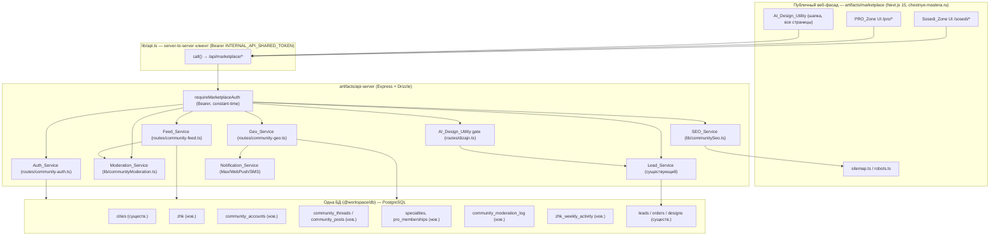
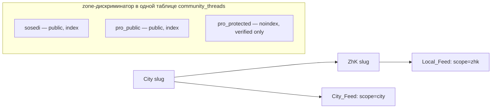
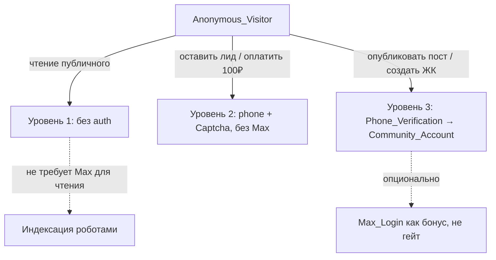
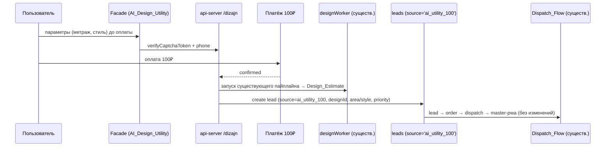

# Design Document — «ХочуТакже» (hochu-takzhe-community)

## Overview

«ХочуТакже» — это переориентация существующего marketplace-продукта (ранее «Российский Houzz / каталог работ мастеров») в гео-сообщество масштаба ЖК: транзакционный аналог Nextdoor, объединённый с профессиональным сообществом мастеров и платной AI-утилитой.

Ключевая инженерная установка (Requirement 20): **платформа не изобретает новую backend-логику заказов**. Она надстраивает гео-сообщество и зоны поверх уже работающих активов репозитория `sfera888`:

- Публичный веб-фасад — существующий артефакт `artifacts/marketplace` (Next.js 15 App Router, домен `chestnye-mastera.ru`). Фасад ходит в backend **только** через server-to-server клиент `artifacts/marketplace/lib/api.ts` (`call<T>()`, Bearer `INTERNAL_API_SHARED_TOKEN`), без прямого доступа к БД.
- Backend — `artifacts/api-server` (Express + Drizzle, `@workspace/db`). Публичная площадка обслуживается роутером `src/routes/marketplace.ts`, защищённым `MARKETPLACE_INGEST_TOKEN` (constant-time Bearer, см. `requireMarketplaceAuth`).
- Поток лидов и заказов — существующий: `leads` (с колонкой `source`) → `POST /api/marketplace/leads` / `POST /api/leads/:id/send-to-buffer` → `orders` → `performBroadcast` (`src/lib/broadcastOrder.ts`) → master-pwa. Мы **не** создаём параллельный поток.
- AI-дизайн — существующий пайплайн: таблица `designs` (`lib/db/src/schema/designs.ts`), `src/lib/designWorker.ts`, `materialsEstimator.ts`, `falAi.ts`, роут `src/routes/dizajn.ts`. Утилита «100 ₽» переиспользует его, добавляя лишь платёжный гейт и лид-связку (`designs.leadId`).
- Существующие библиотеки: `src/lib/slug.ts` (`slugify`, `pickUniqueSlug`), `src/lib/smartCaptcha.ts` (`verifyCaptchaToken`), `src/lib/marketplaceModeration.ts` (`validateText`), `src/lib/indexNow.ts` (`pingIndexNow`), `src/lib/marketplaceRevalidate.ts` (`revalidateMarketplacePaths`), `src/maxBot.ts` (бот Max).

Дизайн вводит новый доменный слой «сообщество» (гео-иерархия, зоны, ленты, аккаунты сообщества, модерация, метрики живых ЖК) как набор новых таблиц и новых endpoint-ов внутри `api-server`, разделяющих одну БД с существующими сущностями. Доверие, конвертирующее SEO-трафик в лиды, обеспечивает **живое сообщество**, а не AI-галереи; AI-контент явно помечается как вспомогательный.

### Grounding в существующем коде (что переиспользуется как есть)

| Потребность спецификации | Существующий актив | Файл |
| --- | --- | --- |
| Slug для City/ZhK | `slugify()`, `pickUniqueSlug(base, isTaken)` | `src/lib/slug.ts` |
| Captcha на лид/оплату | `verifyCaptchaToken()` (Yandex SmartCaptcha) | `src/lib/smartCaptcha.ts` |
| Модерация текста | `validateText()`, стоп-слова/PII/спам | `src/lib/marketplaceModeration.ts` |
| SEO instant-index | `pingIndexNow()` | `src/lib/indexNow.ts` |
| Ревалидация страниц фасада | `revalidateMarketplacePaths()`, `masterPublicationPaths()` | `src/lib/marketplaceRevalidate.ts` |
| Лиды + источник | `leadsTable.source`, `POST /api/marketplace/leads` | `schema/leads.ts`, `routes/marketplace.ts` |
| Заказы/диспетчеризация | `ordersTable`, `performBroadcast()` | `schema/orders.ts`, `lib/broadcastOrder.ts` |
| AI-дизайн-пайплайн | `designsTable`, `designWorker`, `materialsEstimator` | `schema/designs.ts`, `lib/*` |
| Города (верх иерархии) | `citiesTable` (slug, population, isActive, seo*) | `schema/settings.ts` |
| Уведомления/вход Max | `maxBot.ts`, push-подписки | `src/maxBot.ts`, `schema/*push*` |

## Architecture

### Слои системы

### Гео-иерархия и зоны

Гео-иерархия — ровно два уровня: `City → ZhK`. `City` — существующая таблица `cities`. `ZhK_Record` — новая таблица `zhk` с FK `city_id`. Каждый ZhK принадлежит ровно одному городу; город содержит 0..∞ ЖК (Requirement 1.1).

Две публичные зоны (`Sosedi_Zone`, `PRO_Zone`) и защищённый слой (`PRO_Protected_Layer`) обслуживаются из одной БД, различаясь дискриминатором `zone` в `community_threads` и разными префиксами URL/рендерами фасада (Requirement 8.1). Изоляция — на уровне запросов (каждый endpoint фильтрует по `zone`) и на уровне модерации (реклама услуг в Sosedi блокируется).

### Трёхуровневая модель доступа (Auth_Service)

- Уровень 1 — публичное чтение без аутентификации; роботы получают контент без auth (Requirement 9). Операционные ограничения (rate-limit, обслуживание, модерация) могут отказать (9.4).
- Уровень 2 — лид/оплата требуют только `phone` + `Captcha` (`verifyCaptchaToken`), **никогда** Max (Requirement 10).
- Уровень 3 — публикация создаёт `Community_Account` по `Phone_Verification`; Max_Login — опциональный одношаговый бонус (Requirement 11).

### Поток AI-утилиты в существующий лид-флоу

## Components and Interfaces

Все публичные endpoint-ы добавляются под существующий защищённый префикс `/api/marketplace/*` (наследуют `requireMarketplaceAuth`) либо в соседние community-роутеры, монтируемые с той же Bearer-защитой. Фасад вызывает их через `lib/api.ts::call<T>()`. Ниже — контракты уровня домена, а не полные сигнатуры Express.

### Geo_Service (`routes/community-geo.ts`)

- `GET /marketplace/geo/city/:citySlug` → `{ city, cityFeed }` | 404. Возвращает City и City_Feed (темы уровня города, сортировка по `createdAt` desc). Пустой фид → `{ items: [], empty: true }`, не ошибка (Requirements 1.2, 1.3).
- `GET /marketplace/geo/zhk/:zhkSlug` → `{ zhk, localFeed }` | 404. Local_Feed содержит только темы данного ZhK (Requirements 1.4, 3.3). Незаполненные атрибуты ЖК не отдаются в DTO (1.7).
- `POST /marketplace/geo/zhk` (уровень 3) → создание ZhK_Record: `{ name (2..100), citySlug }`. Валидация имени и существования города; дедупликация по `lower(trim(name))` в пределах города — при совпадении возвращает существующий ЖК, не создаёт дубликат (Requirements 4.1–4.5). После создания Local_Feed доступен ≤ 2 c (4.6).
- Внутренняя функция `resolveZhkSlug(name, cityId)` использует `slugify()` + `pickUniqueSlug()` для глобально уникального slug `^[a-z0-9-]{1,100}$` (Requirement 1.6).

### Feed_Service (`routes/community-feed.ts`)

- `POST /marketplace/feed/city` (уровень 3) — публикация темы City_Feed; привязывает к текущему City (Requirement 2.2).
- `POST /marketplace/feed/zhk` (уровень 3) — публикация темы Local_Feed; привязывает к ZhK, к которому привязан аккаунт на момент публикации (Requirement 3.2). Валидация: категория ∈ {`utility_incident`, `developer_defect`, `tool_sharing`, `local_recommendation`}, `title` 1..200, `body` ≤ 5000; при нарушении — отклонить, **сохранить ввод как черновик** и вернуть код ошибки (Requirement 3.4). Если аккаунт не привязан к ЖК — отклонить с `NO_ZHK_BINDING` (3.5).
- `GET /marketplace/pro/:specialtySlug` — PRO_Public_Layer; по умолчанию All_Russia_Feed (Requirement 6.2). `?cityFilter=1` включает My_City_Filter только явно; при пустом локальном результате — пустая лента без отката к All_Russia (Requirements 6.3–6.6). Публичные темы ограничены профессиональными категориями (6.8).
- `GET /marketplace/pro/:specialtySlug/protected` (verified only) — PRO_Protected_Layer; noindex; отказ анонимам с предложением верификации (Requirement 7).

### Auth_Service (`routes/community-auth.ts`)

- `POST /marketplace/auth/lead-gate` — валидация уровня 2: `{ phone, captchaToken }` → `verifyCaptchaToken`. Успех → разрешение на создание лида/оплату; провал капчи → `CAPTCHA_FAILED`, повтор (Requirements 10.1–10.4).
- `POST /marketplace/auth/phone/start` и `/phone/verify` — Phone_Verification; при успехе создаёт/возвращает `Community_Account` и выдаёт сессию с правами публикации немедленно, **не** дожидаясь Max (Requirement 11.1, 11.4).
- `POST /marketplace/auth/max/link` — опциональная привязка Max_Login (бонус, не гейт) (Requirement 11.2).

### Moderation_Service (`lib/communityModeration.ts`, `routes/community-moderation.ts`)

- `screenCommunityText(text, zone, category)` — обёртка над существующим `validateText()`; дополнительно распознаёт: рекламу услуг в Sosedi (блокировать, уведомить автора — Requirement 8.2), PII/диффамацию (перенос в PRO_Protected_Layer или снятие — 19.2), спам (блок — 19.5).
- Публикация не обязана проходить модерацию для видимости (Requirement 19.1): модерация — post-hoc/асинхронная политика; `community_threads.moderation_status` по умолчанию `not_screened`, видимость определяется `visibility`.
- Все действия пишутся в `community_moderation_log` с `reason` и `moderator_id` (Requirement 19.4).

### SEO_Service (`lib/communitySeo.ts`)

- `computeContentScore(page)` и `isIndexable(page)` — гейт «тонких» страниц: страница ЖК/города публикуется для индексации только при прохождении порога контента (Requirement 16.3). Иначе — наполнение сид-данными/авто-темами/агрегированными ценами/AI-сид-контентом (16.2).
- `zoneIndexPolicy(zone)` — `sosedi`/`pro_public` → index + sitemap; `pro_protected` → noindex, исключить из sitemap (Requirements 5.2, 6.7, 7.3).
- Инвалидация — существующий `revalidateMarketplacePaths()` + `pingIndexNow()`; расширяется хелперами `zhkPublicationPaths(citySlug, zhkSlug)`, `cityFeedPaths(citySlug)`.
- Целевой генерируемый набор — ~40 городов РФ с населением ≥ 400 000 (Requirement 16.1), маркируются `cities.is_active` + новым флагом покрытия.

### Living-community layer (`lib/livingZhk.ts`)

- `classifyZhk(zhkId, weekWindow)` — считает активных жителей за неделю по `zhk_weekly_activity`; при `≥ N` → `LIVING`, иначе явно `NON_LIVING` (Requirement 17.2).
- `livingZhkCount(starterCities)` — основная метрика успеха, отдельно от объёма трафика (17.3).
- Стартовые города (1..3) помечаются `cities.is_starter`; новостройки в них приоритизируются для сидирования (17.1, 17.4).

### AI_Design_Utility gate (`routes/dizajn.ts` — расширение существующего)

- Форма доступна из шапки на всех публичных страницах фасада (Requirement 12.1); собирает `{ area, style, ... }` до оплаты (12.2).
- После подтверждения оплаты 100 ₽ — запуск существующего `designWorker` пайплайна → `Design_Estimate` (views + estimate + materials) (12.3, 12.4, 12.6). Без оплаты — не генерировать, сообщить о незавершённой оплате (12.5).
- По подтверждению оплаты — `createUtilityLead()` создаёт запись в `leads` с `source='ai_utility_100'`, `designId`, параметрами в `marketplace_context`, приоритетным признаком намерения; далее существующий Dispatch_Flow (Requirements 13.1–13.4, 20.1–20.3).

## Data Models

Новые таблицы соблюдают существующие соглашения (`@workspace/db`, snake_case колонки, `serial` PK, nullable-расширения). Existing `cities`, `leads`, `orders`, `designs` переиспользуются и минимально расширяются nullable-колонками.

### `zhk` (ZhK_Record) — новая

| Колонка | Тип | Назначение |
| --- | --- | --- |
| `id` | serial PK | |
| `slug` | varchar(100) unique | публичный URL, `^[a-z0-9-]{1,100}$` (R1.6) |
| `name` | varchar(100) not null | 2..100 символов (R4.2) |
| `name_normalized` | varchar(100) not null | `lower(trim(name))` для дедупликации в городе (R4.5) |
| `city_id` | integer FK → cities.id, not null | ровно один City (R1.1) |
| `developer` | varchar(200) null | атрибут (R1.7) |
| `completion_date` | varchar(40) null | срок сдачи (R1.7) |
| `buildings` | jsonb null | список корпусов (R1.7) |
| `status` | varchar(20) not null default `'NON_LIVING'` | `LIVING`/`NON_LIVING` (R17.2) |
| `is_seeded` | boolean not null default false | создан сидированием vs жителем (R4, R16.2) |
| `content_score` | integer not null default 0 | гейт «тонких» страниц (R16.3) |
| `is_indexable` | boolean not null default false | публикуется в sitemap только при прохождении порога (R16.3) |
| `created_by_account_id` | integer FK → community_accounts.id null | автор-житель (R4.1) |
| `seo_title`/`seo_description`/`h1`/`body_md` | как в `cities` | SEO |
| `created_at` | timestamp default now | сортировка/аудит |

Уникальный индекс `(city_id, name_normalized)` не создаётся жёстким (дедуп — на уровне сервиса, чтобы вернуть существующий, а не падать), но добавляется индекс поиска `(city_id, name_normalized)`.

### `community_accounts` (Community_Account) — новая

| Колонка | Тип | Назначение |
| --- | --- | --- |
| `id` | serial PK | |
| `phone` | varchar(30) not null unique | основной метод (R11.1) |
| `phone_verified_at` | timestamp null | Phone_Verification завершена (R11.4) |
| `role` | varchar(20) not null default `'resident'` | `resident`/`master` |
| `zhk_id` | integer FK → zhk.id null | привязка жителя к ЖК на момент публикации (R3.2, R3.5) |
| `max_user_id` | varchar(80) null | опциональный Max_Login (R11.2), никогда не обязателен |
| `created_at` | timestamp default now | |

### `community_threads` (темы City_Feed / Local_Feed / PRO) — новая

| Колонка | Тип | Назначение |
| --- | --- | --- |
| `id` | serial PK | |
| `zone` | varchar(20) not null | `sosedi`/`pro_public`/`pro_protected` (R8.1) |
| `scope` | varchar(10) not null | `city`/`zhk`/`pro` |
| `city_id` | integer FK → cities.id null | для scope city/pro |
| `zhk_id` | integer FK → zhk.id null | для scope zhk (R3.3) |
| `specialty_id` | integer FK → specialties.id null | для PRO (R6.1) |
| `is_local` | boolean not null default false | локальная PRO-тема для My_City_Filter (R6.4) |
| `category` | varchar(40) null | категории Local_Feed (R3.1) / PRO (R6.8) |
| `title` | varchar(200) not null | 1..200 (R3.4) |
| `body` | text not null | ≤ 5000 (R3.4) |
| `author_account_id` | integer FK → community_accounts.id null | null для сид-контента |
| `is_seeded` | boolean not null default false | авто/сид-темы (R16.2) |
| `visibility` | varchar(12) not null default `'public'` | `public`/`protected`/`hidden` (R19.2) |
| `moderation_status` | varchar(16) not null default `'not_screened'` | не гейт видимости (R19.1) |
| `last_activity_at` | timestamp not null default now | сортировка City_Feed по активности (R2.3) |
| `created_at` | timestamp default now | сортировка лент (R1.2, R1.4) |

Индексы: `(scope, city_id, created_at)`, `(scope, zhk_id, created_at)`, `(zone, specialty_id, is_local, city_id)`.

### `community_thread_drafts` (сохранённый ввод при ошибке) — новая

Хранит введённые данные при отклонённой публикации, чтобы ввод не терялся даже если доставка сообщения об ошибке не удалась (R3.4, R11.3): `id`, `author_account_id` null, `payload jsonb`, `reason varchar(40)`, `created_at`.

### `specialties` (Specialty) — новая

`id`, `slug varchar(100) unique`, `name varchar(100)`, `is_active boolean`. Определяет тематические PRO-сообщества (R6.1).

### `pro_memberships` — новая

`id`, `account_id FK`, `specialty_id FK null`, `verified boolean default false`, `verified_at timestamp null`. Доступ к PRO_Protected_Layer только `verified=true` (R7.1, R7.2).

### `community_moderation_log` — новая

`id`, `target_type varchar(20)` (`thread`/`account`), `target_id integer`, `action varchar(24)` (`block`/`hide`/`move_protected`/`queue`), `reason text`, `moderator_id integer null` (null = авто), `created_at` (R19.4).

### `zhk_weekly_activity` — новая

`id`, `zhk_id FK`, `week_start date`, `active_residents integer not null default 0`, unique `(zhk_id, week_start)`. Источник метрики Living_ZhK (R17.2, R17.3).

### Расширения существующих таблиц (nullable, безопасные)

- `cities`: `is_starter boolean not null default false` (R17.1), `is_geo_covered boolean not null default false` (R16.1). Slug/population/isActive/seo уже есть.
- `leads`: новых колонок не требуется — `source='ai_utility_100'`, `design_id`, `marketplace_context` (jsonb с `{area, style, priority:'hot'}`) уже существуют (R13.1, R13.2, R20.1).
- `designs`: переиспользуется как есть; `lead_id` уже связывает Design_Estimate с лидом (R13.2).

### Значения-константы

- `LIVING_ZHK_WEEKLY_ACTIVE_THRESHOLD = N` (конфиг; порог активных жителей/неделю, R17.2).
- `MIN_CONTENT_SCORE_FOR_INDEX` — порог «тонкой» страницы (R16.3).
- `LOCAL_FEED_CATEGORIES = ['utility_incident','developer_defect','tool_sharing','local_recommendation']` (R3.1).
- `AI_UTILITY_LEAD_SOURCE = 'ai_utility_100'` (R13.1).
